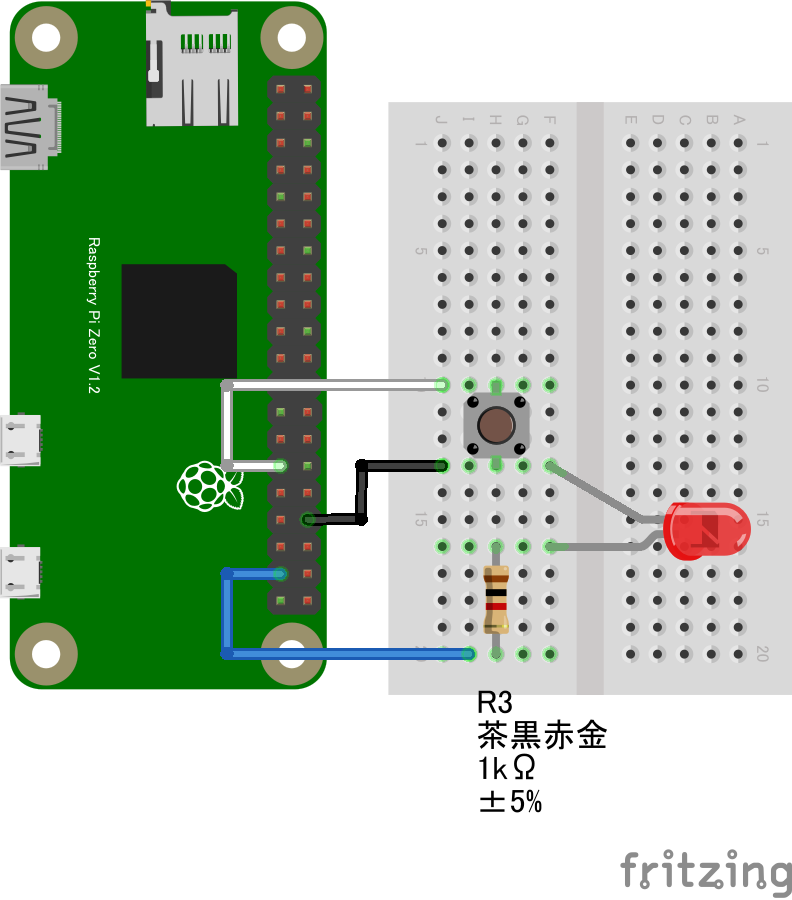
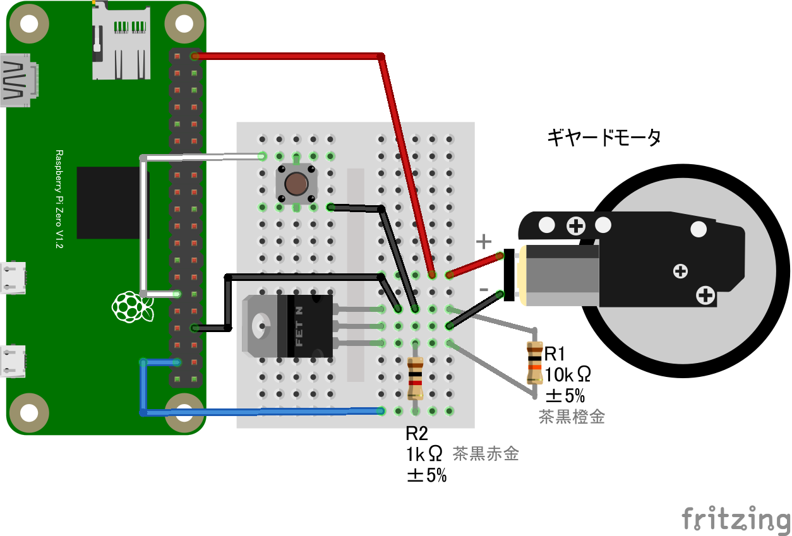

# リモートスイッチ+(LED or モータ)

## 配線図１ (スイッチ+LED)

## 配線図２ (スイッチ+ギヤードモーター)

GPIO PORT5にスイッチ、GPIOPORT26に抵抗とLED、またはモーター制御回路を繋ぎます

> [!WARNING]
> Node.js v20 では `WebSocket` が実験的機能としてデフォルト無効のため、Raspberry Pi Zero 側で `node main.js` を実行すると `nodeWebSocketClass and OriginURL are required.` というエラーで終了します。
> `node --experimental-websocket main.js` のようにフラグを付けて実行してください (v22 以降ではフラグ不要です)。

## 遠隔モニタ・コントロール(PC/スマホブラウザ)側

[pc/index.html](https://codesandbox.io/s/github/chirimen-oh/chirimen.org/tree/master/pizero/src/esm-examples/remote_gpio-inout/pc?module=pc.js)を起動します。

PORT5のスイッチの状態がリアルタイムでブラウザに表示されます。また、ブラウザのボタンからPORT26に繋いだLED/モータをOn/Offできます。
