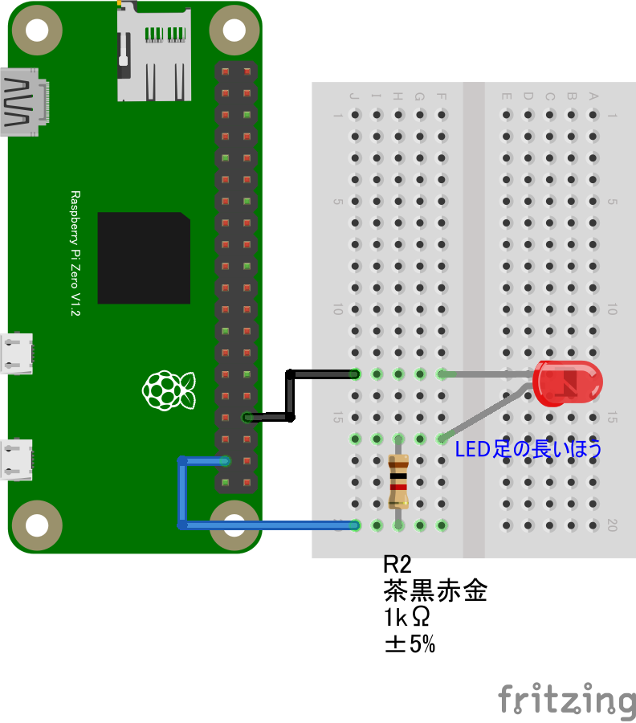

# リモートLチカ

## 配線図

GPIO PORT26に繋ぎます

## 遠隔コントロール(PC/スマホブラウザ)側

[pc/index.html](https://codesandbox.io/s/github/chirimen-oh/chirimen.org/tree/master/pizero/src/esm-examples/remote_gpio_led/pc?module=pc.js)を起動します。