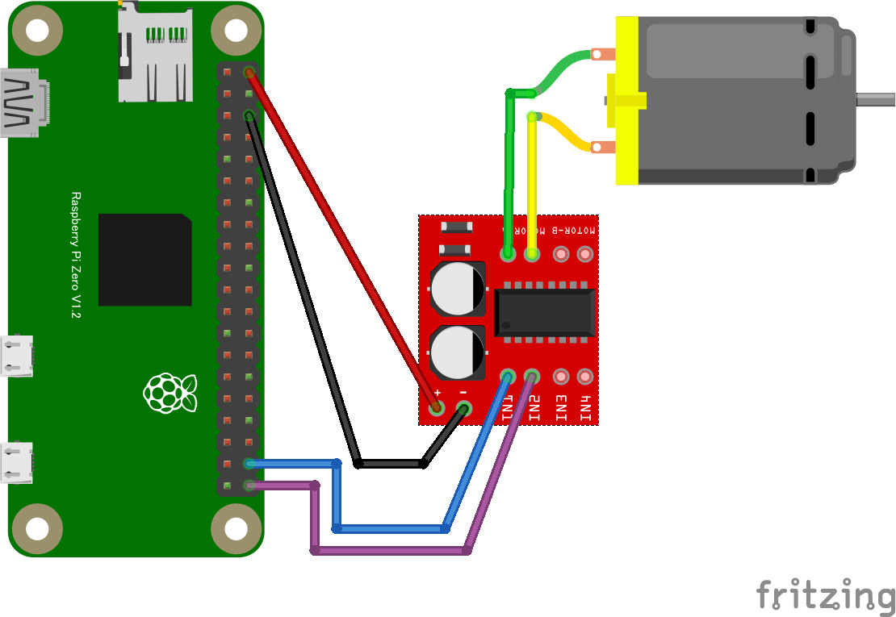
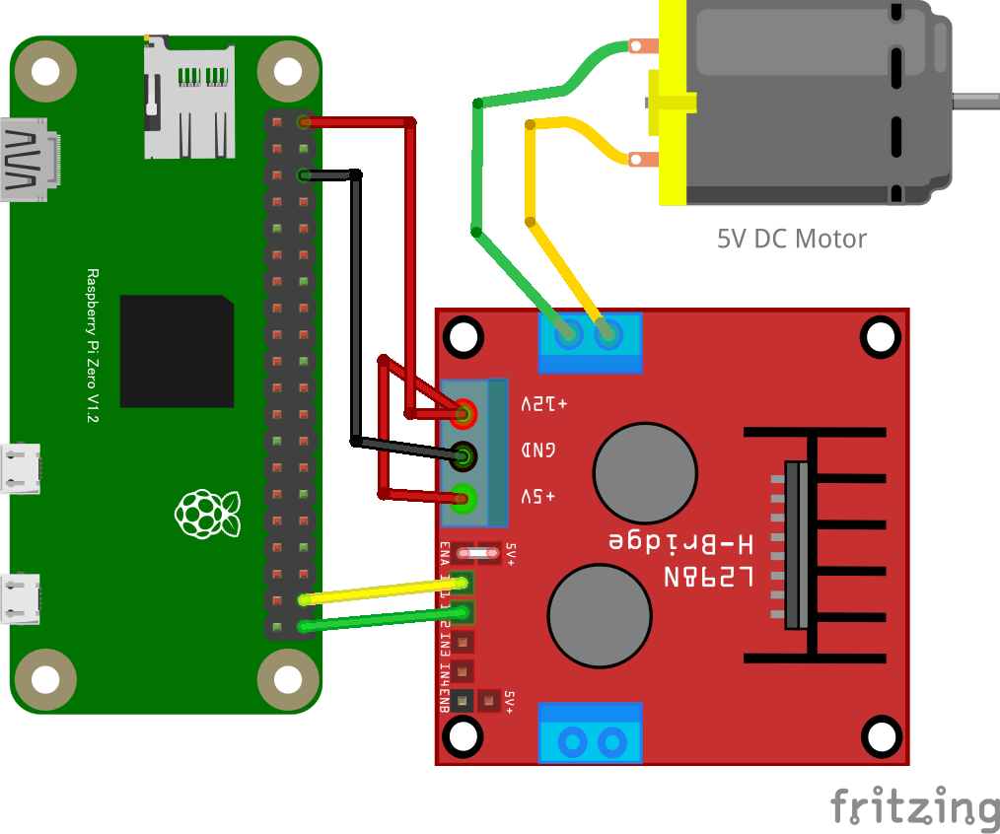

# リモートモータ正転・逆転制御

MX1508（または L298N）モータードライバーを使って、ブラウザからワイヤレスで DC モーターの正転・逆転・ブレーキ・フリーを制御します。

## MX1508 モータードライバー

## 配線図

**接続方法：**

- MX1508 の IN1 を GPIO20 に接続
- MX1508 の IN2 を GPIO21 に接続
- MX1508 の VCC を 5V に接続（モーター電源）
- MX1508 の GND を GND に接続
- モーターを MOTOR A または MOTOR B に接続

**制御信号：**

- 正転：IN1=1, IN2=0
- 逆転：IN1=0, IN2=1
- ブレーキ：IN1=1, IN2=1
- フリー：IN1=0, IN2=0

## L298N での接続について（参考）

L298N を使用する場合も、IN1 を GPIO20、IN2 を GPIO21 に接続すれば同じコードで制御できます。

> [!WARNING]
> Node.js v20 では `WebSocket` が実験的機能としてデフォルト無効のため、Raspberry Pi Zero 側で `node main.js` を実行すると `nodeWebSocketClass and OriginURL are required.` というエラーで終了します。
> `node --experimental-websocket main.js` のようにフラグを付けて実行してください (v22 以降ではフラグ不要です)。

## 遠隔コントローラ(PC/スマホブラウザ)側

[pc/index.html](https://codesandbox.io/s/github/chirimen-oh/chirimen.org/tree/master/pizero/src/esm-examples/remote_hbridge1/pc?module=pc.js)を起動します。

「正転」「逆転」「ブレーキ」「フリー（停止）」の各ボタンでモーターの動作を切り替えられます。
