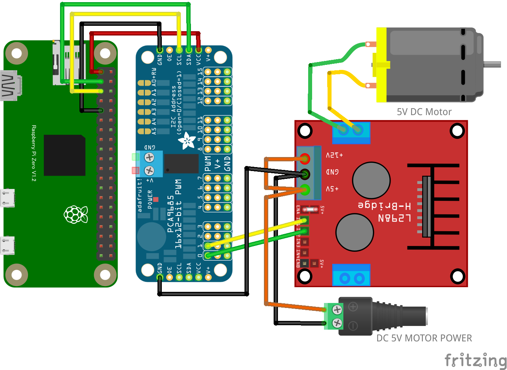

# リモートモータ

## 配線図

## 遠隔コントローラ(PC/スマホブラウザ)側

[pc/index.html](https://codesandbox.io/s/github/chirimen-oh/chirimen.org/tree/master/pizero/src/esm-examples/remote_hbridge_pca9685/pc?module=pc.js)を起動します。