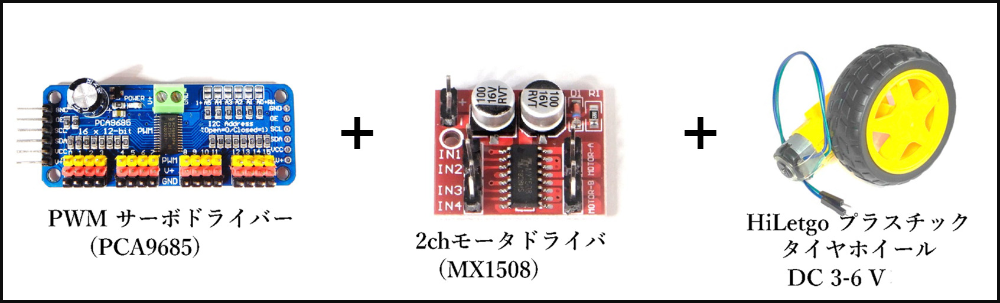
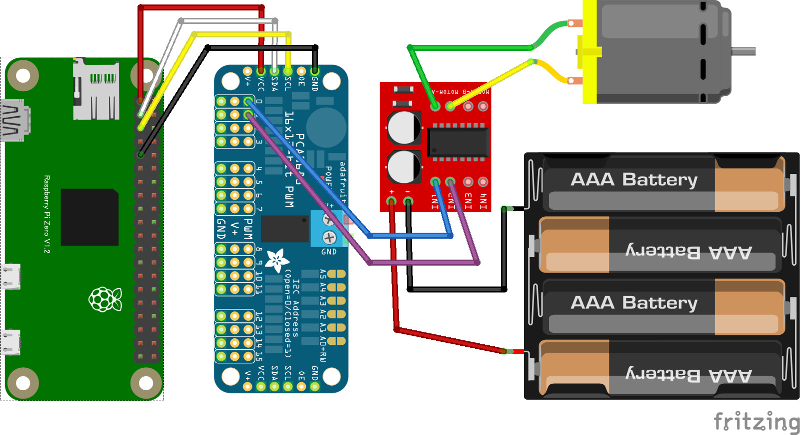

# リモートモータ（MX1508 + PCA9685）

PCA9685 と MX1508 を使って、PC/スマホブラウザからワイヤレスで DC モーターを制御します。
インターネット経由でモーターの正転・逆転・速度制御が可能です。

## システム構成

**システムの特徴：**

- Raspberry Pi Zero に PCA9685 と MX1508 を接続
- WebSocket を使用してリアルタイム通信
- PC/スマホのブラウザから直感的な操作
- PWM による滑らかな速度制御
- インターネット経由での遠隔制御

## 配線図

**接続方法：**

- PCA9685 の SDA を GPIO2（SDA）に接続
- PCA9685 の SCL を GPIO3（SCL）に接続
- PCA9685 のチャンネル 0 を MX1508 の IN1 に接続
- PCA9685 のチャンネル 1 を MX1508 の IN2 に接続
- MX1508 の VCC を外部電源（モーター電源）に接続
- 全ての GND を共通接続

## 遠隔コントローラ(PC/スマホブラウザ)側

[pc/index.html](https://codesandbox.io/s/github/chirimen-oh/chirimen.org/tree/master/pizero/src/esm-examples/remote_hbridge_pca9685/pc?module=pc.js)を起動します。

**操作方法：**

- スライダーでモーター速度を調整
- 方向ボタンで正転・逆転を切り替え
- リアルタイムでモーターの動作を確認

## L298N での接続について（参考）

元の配線図は L298N と PCA9685 の組み合わせを示しています。リモート制御においても L298N を使用することが可能です：

**L298N 接続方法：**

- PCA9685 と L298N の接続は前述と同様
- Web インターフェースは同じものが使用可能
- モーター電源として 6V〜12V を使用

**リモート制御での選択指針：**

- **L298N**：屋外ロボット、大型車輪、長距離移動
- **MX1508**：室内小型ロボット、デモンストレーション、学習用

どちらのドライバーを使用しても Web インターフェースからの制御方法は変わりません。プロジェクトの規模と要件に応じて適切なドライバーを選択してください。
