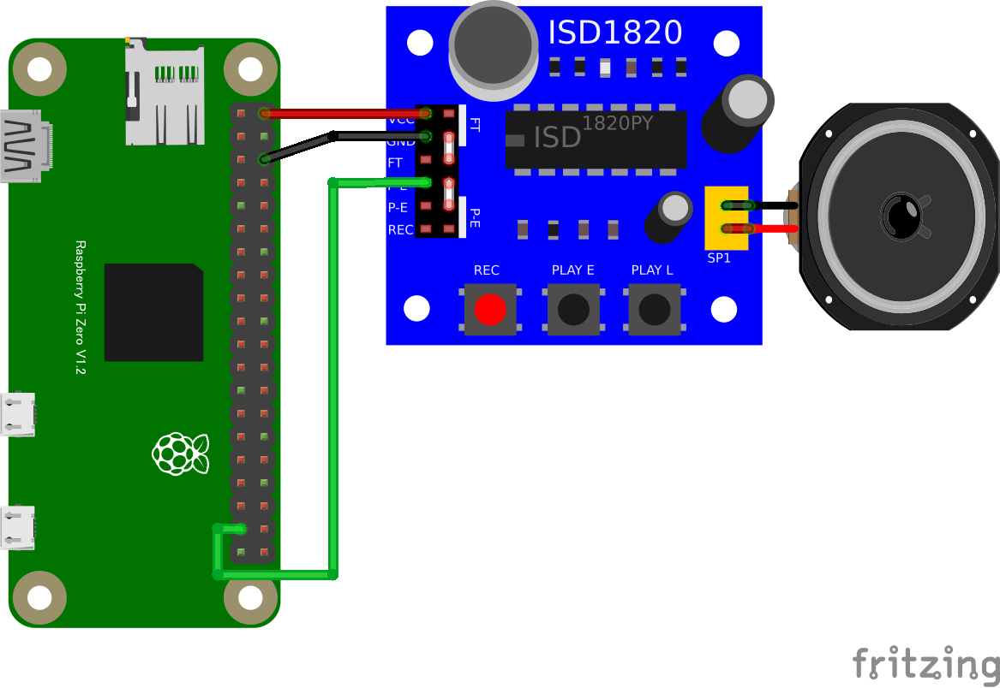

# リモートボイスレコーダー

## 配線図

* GPIO PORT26をISD1820のP-L端子に繋ぎます(P-L端子がHighになっている間だけ再生します(PLAY Lボタンと同じ動作))
* GPIO PORT19をISD1820のREC端子に繋ぐと、ブラウザから録音の開始・停止もコントロールできます(REC端子がHighになっている間だけ録音、最大10秒)
* REC端子を配線しない場合は録音ボタンは動作しません(再生のみ利用可能)

> [!WARNING]
> Node.js v20 では `WebSocket` が実験的機能としてデフォルト無効のため、Raspberry Pi Zero 側で `node main.js` を実行すると `nodeWebSocketClass and OriginURL are required.` というエラーで終了します。
> `node --experimental-websocket main.js` のようにフラグを付けて実行してください (v22 以降ではフラグ不要です)。

## 遠隔コントローラ(PC/スマホブラウザ)側

[pc/index.html](https://codesandbox.io/s/github/chirimen-oh/chirimen.org/tree/master/pizero/src/esm-examples/remote_isd1820/pc?module=pc.js)を起動します。

「押している間 録音」「押している間 再生」の各ボタンを押している間だけ、録音・再生が行われます。
