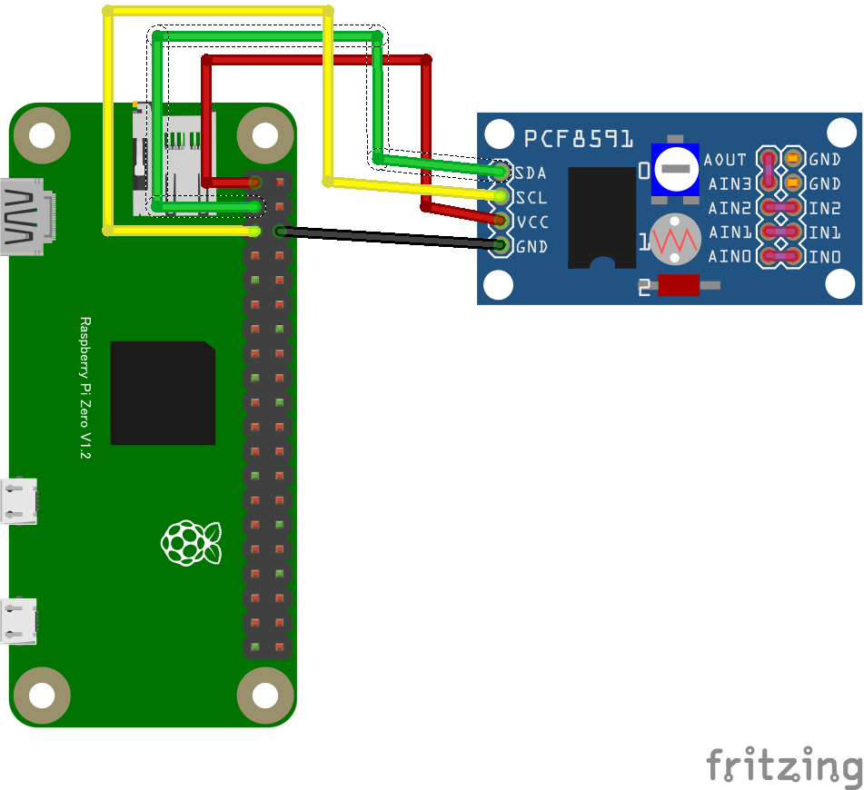

# リモート電圧測定・電圧出力

## 配線図

> [!WARNING]
> Node.js v20 では `WebSocket` が実験的機能としてデフォルト無効のため、Raspberry Pi Zero 側で `node main.js` を実行すると `nodeWebSocketClass and OriginURL are required.` というエラーで終了します。
> `node --experimental-websocket main.js` のようにフラグを付けて実行してください (v22 以降ではフラグ不要です)。

## 遠隔モニタ・コントロール(PC/スマホブラウザ)側

[pc/index.html](https://codesandbox.io/s/github/chirimen-oh/chirimen.org/tree/master/pizero/src/esm-examples/remote_pcf8591/pc?module=pc.js)を起動します。

Pi Zero側のPCF8591で測定したADC値(CH0〜CH3、電圧)が数秒間隔でブラウザに表示されます。また、スライダーを操作するとDA出力電圧(0〜3.3V)をPi Zero側に送信し、DAC出力を変更できます。
