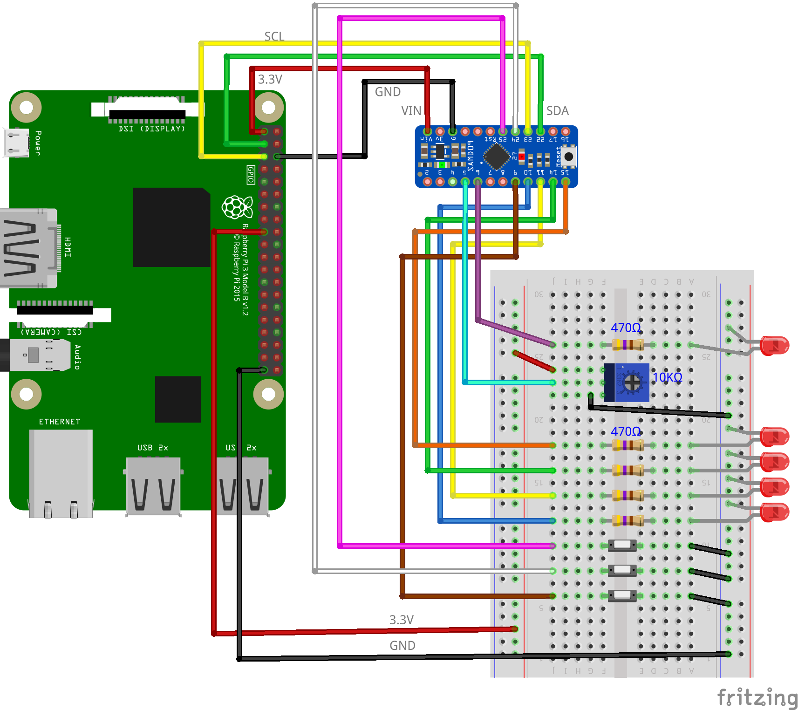

# リモート多目的インターフェース(seesaw)

## 配線図

VCC(3.3V)・GND・SDA・SCL の4本をRaspberry PiのI2Cピンに接続します。I2Cアドレスは `0x49` 固定です。

さらに、[seesawのアナログ入力・デジタル出力](../seesaw#配線図)と同様に、seesaw基板のピン `2`(A0) に可変抵抗、ピン `15` にLEDを接続します。

> [!WARNING]
> Node.js v20 では `WebSocket` が実験的機能としてデフォルト無効のため、Raspberry Pi Zero 側で `node main.js` を実行すると `nodeWebSocketClass and OriginURL are required.` というエラーで終了します。
> `node --experimental-websocket main.js` のようにフラグを付けて実行してください (v22 以降ではフラグ不要です)。

## 遠隔モニタ(PC/スマホブラウザ)側

[pc/index.html](https://codesandbox.io/s/github/chirimen-oh/chirimen.org/tree/master/pizero/src/esm-examples/remote_seesaw/pc?module=pc.js)を起動します。

seesaw基板のアナログ入力値と、その値に応じてON/OFFしたLEDの状態がブラウザに表示されます。
