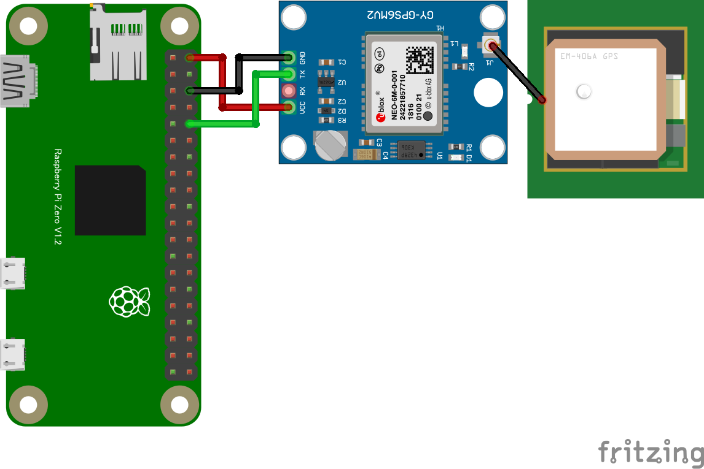

# リモートGPSレシーバ

PiZeroのシリアル端子に、GY-GPS6MV2等のGPSレシーバ基板を繋いで使用します。数秒間隔で緯度・経度などの位置情報をブラウザに表示します。

## 配線図

* OSの設定
  * `sudo raspi-config`
  * Interface Options -> Serial Port -> Login over serial: いいえ , serial port enabled: はい -> Finish (reboot)
  * Note: この設定はUSBシリアルのコンソールログインには影響しない
* 結線 (GPSのRX端子の結線は基本動作では不要)
  * 動作検証したモジュール (GY-NEO6MV2,基板の印刷はGY-GPS6MV2)
    * https://electronicwork.shop/items/625c1ca99fe3d707d725cbe1
  * 同等品と考えられるもの
    * https://www.amazon.co.jp/dp/B07LF6KGR8
    * https://www.aitendo.com/product/10255
* 動作確認
  * `cat /dev/ttyS0`
  * Note: GPS衛星電波受信されていなくてもメッセージが出力される。`/dev/serial0` も使える。測位成功するとメッセージが派手になり、LEDが点滅する (LEDは測位成功していないときは消灯)

> [!WARNING]
> Node.js v20 では `WebSocket` が実験的機能としてデフォルト無効のため、Raspberry Pi Zero 側で `node main.js` を実行すると `nodeWebSocketClass and OriginURL are required.` というエラーで終了します。
> `node --experimental-websocket main.js` のようにフラグを付けて実行してください (v22 以降ではフラグ不要です)。

## 遠隔モニタ(PC/スマホブラウザ)側

[pc/index.html](https://codesandbox.io/s/github/chirimen-oh/chirimen.org/tree/master/pizero/src/esm-examples/remote_serial_gps/pc?module=pc.js)を起動します。

数秒間隔で緯度・経度・高度・捕捉衛星数などの位置情報がブラウザに表示されます。衛星をまだ捕捉できていない間は「衛星未捕捉」と表示されます。
