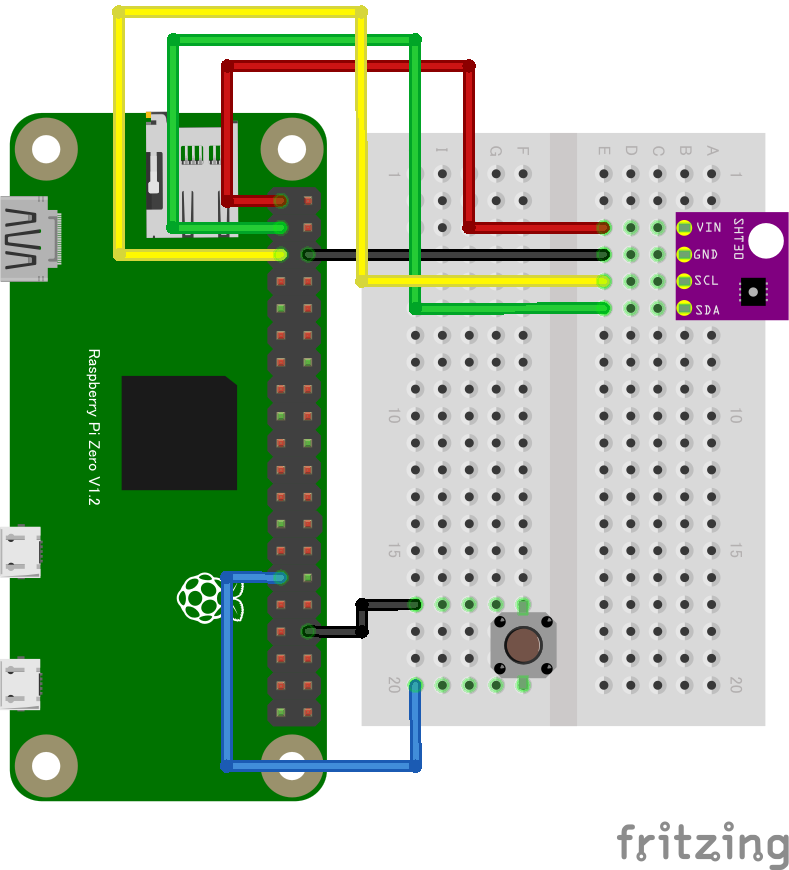

# リモート温湿度センサ２
スイッチを押すと温湿度センサーの値を送信します。スイッチの代わりに人感センサー等を繋ぐと有意義かもしれません。

## 配線図

## 遠隔モニタ(PC/スマホブラウザ)側

[pc/index.html](https://codesandbox.io/s/github/chirimen-oh/chirimen.org/tree/master/pizero/src/esm-examples/remote_sht30_gpioin/pc?module=pc.js)を起動します。