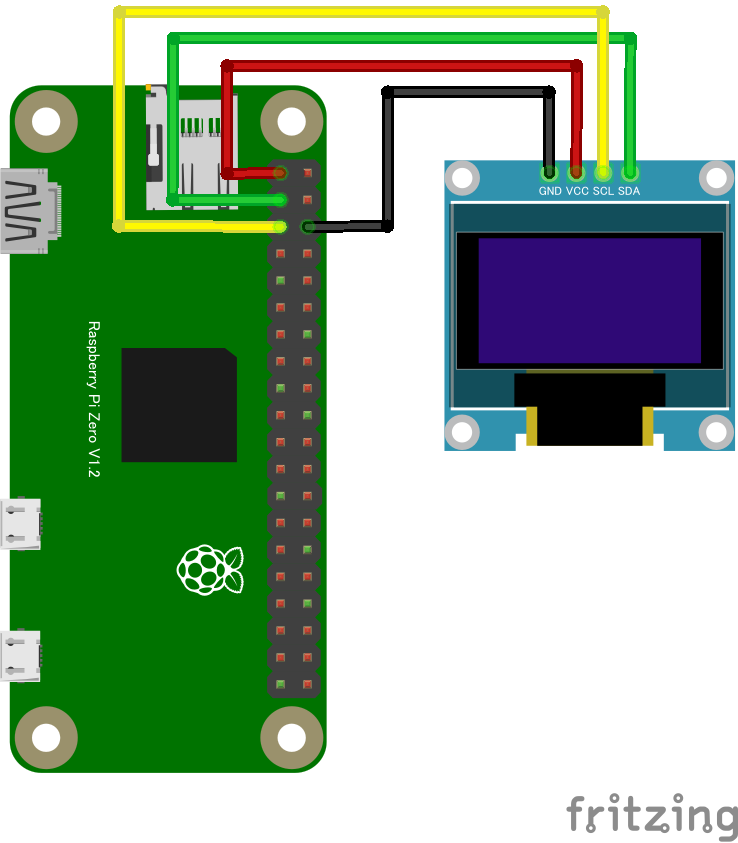

# リモート有機ELディスプレイ(SSD1306)

## 配線図

> [!WARNING]
> Node.js v20 では `WebSocket` が実験的機能としてデフォルト無効のため、Raspberry Pi Zero 側で `node main.js` を実行すると `nodeWebSocketClass and OriginURL are required.` というエラーで終了します。
> `node --experimental-websocket main.js` のようにフラグを付けて実行してください (v22 以降ではフラグ不要です)。

## 遠隔コントロール(PC/スマホブラウザ)側

[pc/index.html](https://codesandbox.io/s/github/chirimen-oh/chirimen.org/tree/master/pizero/src/esm-examples/remote_ssd1306/pc?module=pc.js)を起動します。

テキストエリアに文字列を入力して送信すると、Pi Zero側のOLED(有機EL 128x64px)SSD1306ディスプレイに表示されます。改行区切りで最大8行まで表示できます。
