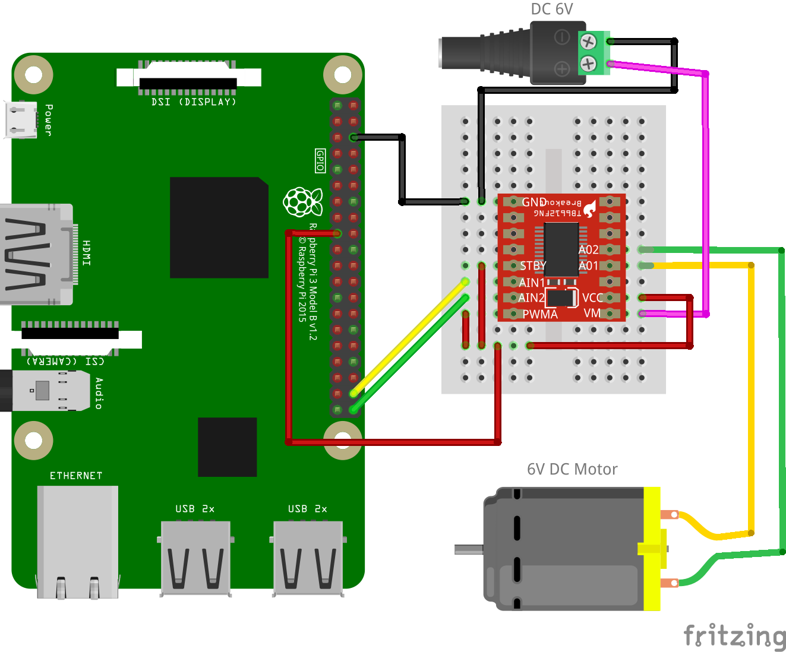

# リモートモータ正転・逆転制御(TB6612FNG)

TB6612FNGモータードライバーを使って、ブラウザからワイヤレスでDCモーターの正転・逆転・ブレーキ・フリーを制御します。

## 配線図

[tb6612fngの配線図](../tb6612fng#配線図)と同様に接続します。

- TB6612FNG の STBY を GPIO19 に接続
- TB6612FNG の AIN1 を GPIO20 に接続
- TB6612FNG の AIN2 を GPIO21 に接続
- TB6612FNG の PWMA を VCC(3.3V)に接続(常にフルスピードで動作させる場合)
- TB6612FNG の VM をモーター電源(2.5V〜13.5V)に接続
- TB6612FNG の VCC を Raspberry Pi の 3.3V に接続
- TB6612FNG の GND を共通接続
- モーターを AO1、AO2 に接続

> [!WARNING]
> Node.js v20 では `WebSocket` が実験的機能としてデフォルト無効のため、Raspberry Pi Zero 側で `node main.js` を実行すると `nodeWebSocketClass and OriginURL are required.` というエラーで終了します。
> `node --experimental-websocket main.js` のようにフラグを付けて実行してください (v22 以降ではフラグ不要です)。

## 遠隔コントローラ(PC/スマホブラウザ)側

[pc/index.html](https://codesandbox.io/s/github/chirimen-oh/chirimen.org/tree/master/pizero/src/esm-examples/remote_tb6612fng/pc?module=pc.js)を起動します。

「正転」「逆転」「ブレーキ」「フリー(停止)」の各ボタンでモーターの動作を切り替えられます。
