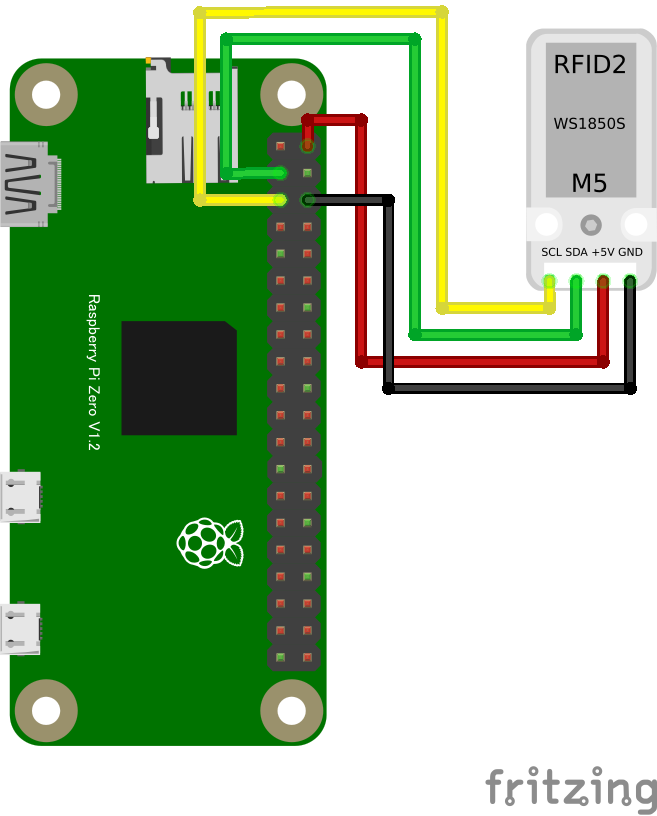

# リモートRFIDリーダー(WS1850S)

## 配線図

> [!WARNING]
> Node.js v20 では `WebSocket` が実験的機能としてデフォルト無効のため、Raspberry Pi Zero 側で `node main.js` を実行すると `nodeWebSocketClass and OriginURL are required.` というエラーで終了します。
> `node --experimental-websocket main.js` のようにフラグを付けて実行してください (v22 以降ではフラグ不要です)。

## 遠隔モニタ(PC/スマホブラウザ)側

[pc/index.html](https://codesandbox.io/s/github/chirimen-oh/chirimen.org/tree/master/pizero/src/esm-examples/remote_ws1850s/pc?module=pc.js)を起動します。

Note: RC522 のスレーブアドレスはデフォルト値（0x28）を使用しています。明示する場合は `new RC522(port, 0x28)` と書けます。カードをリーダーにかざすとUIDが検出され、ブラウザ側の表示が更新されます。
