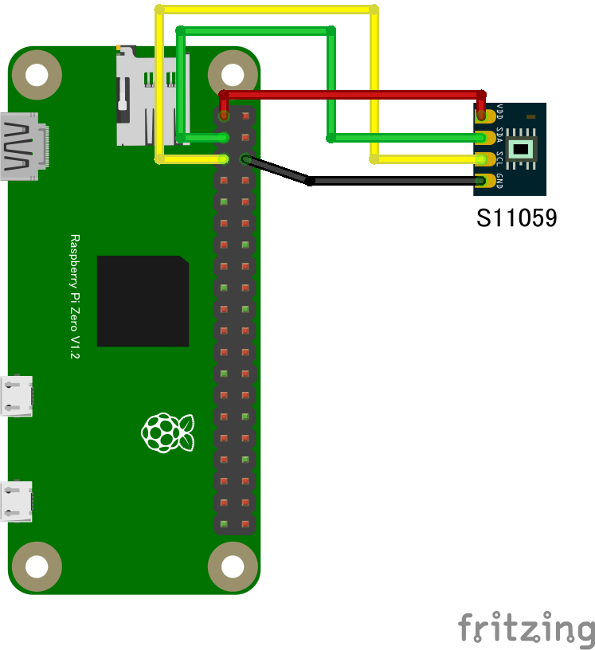

# S11059 デジタルカラーセンサー

## 配線図



## ドライバのインストール

```sh
npm i node-web-i2c @chirimen/s11059
```

## サンプルコード
同ディレクトリの [main.js](main.js) と同じ内容です。

```javascript
import { requestI2CAccess } from "node-web-i2c";
import S11059 from "@chirimen/s11059";
const sleep = (msec) => new Promise((resolve) => setTimeout(resolve, msec));

const i2cAccess = await requestI2CAccess();
const i2cPort = i2cAccess.ports.get(1);
const s11059 = new S11059(i2cPort, 0x2a);
await s11059.init();
while (true) {
  try {
    const values = await s11059.readR8G8B8();
    const red = values[0] & 0xff;
    const green = values[1] & 0xff;
    const blue = values[2] & 0xff;
    const gain_level = values[3];
    console.log(`R:${red} G:${green} B:${blue} GAIN: ${gain_level}`);
  } catch (error) {
    console.error("READ ERROR:" + error);
  }
  await sleep(1000);
}
```
