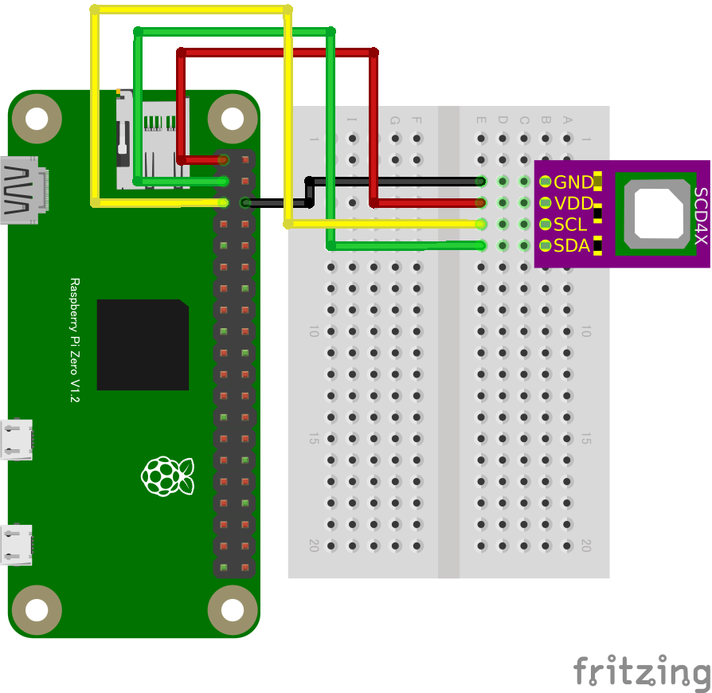

# SCD40 CO2センサー

## 配線図



## ドライバのインストール

```sh
npm i node-web-i2c @chirimen/scd40
```

## サンプルコード
同ディレクトリの [main.js](main.js) と同じ内容です。

```javascript
import { requestI2CAccess } from "node-web-i2c";
import SCD40 from "@chirimen/scd40";
const sleep = (msec) => new Promise((resolve) => setTimeout(resolve, msec));

const i2cAccess = await requestI2CAccess();
const i2cPort = i2cAccess.ports.get(1);
const scd40 = new SCD40(i2cPort, 0x62);
await scd40.init();
console.log(await scd40.serial_number());
await scd40.start_periodic_measurement();

// 値が出てくるまで数秒かかります
// 測定が更新されると、updatedフラグがtrueになります
while (true) {
		const data = await scd40.getData();
		console.log(data);
		await sleep(1000);
	}
```
