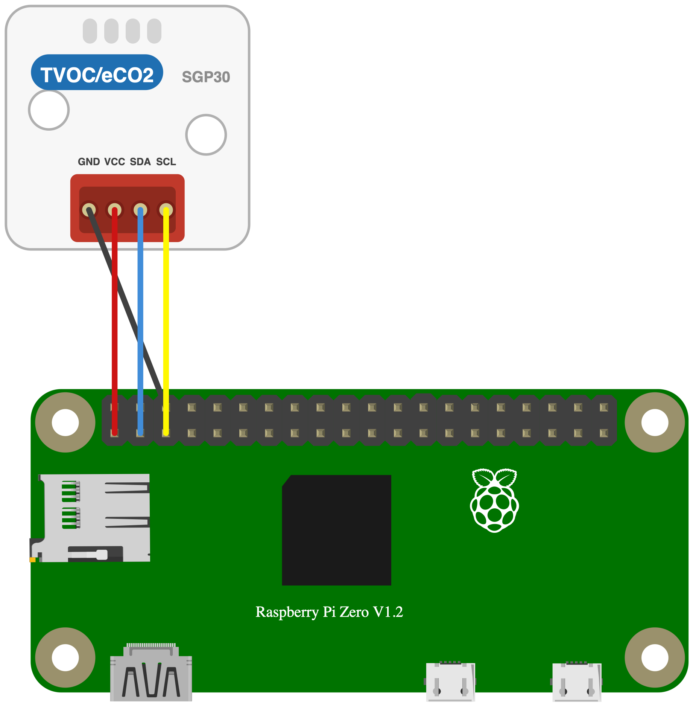

# SGP30 TVOC/eCO2ガスセンサ

## センサー仕様
- Sensirion製 室内空気品質センサー
- 測定項目：eCO2（CO2相当値、400〜60000 ppm）、TVOC（総揮発性有機化合物、0〜60000 ppb）、
  センサー素子の生信号（水素・エタノール）
- 電源：VCC 3.3 V で駆動する（動作確認に使用したM5Stack製ユニットは「5V」と表示されているが、
  下記の理由により3.3 Vを与える）
- I2Cアドレス：0x58（固定）
- 配線：GND・VCC（3.3 V）・SDA・SCL の4本をRaspberry PiのI2C端子に接続する
- **VCCに5Vを与えてはいけない。** ユニット基板上のレベルシフタ（BSS138）の高圧側プルアップが
  コネクタのVCCピンに接続されているため、I2Cのロジックレベルは与えた電圧に追従する。
  5Vを与えるとRaspberry PiのSDA/SCLに5Vが乗り、GPIOを破損させるおそれがある。
  SGP30チップ本体（1.62〜1.98 V）は基板上のLDO（RT9193-1.8V）から駆動されるため3.3 Vで問題ない
- init()直後の約15秒間は初期化フェーズで、eCO2 = 400 ppm / TVOC = 0 ppb の固定値が返る。
  この間センサーは測定していないため値を捨てる。生信号はベースライン補正を受けないため
  この期間も実際の値が返る（ただしヒーターの暖機中は値が動き続ける）
- read()は約1秒間隔で呼び続ける必要がある。動的ベースライン補正アルゴリズムがこの周期を
  前提にしており、間隔が乱れると補正が正しく働かない
- eCO2は本物のCO2濃度ではない。MOX（金属酸化物）方式ではCO2を直接検出できず、室内では
  CO2と他のガスが一緒に増えるという相関から推定した値である。換気の指標には使えるが
  CO2濃度計としては使えない。アルコールを近づけるとCO2が増えていないのに数千ppmを示す

## 配線図



## ドライバのインストール

```
npm i @chirimen/sgp30
```

## ファイル説明
- SGP30.fzpz  
M5Stack製 TVOC/eCO2ガスセンサユニット（SKU: U088）のパーツファイル  
対応APP：Fritzing

- SGP30.fzz  
配線図のファイル  
対応APP：Fritzing

- SGP30.svg  
配線図で使用しているセンサーユニットのベクター形式画像

## サンプルコード説明

I2Cアドレス0x58でインスタンスを作成  
アドレスは0x58固定のため、第2引数は省略してもよい
```
new SGP30(i2cPort, 0x58);
```

センサーの初期化  
Get feature set（0x202F）で製品タイプを確認し、SGP30でなければ例外を投げる。
配線ミスやI2Cアドレスの誤りをここで検出できる。そのあとInit air quality（0x2003）で
IAQアルゴリズムを開始する
```
await sgp30.init();
```

48bitのシリアル番号を12桁の小文字16進文字列で取得  
測定とは無関係で値そのものに意味はないが、配線とCRCが正しければ必ず同じ値が返るため
疎通確認に使える
```
await sgp30.readSerialNumber();
```

空気品質を測定し、結果をオブジェクトで取得  
eCO2（単位はppm）とtvoc（単位はppb）が得られる  
約1秒間隔で呼び続ける必要がある
```
await sgp30.read();
```

センサー素子の生信号を測定し、結果をオブジェクトで取得  
h2（水素）とethanol（エタノール）が得られる  
単位はティックで物理的な単位を持たない。**値の向きがread()とは逆で、ガス濃度が上がると
素子の抵抗が下がり数値も下がる。** read()の出力が上限に達しても生信号は動き続けるため、
強いガスイベントを扱う場合はこちらを使う
```
await sgp30.readRaw();
```

ベースライン補正アルゴリズムの内部状態を取得  
ppm/ppbではなく、setBaseline()に渡して復元するためだけの不透明な値である  
確立していない間は { eCO2: 0, tvoc: 0 } が返る
```
await sgp30.getBaseline();
```

保存しておいたベースラインを復元  
init()の後に呼ぶ必要がある。SGP30は電源を切るとベースラインの学習結果を失うため、
getBaseline()の値を保存しておいて起動時に書き戻すと学習をやり直さずに済む  
Sensirionのドライバー統合ガイドによれば、保存できるようになるまで12時間の連続運転が必要で、
保存値の有効期限は最大7日である。1週間以上前の値を渡してはいけない
```
await sgp30.setBaseline(eCO2, tvoc);
```

## 参考URL
- 本サンプルコードで使用しているドライバ  
[@chirimen/sgp30](https://www.jsdelivr.com/package/npm/@chirimen/sgp30)

- センサーの製品ページ  
https://www.switch-science.com/products/6619

- 参考元のドライバのコード  
https://github.com/adafruit/Adafruit_SGP30
