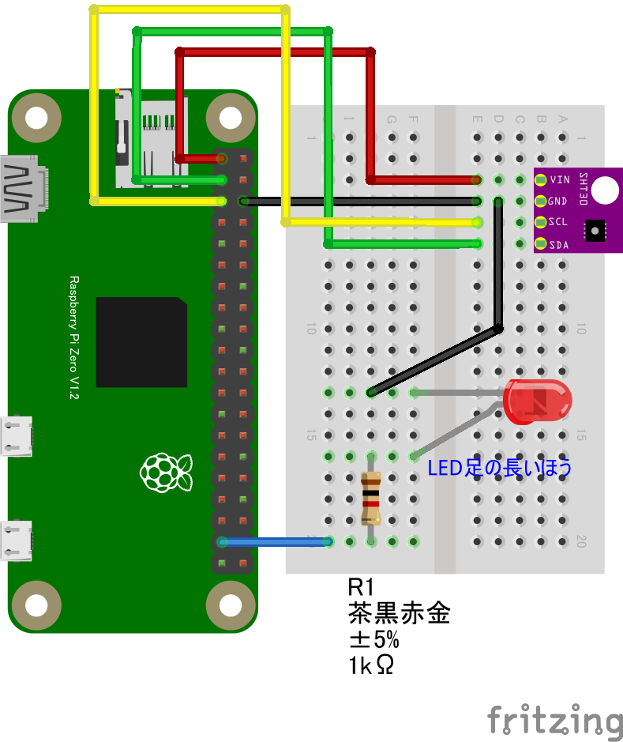
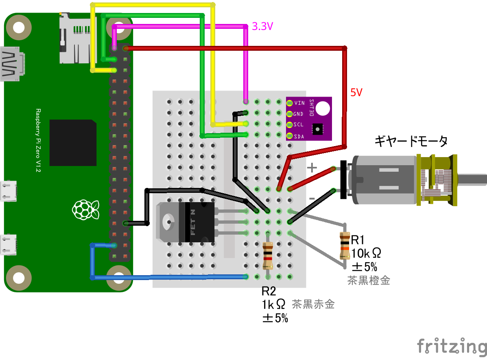

# SHT30 温湿度センサー + LED

## 配線図



LEDの代わりにモーターを接続


## ドライバのインストール

```sh
npm i node-web-gpio node-web-i2c @chirimen/sht30
```

## サンプルコード
同ディレクトリの [main.js](main.js) と同じ内容です。

```javascript
/* 各種ライブラリをインポート */
import { requestGPIOAccess } from "node-web-gpio";
import { requestI2CAccess } from "node-web-i2c";
import SHT30 from "@chirimen/sht30";

/* LED点灯制御 */
const gpioAccess = await requestGPIOAccess();
const gpioPort = gpioAccess.ports.get(26);
await gpioPort.export("out");

/* 温湿センサー制御 */
const i2cAccess = await requestI2CAccess();
const i2cPort = i2cAccess.ports.get(1);
const sht30 = new SHT30(i2cPort, 0x44);
await sht30.init();

/* 温湿センサーとLED制御の組み合わせ */
while (true) {
    const { temperature, humidity } = await sht30.readData();
    console.log(`${temperature.toFixed(2)}℃ ${humidity.toFixed(2)}％`);

    // 室温が28.0以上のときにLED発光
    if (temperature > 28.00) {
        await gpioPort.write(1);
    } else {
        await gpioPort.write(0);
    }
}
```
