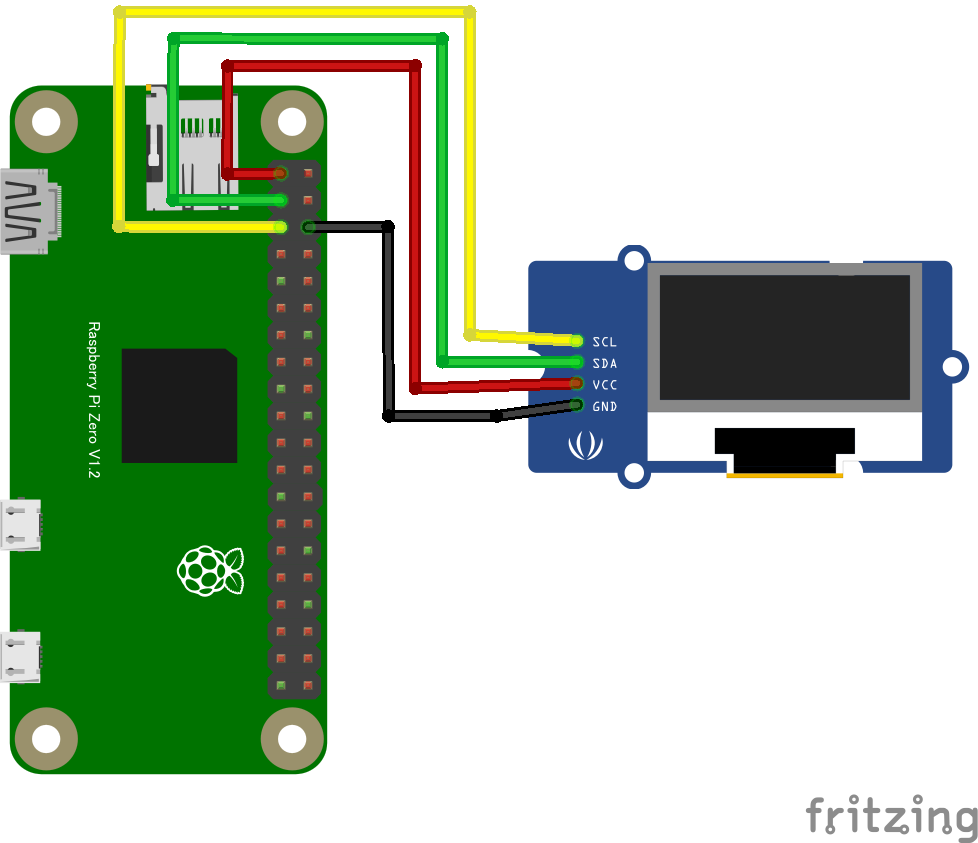

# SSD1308 Grove OLED ディスプレイ

## 配線図



## ドライバのインストール

```sh
npm i node-web-i2c @chirimen/grove-oled-display
```

## サンプルコード
同ディレクトリの [main.js](main.js) と同じ内容です。

```javascript
import { requestI2CAccess } from "node-web-i2c";
import OledDisplay from "@chirimen/grove-oled-display";

const i2cAccess = await requestI2CAccess();
console.log("initializing...");
const i2cPort = i2cAccess.ports.get(1);
const display = new OledDisplay(i2cPort);
await display.init(); // SSD1308の場合はパラメータ不要(SSD1306(grove-oled-display)の場合はtrueを設定)
display.clearDisplayQ();
await display.playSequence();
console.log("drawing text...");
display.drawStringQ(0, 0, "Hello");
display.drawStringQ(1, 0, "Real");
display.drawStringQ(2, 0, "World");
await display.playSequence();
console.log("completed");
```
