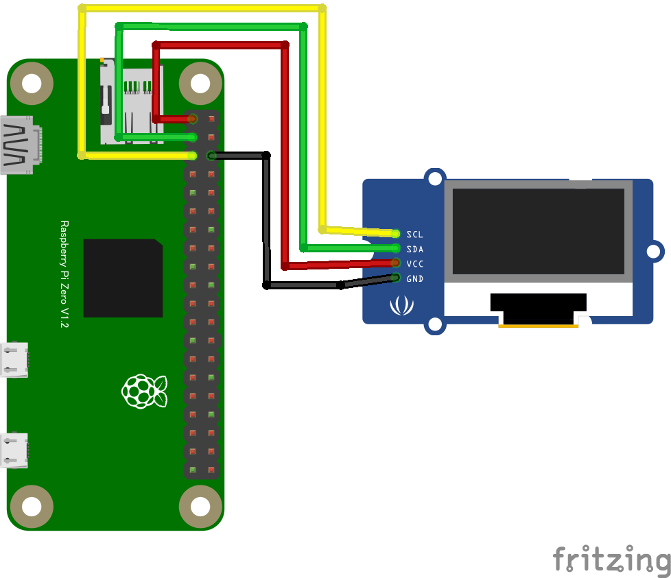

# SSD1308 Grove OLED ディスプレイ

## 配線図



# ドライバのインストール

```
npm i @chirimen/grove-oled-display
```

# サンプルコード

```javascript
const { requestI2CAccess } = require("node-web-i2c");
const OledDisplay = require("@chirimen/grove-oled-display");

main();

async function main() {
  const i2cAccess = await requestI2CAccess();
  console.log("initializing...");
  const port = i2cAccess.ports.get(1);
  const display = new OledDisplay(port);
  await display.init();
  display.clearDisplayQ();
  await display.playSequence();
  console.log("drawing text...");
  display.drawStringQ(0, 0, "Hello");
  display.drawStringQ(1, 0, "Real");
  display.drawStringQ(2, 0, "World");
  await display.playSequence();
  console.log("completed");
}
```

