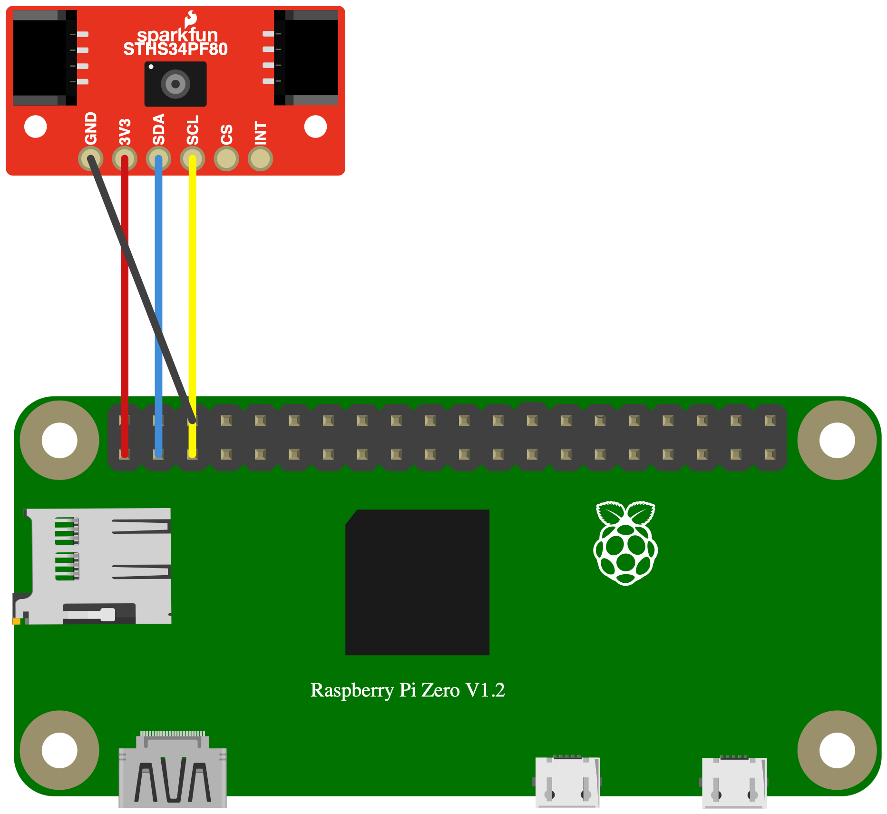

# STHS34PF80 赤外線温度センサ

STMicroelectronics製のSTHS34PF80を使用して、対象物の赤外線温度と周辺温度を取得するサンプルです。

## 配線図



## ドライバのインストール

```sh
npm i @chirimen/sths34pf80
```

## サンプルコード

```js
import { requestI2CAccess } from "node-web-i2c";

import STHS34PF80 from "@chirimen/sths34pf80";

const sleep = (ms) => new Promise((resolve) => setTimeout(resolve, ms));

const i2cAccess = await requestI2CAccess();

const i2cPort = i2cAccess.ports.get(1);

const sths34pf80 = new STHS34PF80(i2cPort, 0x5A);

await sths34pf80.init();

while (true) {
  const data = await sths34pf80.read();

  console.log(data);

  await sleep(1000);
}
```

## 実行結果

以下のように対象物の温度と周辺温度が表示されます。

```text
{
  objectTemperatureRaw: -318,
  objectTemperature: -0.159,
  ambientTemperatureRaw: 2650,
  ambientTemperature: 26.5
}
```

- `objectTemperatureRaw`: 対象物温度の生データ
- `objectTemperature`: 対象物温度（℃）
- `ambientTemperatureRaw`: 周辺温度の生データ
- `ambientTemperature`: 周辺温度（℃）
