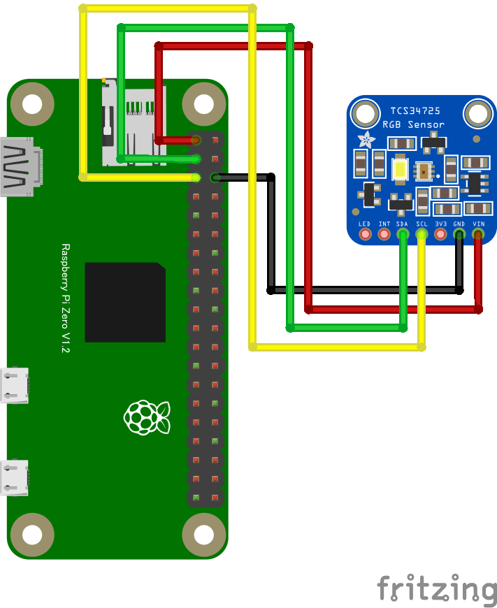

# TCS34725 カラーセンサー

## 配線図



## ドライバのインストール

```sh
npm i node-web-i2c @chirimen/tcs34725
```

## サンプルコード
同ディレクトリの [main.js](main.js) と同じ内容です。

```javascript
import { requestI2CAccess } from "node-web-i2c";
import TCS34725 from "@chirimen/tcs34725";
const sleep = (msec) => new Promise((resolve) => setTimeout(resolve, msec));

const i2cAccess = await requestI2CAccess();
const i2cPort = i2cAccess.ports.get(1);
const tcs34725 = new TCS34725(i2cPort, 0x29);
await tcs34725.init();

// You can select the value of gain from 1, 4, 16 or 60.
await tcs34725.gain(4);

while (true) {
  const data = await tcs34725.read();
  console.log(
    [
      `R: ${data.r}`,
      `G: ${data.g}`,
      `B: ${data.b}`,
      `Clear Light: ${data.c}`
    ].join(", ")
  );

  await sleep(500);
}
```
