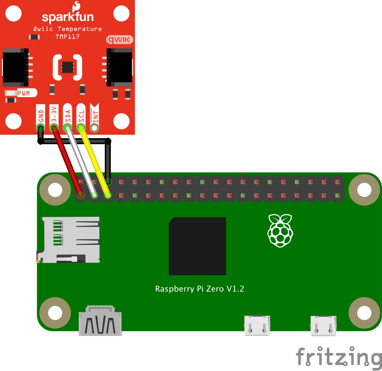

# TMP117 温度センサー

TI製 TMP117 高精度温度センサーを使ったサンプルです。

## 配線図

| TMP117 | Raspberry Pi |
|---|---|
| GND | GND |
| 3.3V | 3.3V |
| SDA | SDA |
| SCL | SCL |

## センサー情報

- 製品ページ: https://www.switch-science.com/products/5963
- データシート: https://www.ti.com/lit/ds/symlink/tmp117.pdf
- I2C スレーブアドレス: 0x48(デフォルト)

## ドライバのインストール方法

npm install node-web-i2c @chirimen/tmp117

## 実行方法

cd ~/myApp
node main.js

停止は `Ctrl+C` です。

## サンプルコードの解説

import { requestI2CAccess } from "node-web-i2c";
import TMP117 from "@chirimen/tmp117";

const i2cAccess = await requestI2CAccess();
const i2cPort = i2cAccess.ports.get(1);
const tmp117 = new TMP117(i2cPort, 0x48);
await tmp117.init();

while (true) {
  const data = await tmp117.read();
  console.log(`${data.temperature} degree`);
  await sleep(1000);
}

1秒ごとに温度を取得し、コンソールに表示します。
