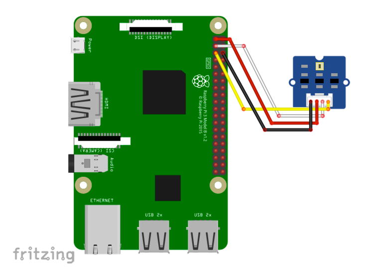

# TSL2561 Grove Digital Light Sensor 光センサー

## 配線図



## ドライバのインストール

```sh
npm i node-web-i2c @chirimen/grove-light
```

## サンプルコード
同ディレクトリの [main.js](main.js) と同じ内容です。

```javascript
import { requestI2CAccess } from "node-web-i2c";
import GROVELIGHT from "@chirimen/grove-light";
const sleep = (msec) => new Promise((resolve) => setTimeout(resolve, msec));

const i2cAccess = await requestI2CAccess();
const i2cPort = i2cAccess.ports.get(1);
const grovelight = new GROVELIGHT(i2cPort, 0x29);
await grovelight.init();
while (true) {
  try {
    const value = await grovelight.read();
    console.log(value);
  } catch (error) {
    console.error(" Error : ", error);
  }
  await sleep(200);
}
```
