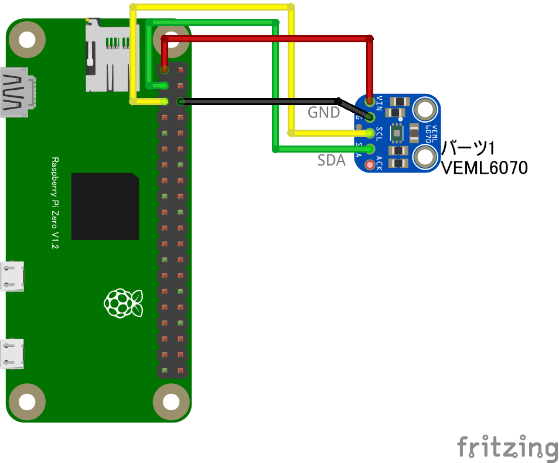

# VEML6070 UV センサー

## 配線図



## ドライバのインストール

```sh
npm i node-web-i2c @chirimen/veml6070
```

## サンプルコード
同ディレクトリの [main.js](main.js) と同じ内容です。

```javascript
import { requestI2CAccess } from "node-web-i2c";
import VEML6070 from "@chirimen/veml6070";
const sleep = (msec) => new Promise((resolve) => setTimeout(resolve, msec));

const i2cAccess = await requestI2CAccess();
const i2cPort = i2cAccess.ports.get(1);
const veml6070 = new VEML6070(i2cPort);
await veml6070.init();
while (true) {
  const value = await veml6070.read();
  console.log(value);
  await sleep(200);
}
```
