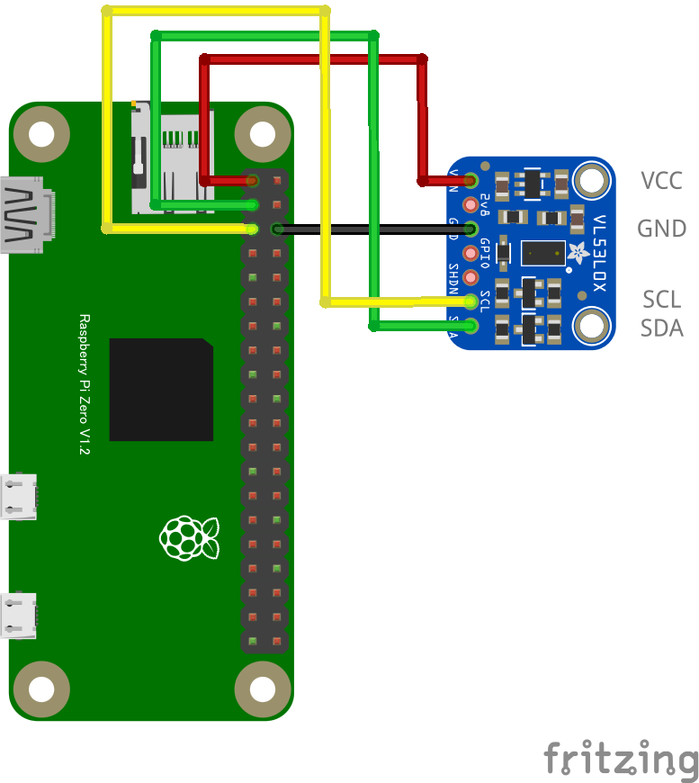

# VL53L0X レーザー測距センサー 30 mm - 2 m

## 配線図



## ドライバのインストール

```sh
npm i node-web-i2c @chirimen/vl53l0x
```

## サンプルコード
同ディレクトリの [main.js](main.js) と同じ内容です。

```javascript
import { requestI2CAccess } from "node-web-i2c";
import VL53L0X from "@chirimen/vl53l0x";
const sleep = (msec) => new Promise((resolve) => setTimeout(resolve, msec));

const i2cAccess = await requestI2CAccess();
const i2cPort = i2cAccess.ports.get(1);
const vl = new VL53L0X(i2cPort, 0x29);
await vl.init(); // for Long Range Mode (<2m) : await vl.init(true);
while (true) {
  const distance = await vl.getRange();
  console.log(`${distance} [mm]`);
  await sleep(500);
}
```
