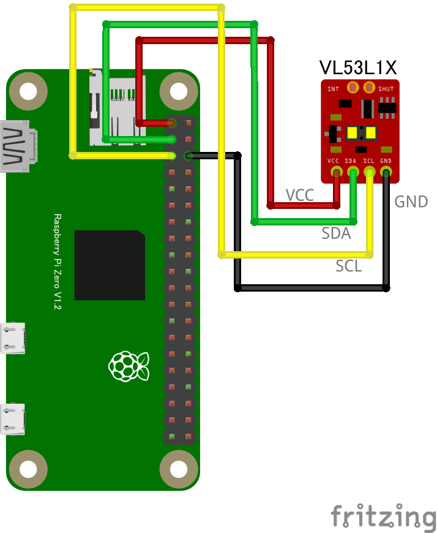

# VL53L1X レーザー距離センサー

## 配線図



## ドライバのインストール

```sh
npm i node-web-i2c @chirimen/vl53l1x
```

## サンプルコード
同ディレクトリの [main.js](main.js) と同じ内容です。

```javascript
import { requestI2CAccess } from "node-web-i2c";
import VL53L1X from "@chirimen/vl53l1x";
const sleep = (msec) => new Promise((resolve) => setTimeout(resolve, msec));

const i2cAccess = await requestI2CAccess();
const i2cPort = i2cAccess.ports.get(1);
const vl53l1x = new VL53L1X(i2cPort, 0x29);

// Mode: short, medium, long
await vl53l1x.init("short");

// Necessary to start measurement
await vl53l1x.startContinuous();

while (true) {
  const distance = await vl53l1x.read();
  console.log(distance.toFixed(2) + " mm");
  await sleep(500);
}
```
