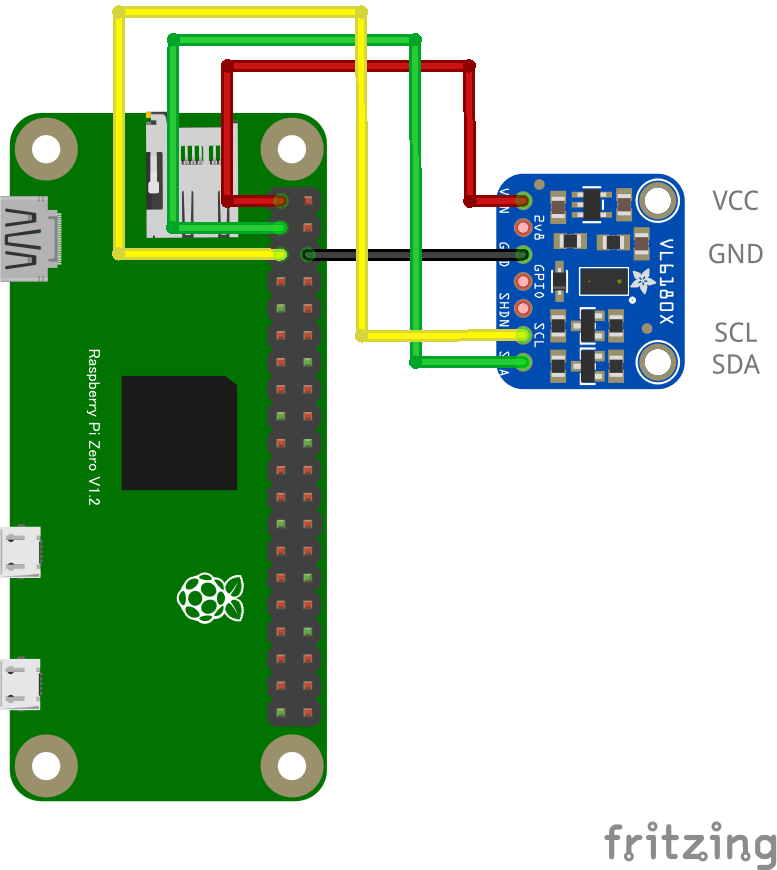

# VL6180X レーザー測距センサー 0 mm - 255 mm

## 配線図



## ドライバのインストール

```sh
npm i node-web-i2c @chirimen/vl6180x
```

## サンプルコード
同ディレクトリの [main.js](main.js) と同じ内容です。

```javascript
import { requestI2CAccess } from "node-web-i2c";

// vl6180x.js から VL6180Xをインポート
import VL6180X from "@chirimen/vl6180x";
const sleep = (msec) => new Promise((resolve) => setTimeout(resolve, msec));
// メインの処理を実行する非同期関数

// メイン関数を実行

// WebI2Cサービスを取得
const i2cAccess = await requestI2CAccess();
const i2cPort = i2cAccess.ports.get(1);

// VL6180Xインスタンスを初期化
const vl6180x = new VL6180X(i2cPort);
await vl6180x.init();

// 永久ループ
while (true) {
		console.log("--next loop--");

		const l = await vl6180x.getRange();
		console.log(l, "mm");
		await sleep(500);
	}
```
