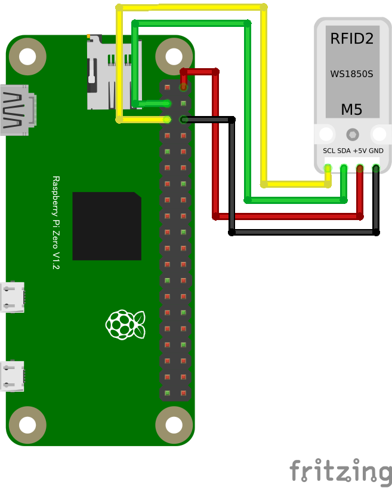

# RFID2 WS1850S (RC522) RFIDリーダ

## 配線図



## ドライバのインストール

```sh
npm i node-web-i2c @chirimen/rc522_ws1850s
```

## サンプルコード
同ディレクトリの [main.js](main.js) と同じ内容です。

```javascript
import { requestI2CAccess } from "node-web-i2c";
import RC522 from "@chirimen/rc522_ws1850s";
const sleep = (msec) => new Promise((resolve) => setTimeout(resolve, msec));

const i2cAccess = await requestI2CAccess();
const i2cPort = i2cAccess.ports.get(1);
const rc522 = new RC522(i2cPort);
await rc522.init();
while (true) {
  try {
    // カードがリーダー上にあるかを確認
    const isNewCard = await rc522.PICC_IsNewCardPresent();
    if (isNewCard) {
      const uid = await rc522.PICC_ReadCardSerial();
      console.log(uid);
      const stat = await rc522.PICC_HaltA();
      console.log(stat);
    }
  } catch (error) {
    console.error("READ ERROR:" + error);
  }
  await sleep(1000);
}
```

Note: RC522 のスレーブアドレスはデフォルト値（0x28）を使用しています。明示する場合は `new RC522(port, 0x28)` と書けます。
