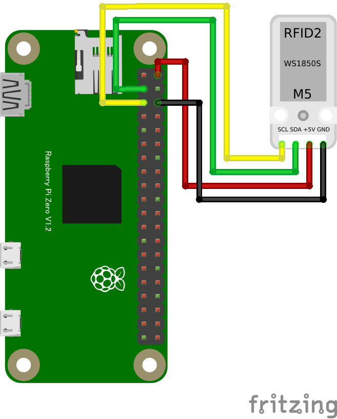

# RFID2 WS1850S (RC522) RFIDリーダ

## 配線図



# ドライバのインストール

```
npm i @chirimen/rc522_ws1850s
```

# サンプルコード

```javascript
const { requestI2CAccess } = require("node-web-i2c");
const RC522 = require("@chirimen/rc522_ws1850s");
const { promisify } = require("util");
const sleep = promisify(setTimeout)


main();

async function main() {
  const i2cAccess = await requestI2CAccess();
  const port = i2cAccess.ports.get(1);
  const rc522 = new RC522(port, 0x28);
  await rc522.init();
  for (;;) {
    try {
      const isNewCard = await rc522.PICC_IsNewCardPresent();
      if (isNewCard) {
        console.log("Card detected!");
        const uid = await rc522.PICC_ReadCardSerial();
        console.log(uid);
        var stat = await rc522.PICC_HaltA();
      }
    } catch (error) {
      console.error("READ ERROR:" + error);
    }
    await sleep(1000);
  }
}
```

