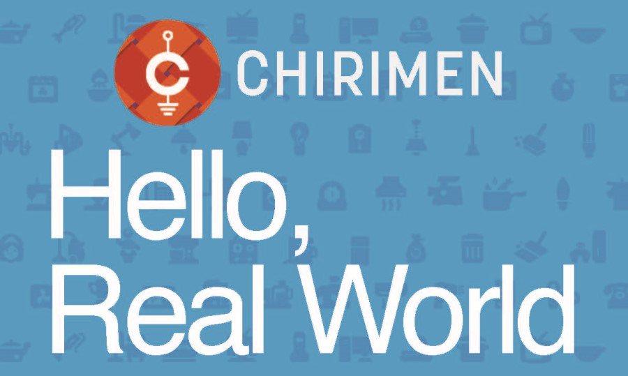

# CHIRIMEN チュートリアル概要

CHIRIMEN Raspberry Pi Zero 版を用いたIoT実習資料です。

開発環境には Raspberry Pi Zero W を、開発言語には JavaScript を使い、センサーやアクチュエーターを制御しながらIoTプロトタイピングを行います。

CHIRIMEN、Raspberry Pi、JavaScript について、この概要で解説します。

既に CHIRIMEN を使い慣れている方に向けた情報リンク集も掲載します。

## 目次

{{#include SUMMARY.md}}
