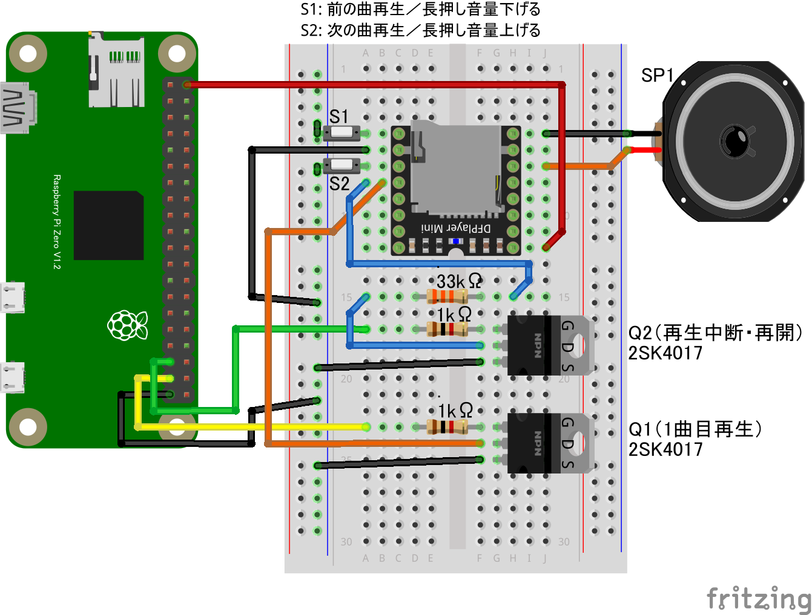

# DFPlayer Mini(MP3プレーヤーボードをGPIO OUTPUTで制御)

## 配線図



* DFPlayer MiniボードのADKEY1端子をNchMOSFETを介してGPIOで制御します
(他にシリアル通信での制御も可能なボードですがこのサンプルはGPIOで制御できるADKEY端子を使用)
* 電源投入後、ボリュームが最大になるのでS1スイッチは付けておきましょう
* ADKEY1/2端子と抵抗を組み合わせることでいろいろなコントロールが可能です。GPIO端子の使用数を増やすと制御できる種類も増やせます。[こちらのページ](https://chitakekoubou.blogspot.com/p/dfplayeradkeyio.html)や、[メーカーサイトの説明ページ](https://wiki.dfrobot.com/DFPlayer_Mini_SKU_DFR0299)を参考に

## サンプルコード (main.js)

```javascript
import { requestGPIOAccess } from "./node_modules/node-web-gpio/dist/index.js";
const sleep = msec => new Promise(resolve => setTimeout(resolve, msec));

let play1port;
let pauseport;

async function start_play() {
    const gpioAccess = await requestGPIOAccess();
    play1port = gpioAccess.ports.get(26); // 
    pauseport = gpioAccess.ports.get(19);

    await play1port.export("out");
    await pauseport.export("out");

    await repeat_play();
}

async function repeat_play() {
    while (true) {
        // 1曲目を再生開始
        console.log("start play1")
        await play1port.write(1);
        await sleep(300); // 0.3秒保持して元に戻す
        await play1port.write(0);

        // 10秒保持
        await sleep(10 * 1000);

        // 一時停止
        console.log("stop")
        await pauseport.write(1);
        await sleep(300);
        await pauseport.write(0);

        //  3秒間一時停止
        await sleep(3 * 1000);
    }
}

start_play();
```


---
[← 目次に戻る](../index.md)
