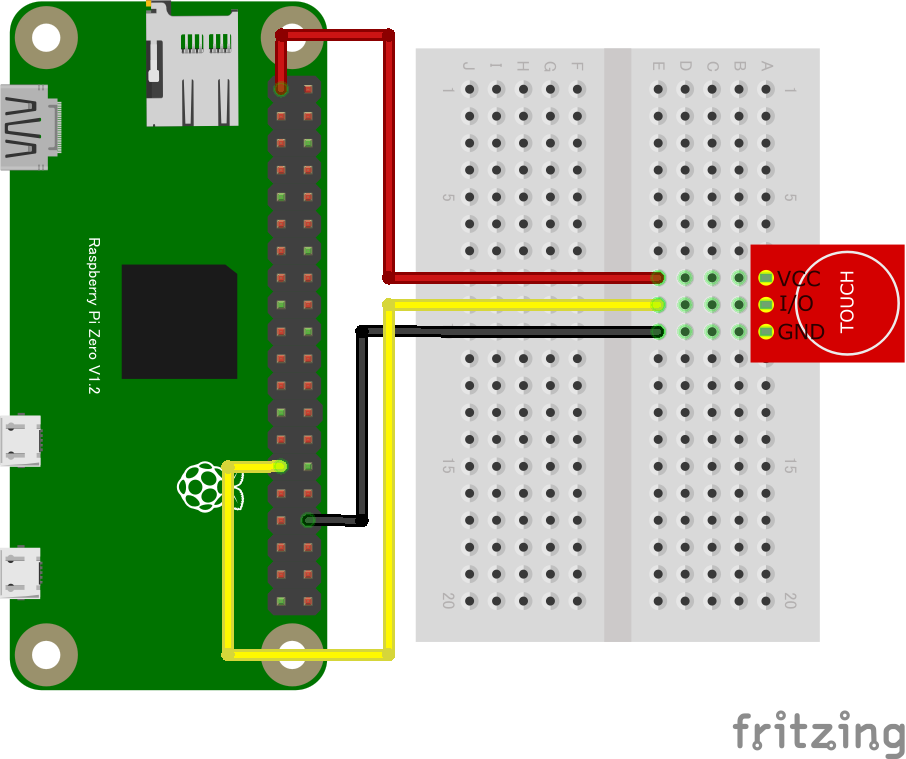

# gpio-onchange
# GPIOスイッチ (GPIO INPUT)

## 配線図

GPIO PORT5に繋ぎます


# GPIOタッチセンサー
TP223を用いたタッチセンサー(タッチスイッチ)を使います。プログラムコードは通常のスイッチと同じです。
## 配線図

GPIO PORT5に繋ぎます。3.3V電源を用います。指でのタッチだけでなく金属の近接も感知(1~2mmに接近すると検知)。なお、接近させる金属がセンサーのピンに接触してショートしないようテープで金属を被覆し絶縁しておくと安全です。



## サンプルコード (main.js)

```javascript
import {requestGPIOAccess} from "./node_modules/node-web-gpio/dist/index.js";
const sleep = msec => new Promise(resolve => setTimeout(resolve, msec));

async function switchCheck() {
  const gpioAccess = await requestGPIOAccess();
  const port = gpioAccess.ports.get(5);

  await port.export("in");
  port.onchange = showPort;

}

function showPort(ev){
	console.log(ev.value);
}

switchCheck();
```


---
[← 目次に戻る](../index.md)
