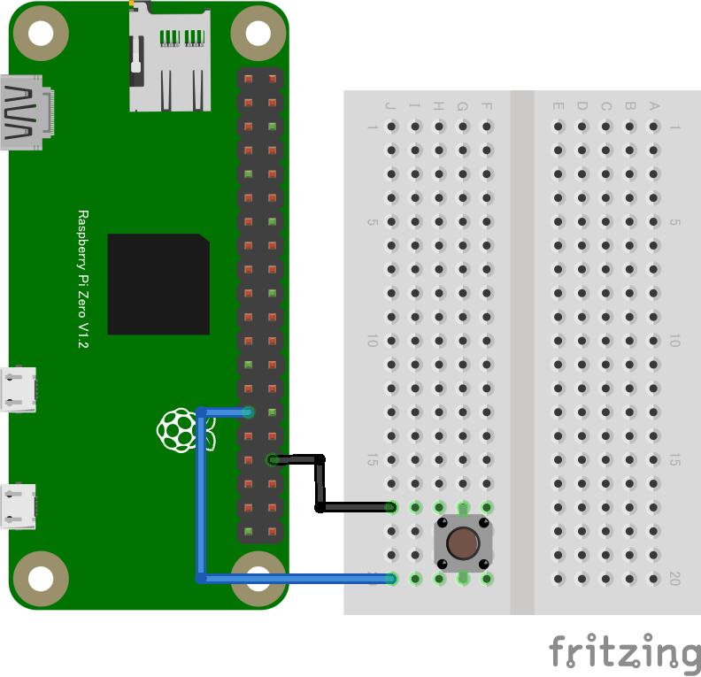

# gpio-polling
# GPIOスイッチ2 (GPIO POLLING INPUT)

## 配線図



GPIO PORT5に繋ぎます

## サンプルコード (main.js)

```javascript
import {requestGPIOAccess} from "./node_modules/node-web-gpio/dist/index.js";
const sleep = msec => new Promise(resolve => setTimeout(resolve, msec));

async function switchCheck() {
  const gpioAccess = await requestGPIOAccess();
  const port = gpioAccess.ports.get(5);

  await port.export("in");

  for(;;){
    const v = await port.read();
	console.log(v);
    await sleep(300);
  }

}

switchCheck();
```


---
[← 目次に戻る](../index.md)
