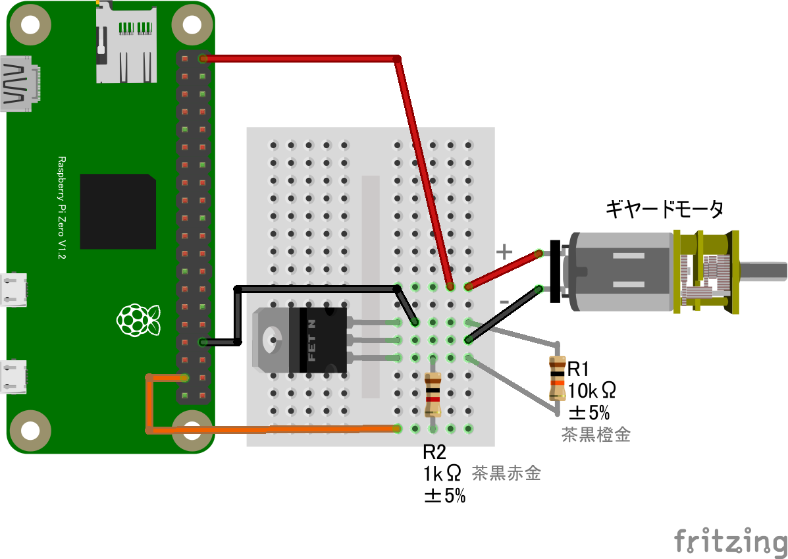
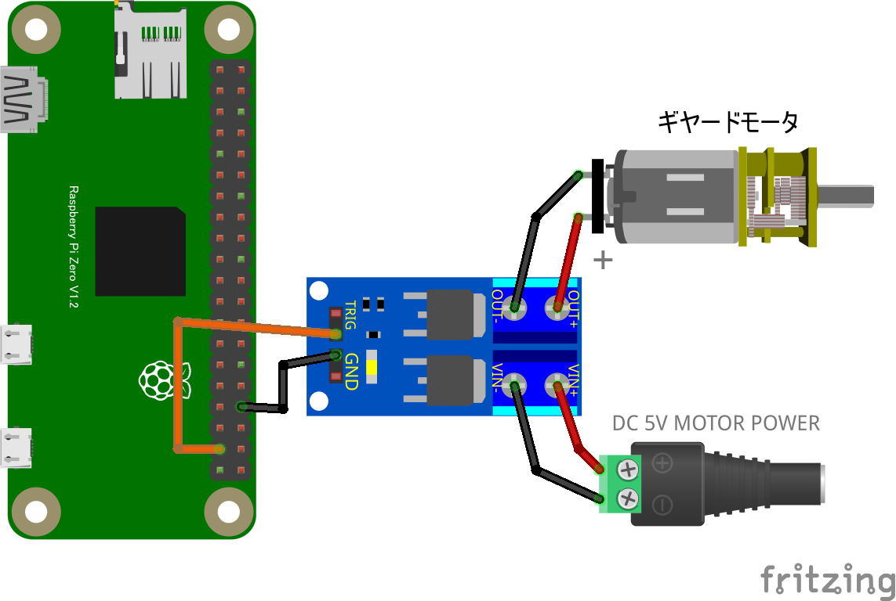
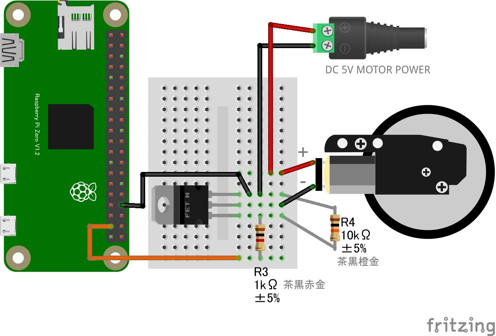

# hello-real-world
# Lチカ (GPIO OUTPUT)

## 配線図


GPIO PORT26にLED+抵抗を繋ぎます

# ギヤードモーター (GPIO OUTPUT)

## 配線図



GPIO PORT26にモーター制御回路を繋ぎます。コードはLチカと共通です

## 外部電源を使用する場合　

5V以外のDC電源も使用可能です。

## MOSFETモジュール基板を使用する場合
### P718Dモジュール

D4184モジュール

5V以外のDC電源も使用可能です。

# ギヤードモータ(その２)




## サンプルコード (main.js)

```javascript
import {requestGPIOAccess} from "./node_modules/node-web-gpio/dist/index.js";
const sleep = msec => new Promise(resolve => setTimeout(resolve, msec));

async function blink() {
  const gpioAccess = await requestGPIOAccess();
  const port = gpioAccess.ports.get(26);

  await port.export("out");

  for (;;) {
    await port.write(1);
    await sleep(1000);
    await port.write(0);
    await sleep(1000);
  }
}

blink();
```


---
[← 目次に戻る](../index.md)
