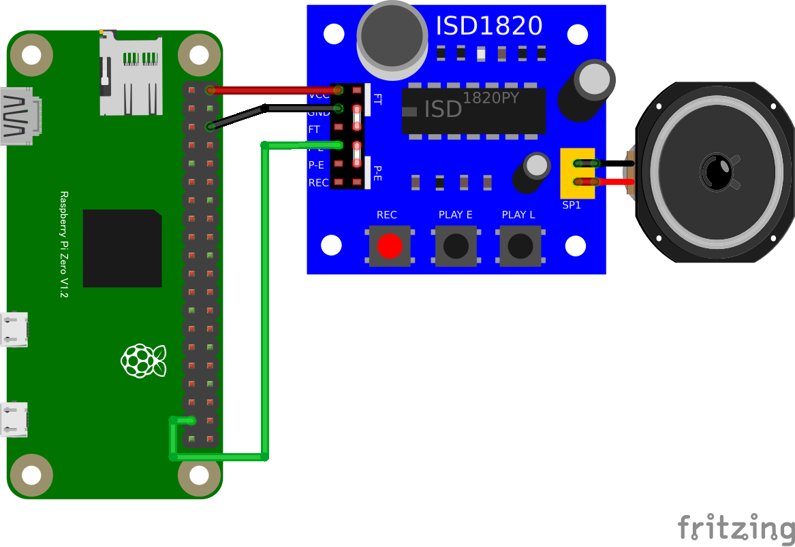

# isd1820
# ISD1820ボイスレコーダ (GPIO OUTPUT)

## 配線図



* GPIO PORT26をISD1820のP-L端子に繋ぎます(P-L端子がHighになっている間だけ再生します(PLAY Lボタンと同じ動作))
* P-E端子に繋いだ場合、録音した内容を全部再生するようになります。(PLAY Eボタンと同じ動作)
* 録音はRECボタンを押している間録音できます(最大10秒)
* REC端子をGPIOに接続すると、録音をコンピュータで制御することもできます。(REC端子がHighになっている間だけ録音)

## サンプルコード (main.js)

```javascript
import {requestGPIOAccess} from "./node_modules/node-web-gpio/dist/index.js";
const sleep = msec => new Promise(resolve => setTimeout(resolve, msec));

async function blink() {
  const gpioAccess = await requestGPIOAccess();
  const port = gpioAccess.ports.get(26);

  await port.export("out");

  for (;;) {
    await port.write(1);
    await sleep(3000); // 3秒間再生
    await port.write(0);
    await sleep(1000); // 1秒間停止
  }
}

blink();
```


---
[← 目次に戻る](../index.md)
