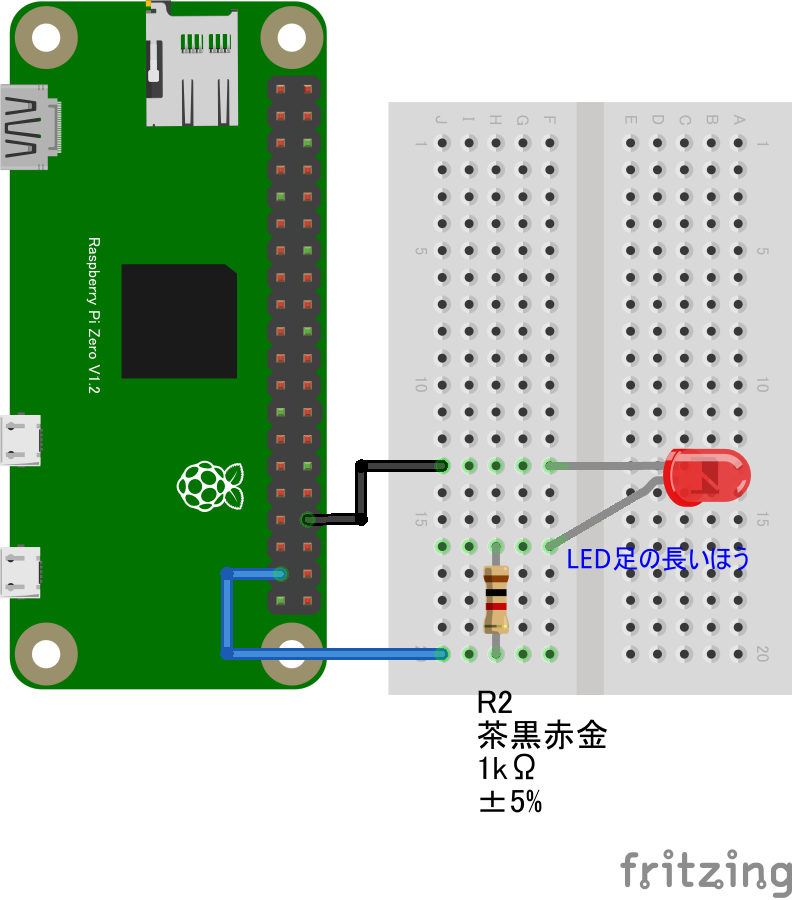

# リモートLチカ

## 配線図



GPIO PORT26に繋ぎます

## 遠隔コントロール(PC/スマホブラウザ)側

[pc/index.html](https://codesandbox.io/s/github/chirimen-oh/chirimen.org/tree/master/pizero/src/esm-examples/remote_gpio_led/pc?module=pc.js)を起動します。

## サンプルコード (main.js)

```javascript
// Remote Example1 - reciever
// for CHIRIMEN with nodejs

import {requestGPIOAccess} from "./node_modules/node-web-gpio/dist/index.js";
const sleep = msec => new Promise(resolve => setTimeout(resolve, msec));
import nodeWebSocketLib from "websocket"; // https://www.npmjs.com/package/websocket
import {RelayServer} from "./RelayServer.js";

var channel;
var gpioPort0;

async function connect(){
	// GPIOポート0の初期化
	var gpioAccess = await requestGPIOAccess();
	var mbGpioPorts = gpioAccess.ports;
	gpioPort0 = mbGpioPorts.get(26);
	await gpioPort0.export("out"); //port0 out
	
	// webSocketリレーの初期化
	var relay = RelayServer("chirimentest", "chirimenSocket" , nodeWebSocketLib, "https://chirimen.org");
	channel = await relay.subscribe("chirimenLED");
	console.log("web socketリレーサービスに接続しました");
	channel.onmessage = controlLED;
}

function controlLED(messge){
	console.log(messge.data);
	if ( messge.data =="LED ON"){
		gpioPort0.write(1);
		console.log("ON");
		channel.send("LEDをオンにしました");
	} else if ( messge.data =="LED OFF"){
		gpioPort0.write(0);
		console.log("OFF");
		channel.send("LEDをオフにしました");
	}
}

connect();
```


---
[← 目次に戻る](../index.md)
