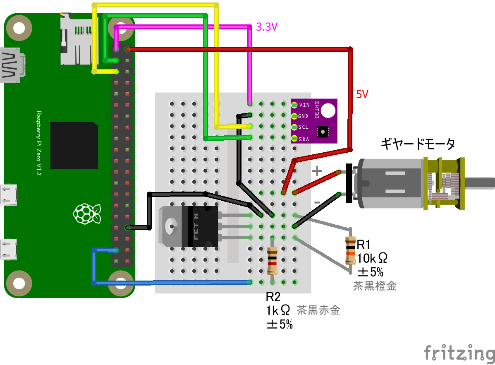

# sht30_led
# SHT30 温湿度センサー + LED

## 配線図


LEDの代わりにモーターを接続


## サンプルコード (main.js)

```javascript
/* 各種ライブラリをインポート */
import { requestGPIOAccess } from "./node_modules/node-web-gpio/dist/index.js"; // WebGPIO 
import { requestI2CAccess } from "./node_modules/node-web-i2c/index.js"; // WebI2C
import SHT30 from "@chirimen/sht30"; // SHT30

main();

async function main() {
    /* LED点灯制御 */
    const gpioAccess = await requestGPIOAccess(); // GPIOを操作
    const gpioPort = gpioAccess.ports.get(26); // 26番ポートを操作
    await gpioPort.export("out"); // ポートを出力モードに設定

    /* 温湿センサー制御 */
    const i2cAccess = await requestI2CAccess();
    const ic2Port = i2cAccess.ports.get(1);
    const sht30 = new SHT30(ic2Port, 0x44);
    await sht30.init();

    /* 温湿センサーとLED制御の組み合わせ */
    while (true) {
        // 室温取得
        const { temperature, humidity } = await sht30.readData();
        console.log(`${temperature.toFixed(2)}℃ ${humidity.toFixed(2)}％`);

        // 室温が28.0以上のときにLED発光
        if (temperature > 28.00) {
            await gpioPort.write(1);
        } else {
            await gpioPort.write(0);
        }
    }
}
```


---
[← 目次に戻る](../index.md)
