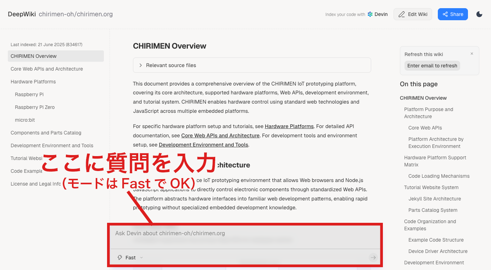

# AIアシスタントを活用する

CHIRIMENの使い方やコードについてわからないことがあれば、AIアシスタントに質問できます。

このアシスタントはCHIRIMENの公式ドキュメントやリポジトリ内のコードを直接参照しながら回答するため、CHIRIMENに特化した的確な回答を返してくれます。

👉 [CHIRIMENアシスタントに質問する](https://deepwiki.com/chirimen-oh/chirimen-deepwiki)

リンクを開いて質問するだけです。登録は不要です。

**質問例**

  - 「LEDを3回点滅させるコードを書いて」
  - 「SHT30で温度を取得するコードを書いて」
  - 「このエラーの意味を教えて：（エラーメッセージをここに貼り付ける）」

## より的確な回答を引き出すためのコツ

質問する際は、以下のポイントを意識するとよりスムーズに開発が進みます。

1.  **使いたいパーツの型番を正確に伝える**

    漠然と「温度センサー」と聞くよりも、手元にある部品の型番を伝えることで、そのデバイス用のアドレスや設定を含んだコードが返ってきます。

      * **良い質問:** 「**BME280**から温度と湿度を取得して、コンソールに表示するコードを書いて」

2.  **既存のサンプルコードをベースにアレンジをお願いする**

    チュートリアルにあるコードを自分なりに改造したいときにも便利です。

      * **良い質問:** 「チュートリアルの **`hello.js` (Lチカのコード)** を元にして、ボタンを押している間だけLEDが光るように書き換えて」

3.  **実現したい動作の「条件」を具体的にする**

    AIにお願いする時は、イメージを伝えるよりも「数値」や「条件」を明確にした方が、思い通りのコードが生成されやすくなります。

      * **良い質問:** 「取得した温度が30度を超えたら、コンソールに警告を出しつつ、GPIO 26に繋いだブザーを1秒間鳴らす処理を追加して」

## ⚠️ AIを利用する上での注意点

AIは非常に強力なサポートツールですが、完璧ではありません。うまく活用するために以下の2点に気をつけてください。

1. **AIの回答が常に正しいとは限らない**

    AIは時折、存在しないコードを提案したり、間違った使い方を教えたりすることがあります。「指示通りにやったのに動かないな」と思ったら、AIの回答を鵜呑みにせず、CHIRIMENの公式チュートリアルやドキュメントを確認してみましょう。

2. **ハードウェアの接続は自分の目で確認する**

    AIはコードを書くのは得意ですが、手元の物理的な配線を見ることはできません。GPIOのピン番号（どこに挿すか）や、センサーの電源（3.3Vか5Vか）といったハードウェアに関わる部分は、AIの回答だけを頼りにせず、必ずCHIRIMENのピンアウト図や部品の仕様書を確認してください。

