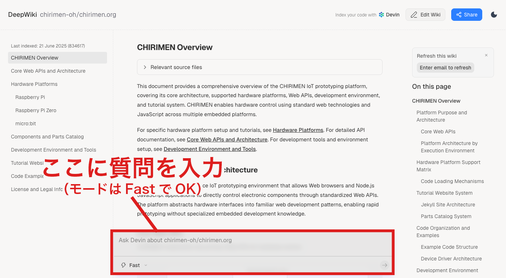

# AIアシスタントを活用する

コードの意味がわからない、あるいはエラーの原因がつかめない。
そんなとき、公式ドキュメントを一から読み返すのは手間がかかります。
CHIRIMENでは、そうした場面で質問できるAIアシスタント（DeepWiki）を用意しています。

## DeepWikiとは？

DeepWiki は、GitHubリポジトリに特化したAI Q&Aプラットフォームです。
提供元は、自律型AIソフトウェアエンジニア「Devin」の開発で知られる Cognition Labs 社です。

ふつうのAIチャットに同じ質問をしても、学習時点の知識にもとづいたそれらしい答えが返ってくるだけで、実際のリポジトリの中身までは踏まえていないことがあります。
DeepWiki が採用しているのは、質問のたびにCHIRIMENの公式リポジトリ内のソースコードやドキュメントを検索し、その内容をもとに回答を生成する「合成知識ベース (Synthetic Knowledge Base)」、いわゆる「LLM Wiki」と呼ばれる仕組みです。
この仕組みのおかげで、WebI2CやWebGPIOといったCHIRIMEN固有のライブラリやサンプルコードに基づいた、的確な回答が返ってきます。

## 質問方法

使い方はシンプルです。
リンクを開き、日本語で質問を書き込むだけです。
公開リポジトリ向けに提供されているオープンな機能のため、アカウント登録は不要で、誰でも無料で利用できます。

👉 [CHIRIMENアシスタントに質問する](https://deepwiki.com/chirimen-oh/chirimen-deepwiki)

### 質問例

- 「LEDを3回点滅させるコードを書いて」
- 「SHT30で温度を取得するコードを書いて」
- 「このエラーの意味を教えて：（エラーメッセージをここに貼り付ける）」

※質問は日本語で構いません。

## より的確な回答を引き出すためのコツ

質問のしかたひとつで、返ってくるコードの精度は変わります。
次の3点を意識すると、開発がスムーズに進みます。

### 1. 前提条件の具体化: 使いたいパーツの型番を正確に伝える

漠然と「温度センサー」と聞くよりも、手元にある部品の型番を伝えることで、そのデバイス用のアドレスや設定を含んだコードが返ってきます。

- **良い質問:** 「**BME280**から温度と湿度を取得して、コンソールに表示するコードを書いて」

### 2. 実現したい動作の具体化

AIにお願いする時は、イメージを伝えるよりも「数値」や「条件」を明確にした方が、思い通りのコードが生成されやすくなります。

**良い質問:** 「取得した温度が30度を超えたら、コンソールに警告を出しつつ、GPIO 26に繋いだブザーを1秒間鳴らす処理を追加して」

### 3. 既存のサンプルコードをベースにアレンジ

チュートリアルにあるコードを自分なりに改造したいときにも便利です。

**良い質問:** 「チュートリアルの **`hello.js` (Lチカのコード)** を元にして、ボタンを押している間だけLEDが光るように書き換えて」

## ⚠️ AIを利用する上での注意点

AIは強力なサポートツールですが、万能ではありません。
うまく活用するには、次の2点を心に留めておく必要があります。

### 1. AIの回答が常に正しいとは限らない

AIは時折、存在しないコードを提案したり、間違った使い方を教えたりすることがあります。「指示通りにやったのに動かないな」と思ったら、AIの回答を鵜呑みにせず、CHIRIMENの公式チュートリアルやドキュメントを確認してみましょう。

### 2. ハードウェアの接続は自分の目で確認する

AIはコードを書くのは得意ですが、手元の物理的な配線を見ることはできません。GPIOのピン番号（どこに挿すか）や、センサーの電源（3.3Vか5Vか）といったハードウェアに関わる部分は、AIの回答だけを頼りにせず、必ずCHIRIMENのピンアウト図や部品の仕様書を確認してください。

