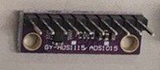
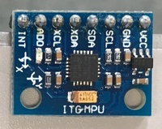
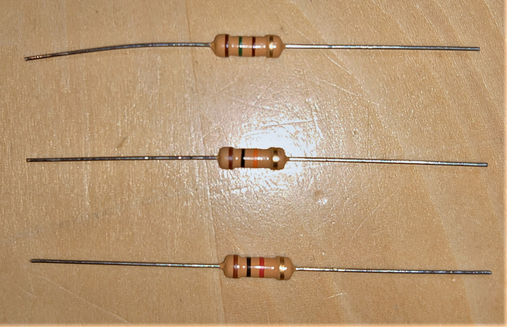
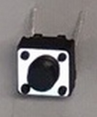
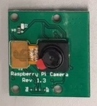

# CHIRIMEN for Raspberry Pi 対応デバイス / パーツ リスト

## I2C センサー
|部品型番/カテゴリ|説明|画像|各種リンク|
|-|-|-|-|
|[ADS1015](https://www.switch-science.com/catalog/1136/) ADC(アナログ電圧測定)|アナログ電圧を 12bit 精度のデジタル信号に変換する部品で、アナログセンサ等を利用する際に必要です||[Examples](https://r.chirimen.org/examples/#I2C-ADS1015) [回路図](https://github.com/adafruit/ADS1X15-Breakout-Board-PCBs) [データシート](https://cdn-shop.adafruit.com/datasheets/ads1015.pdf)|
|[ADS1115](https://www.switch-science.com/catalog/1138/) ADC(アナログ電圧測定)|アナログ電圧を 16bit 精度のデジタル信号に変換する部品で、アナログセンサ等を利用する際に必要です||[Examples](https://r.chirimen.org/examples/#I2C-ADS1115)|
|[PCF8591](http://www.aitendo.com/product/10938) ADC, DAC(アナログ電圧出力) 複合|ADC と DAC が一つになった部品です(デジタル側は 8bit)||[Examples](https://r.chirimen.org/examples/#I2C-PCF8591)|
|[ADT7410](http://akizukidenshi.com/catalog/g/gM-06675/) 温度センサ|-55℃ から +150℃ まで測定できる温度センサです||[Examples](https://r.chirimen.org/examples/#I2C-ADT7410) [回路図](https://github.com/adafruit/ADS1X15-Breakout-Board-PCBs) [データシート](https://cdn-shop.adafruit.com/datasheets/ads1115.pdf)|
|[AMG8833](https://www.switch-science.com/catalog/3395/) サーモグラフィ|センサから見て上下左右のおよそ 60 度の範囲を 8x8 ピクセルに分割し、それぞれのエリアについて 0℃ ～ 80℃ の範囲で測定可能なサーモグラフィです||[Examples](https://r.chirimen.org/examples/#I2C-AMG8833) [回路図](https://docid81hrs3j1.cloudfront.net/medialibrary/2017/11/AMG8833_breakout.pdf) [搭載チップの参考仕様書](https://docid81hrs3j1.cloudfront.net/medialibrary/2017/11/PANA-S-A0002141979-1.pdf)|
|[BME280](http://www.aitendo.com/product/15535) 温度, 圧力, 湿度 複合センサ|温度、湿度、気圧の測定ができる複合センサです||[Examples](https://r.chirimen.org/examples/#I2C-BME280) [データシート](https://ae-bst.resource.bosch.com/media/_tech/media/datasheets/BST-BME280-DS002.pdf)|
|[BMP180](http://www.aitendo.com/product/10760) 温度, 圧力 複合センサ|温度と気圧の測定ができる複合センサです||[Examples](https://r.chirimen.org/examples/#I2C-BMP180) [データシート](http://aitendo3.sakura.ne.jp/aitendo_data/product_img/sensor/BMP180/BMP180.pdf)|
|[BMP280](http://www.aitendo.com/product/15806) 温度, 圧力 複合センサ|温度と気圧の測定ができる複合センサです[(BMP180の後継品で精度が向上しています)](http://www.rvf-rc45.net/wordpress/?p=1823)||[Examples](https://r.chirimen.org/examples/#I2C-BMP280) [データシート](aitendo3.sakura.ne.jp/aitendo_data/product_img/sensor/BMP280/BST-BMP280-DS001-11.pdf)|
|[GP2Y0E03](http://akizukidenshi.com/catalog/g/gI-07547/) 距離センサ|センサから対象物までの距離を測定できるセンサです( 50cm 程度まで)|-|[Examples](https://r.chirimen.org/examples/#I2C-GP2Y0E03) [データシート](akizukidenshi.com/download/ds/sharp/gp2y0e03_e.pdf) [アプリケーションノート](https://akizukidenshi.com/download/ds/sharp/GP2Y0E02_an_20180829.pdf)|
|[VL53L0X](https://www.switch-science.com/catalog/2869/) 距離センサ|センサから対象物までの距離を測定できるセンサです( 2m 程度まで)||[Examples](https://r.chirimen.org/examples/#I2C-VL53L0X) [回路図](https://www.pololu.com/file/0J1188/vl53l0x-time-of-flight-distance-sensor-carrier-schematic.pdf) [データシート](https://www.pololu.com/file/0J1187/VL53L0X.pdf)|
|[Grove-Gesture](https://www.switch-science.com/catalog/2645/) (PAJ7620U2) ジェスチャーセンサ|手を「上、下、左、右、遠ざかる、近づく、時計回り、反時計回り、手を振る」と動かしたときにそれらを検出するセンサです||[Examples](https://r.chirimen.org/examples/#I2C-Grove-Gesture) [回路図](https://github.com/SeeedDocument/Grove_Gesture_V_1.0/raw/master/res/Grove_-_Gesture_v1.0_sch_pcb.zip) [データシート](https://github.com/SeeedDocument/Grove_Gesture_V_1.0/raw/master/res/PAJ7620U2_Datasheet_V0.8_20140611.pdf) [製造元資料(wiki)](http://wiki.seeedstudio.com/Grove-Gesture_v1.0/)|
|[Grove-Light](https://www.switch-science.com/catalog/1174/) 光センサ|0.1lx から 40000lx まで測定可能な照度センサです||[Examples](https://r.chirimen.org/examples/#I2C-Grove-Light) [回路図](https://github.com/SeeedDocument/Grove-Digital_Light_Sensor/raw/master/res/Digital%20light%20sensor%20v1.0%20Sch.pdf) [データシート](https://raw.githubusercontent.com/SeeedDocument/Grove-Digital_Light_Sensor/master/res/TSL2561T.pdf) [製造元資料(wiki)](wiki.seeedstudio.com/Grove-Digital_Light_Sensor/)|
|[Grove-OledDisplay](https://www.switch-science.com/catalog/829/) 小型ディスプレイ|0.96inch、128x64dot の小型 OLED (有機 EL) ディスプレイです|-|[Examples](https://r.chirimen.org/examples/#I2C-Grove-OledDisplay) [製造元資料(wiki)](http://wiki.seeedstudio.com/Grove-OLED_Display_0.96inch/)|
|[Grove-Touch](https://www.switch-science.com/catalog/825/) タッチセンサ|指などの接触を検出するセンサです|-|[Examples](https://r.chirimen.org/examples/#I2C-Grove-Touch) [製造元資料(wiki)](http://wiki.seeedstudio.com/Grove-I2C_Touch_Sensor/) [データシート](https://www.sparkfun.com/datasheets/Components/MPR121.pdf)|
|[S11059](http://akizukidenshi.com/catalog/g/gK-08316/) カラーセンサ|RGB 各色と赤外線の強度を測定するセンサです||[Examples](https://r.chirimen.org/examples/#I2C-S11059) [データシート](http://akizukidenshi.com/download/ds/hamamatsu/s11059-02dt.pdf) [説明書](http://akizukidenshi.com/download/ds/akizuki/S11059_module_manual.pdf)|
|[VEML6070](https://www.switch-science.com/catalog/2748/) 紫外線(UV)センサ|紫外線の強度を測定できるセンサです||[Examples](https://r.chirimen.org/examples/#I2C-VEML6070) [データシート](https://cdn-shop.adafruit.com/product-files/2899/C4170_veml6070.pdf)|
|[Grove-Accelerometer](https://www.switch-science.com/catalog/972/) 3軸加速度センサ|3軸の加速度を検出できるセンサです|-|[Examples](https://r.chirimen.org/examples/#I2C-Grove-Accelerometer) [製造元資料(wiki)](http://wiki.seeedstudio.com/Grove-3-Axis_Digital_Accelerometer-16g/)|
|[MPU6050](https://www.switch-science.com/catalog/5025/) 3軸加速度+ジャイロ 複合センサ|3軸の加速度に加え、ジャイロの測定も可能な複合センサです||[Examples](https://r.chirimen.org/examples/#I2C-MPU6050) [回路図](http://aitendo3.sakura.ne.jp/aitendo_data/product_img/sensor/accelerometer/MPU6050/MPU6050-sch.jpg) [データシート](http://aitendo3.sakura.ne.jp/aitendo_data/product_img/sensor/accelerometer/MPU6050/PS-MPU-6000A-00_v1.0.pdf)|
|[MPU9250](https://www.amazon.co.jp/HiLetgo®-MPU9250-9自由度1-ジャイロスコープ-磁気センサ/dp/B0154PM102/) 3軸加速度+ジャイロ+磁気 複合センサ|3軸の加速度、ジャイロのほか、磁気も測定可能な複合センサです||[Examples](https://r.chirimen.org/examples/#I2C-MPU9250) [仕様書](https://strawberry-linux.com/pub/PS-MPU-9250A-01.pdf) [説明書](https://strawberry-linux.com/pub/RM-MPU-9250A-00.pdf)|
|Neopixel LEDコントローラ|多数のフルカラー LED を個々に制御可能なコントローラです(詳細は[Examples](https://r.chirimen.org/examples/#I2C-NEOPIXEL_I2C)をご覧ください)||[Examples](https://r.chirimen.org/examples/#I2C-NEOPIXEL_I2C) [チュートリアル](https://learn.adafruit.com/adafruit-neopixel-uberguide/the-magic-of-neopixels) [Arduinoでの製作例](https://qiita.com/tatmos/items/3d6a51d8098f4d3d75d3)|
|[64 LED マトリックス](https://www.amazon.co.jp/dp/B07KG3Y2BG/) Neopixel LED 8x8|NEOPIXEL対応の 8x8 LED パネルです||-|
|↑ 12|円形のパネルです||-|
|↑ 60|20個のパネルを3つ組み合わせることで60個のパネルとなります||-|
|[PCA9685](https://www.switch-science.com/catalog/961/) サーボモータ・DCモータ コントローラ|サーボモータを PWM 制御できる部品で、サーボモータを利用する際に必要です||[データシート](https://cdn-shop.adafruit.com/datasheets/PCA9685.pdf) [チュートリアル](https://learn.adafruit.com/16-channel-pwm-servo-driver/downloads)|
|[SG90 Servo](http://akizukidenshi.com/catalog/g/gM-08761/) サーボモータ|アームを指定した角度をに動かすことのできる部品です||[Examples](https://r.chirimen.org/examples/#I2C-PCA9685) [データシート](akizukidenshi.com/download/ds/towerpro/SG90_a.pdf)|
|PCA9685 PWM ↑|詳細は[Examples](https://r.chirimen.org/examples/#GPIO-I2C-PWMHBridge-1)をご覧ください||[Examples](https://r.chirimen.org/examples/#GPIO-I2C-PWMHBridge-1)|

## GPIO センサ・アクチュエータコントローラ
|部品型番など/カテゴリー|説明|画像|各種リンク|
|-|-|-|-|
|[赤色](http://akizukidenshi.com/catalog/g/gI-00624/) [黄色](http://akizukidenshi.com/catalog/g/gI-00626/) [黄緑色](http://akizukidenshi.com/catalog/g/gI-00625) LED|通電すると光る部品です(必ず抵抗を挟んで利用してください)||[Examples](https://r.chirimen.org/examples/#GPIO-Blink)|
|[150Ω](http://akizukidenshi.com/catalog/g/gR-07969/) [10kΩ](http://akizukidenshi.com/catalog/g/gR-07990/) [1kΩ](http://akizukidenshi.com/catalog/g/gR-07980/) カーボン抵抗|必要な場所に電気抵抗を入れる部品です(ここでは通常のものよりサイズが大きく、抵抗値が読みやすい商品を紹介しています)||[Examples](https://r.chirimen.org/examples/#GPIO-Blink) [データシート](http://akizukidenshi.com/download/ds/faithful/R1_CF.pdf)|
|[2pin](http://akizukidenshi.com/catalog/g/gP-08078/) [4pin](http://akizukidenshi.com/catalog/g/gP-03647/) タクトスイッチ|ボタンを押している間だけ電気を流す部品です(chirimen チュートリアルでは 2pin のものを採用しています)||[Examples](https://r.chirimen.org/examples/#GPIO-Button)|
|[SS-10GL13](http://akizukidenshi.com/catalog/g/gP-14659/) マイクロスイッチ|超小型のスイッチです||[Examples](https://r.chirimen.org/examples/#GPIO-Button) [データシート](http://akizukidenshi.com/download/ds/Omron/ss_ds_j_1_13.pdf)|
|[2sK4017](http://akizukidenshi.com/catalog/g/gI-07597/) Nch パワーMOSFET |直流電流の On/Off 制御を行う部品です||[CHIRIMEN チュートリアル](https://tutorial.chirimen.org/raspi/section1#led--) [データシート](akizukidenshi.com/download/ds/toshiba/2SK4017.pdf)|
|[IRF520 (ドライバモジュール)](https://www.amazon.co.jp/Calloy-IRF520-%E3%83%89%E3%83%A9%E3%82%A4%E3%83%90%E3%83%A2%E3%82%B8%E3%83%A5%E3%83%BC%E3%83%AB-PWM%E3%83%A2%E3%83%BC%E3%82%BF%E3%83%BC-Arduino%E3%83%A9%E3%82%BA%E3%83%99%E3%83%AA%E3%83%BC%E3%83%91%E3%82%A4%E7%94%A8/dp/B07KYKDZ94) PWMコントローラ|IRF520 パワーMOSFET を利用した PWM コントローラです||[IRF520データシート](http://www.vishay.com/docs/91017/91017.pdf)|
|[L298N (ドライバモジュール)](http://akizukidenshi.com/catalog/g/gM-06680/) DCモーター 正逆転コントローラ|STマイクロ社のフルブリッジドライバである L298N を使用したDCモーターコントローラです||[Examples](https://r.chirimen.org/examples/#GPIO-HBridge) [マニュアル](https://wiki.dfrobot.com/MD1.3_2A_Dual_Motor_Controller_SKU_DRI0002) [データシート](http://akizukidenshi.com/download/ds/st/l298n.pdf) [回路図](akizukidenshi.com/download/ds/dfrobot/DF-MDv1.3SCH.pdf)|
|[L9110S](https://www.amazon.co.jp/HiLetgo-L9110S-H%E3%83%96%E3%83%AA%E3%83%83%E3%82%B8-%E3%83%A2%E3%83%BC%E3%82%BF%E3%83%89%E3%83%A9%E3%82%A4%E3%83%96-%E3%82%B3%E3%83%B3%E3%83%88%E3%83%AD%E3%83%BC%E3%83%A9%E3%83%9C%E3%83%BC%E3%83%89/dp/B011DT3OAY) DCモータ 正逆転コントローラ|L9110を使用したDCモータコントローラです||[L9110データシート](https://www.elecrow.com/download/datasheet-l9110.pdf)|
|[MX1508](https://www.amazon.co.jp/MX1508-%E3%83%A2%E3%83%BC%E3%82%BF%E3%83%89%E3%83%A9%E3%82%A4%E3%83%90%E3%83%A2%E3%82%B8%E3%83%A5%E3%83%BC%E3%83%AB-%E9%80%9F%E5%BA%A6%E3%83%87%E3%83%A5%E3%82%A2%E3%83%AB-%E3%83%96%E3%83%AA%E3%83%83%E3%82%B8%E3%82%B9%E3%83%86%E3%83%83%E3%83%94%E3%83%B3%E3%82%B0%E3%83%A2%E3%83%BC%E3%82%BF%E3%83%89%E3%83%A9%E3%82%A4%E3%83%90%E3%83%9C%E3%83%BC%E3%83%89%E3%83%A2%E3%82%B8%E3%83%A5%E3%83%BC%E3%83%AB-L298N/dp/B07P2TL2SF) DCモータ 正逆転コントローラ|L298N を使用したDCモータコントローラです||[L298データシート](akizukidenshi.com/download/ds/st/l298n.pdf)|
|[TB6612FNG](https://www.switch-science.com/catalog/385/) DCモータ 正逆転コントローラ|TOSHIBA製 TB6612FNG を利用したモータドライバです||[データシート](http://doc.switch-science.com/datasheets/TB6612FNG_datasheet_ja_20141001.pdf)|
|[KP-IR412](https://eleshop.jp/shop/g/gE3336G/) 赤外線人感センサ|人体に反応するセンサです||[Examples](https://r.chirimen.org/examples/#GPIO-pirSensor) [wiki](http://www.kyohritsu.sakura.ne.jp/prowiki/index.php?%BF%CD%C2%CE%C0%D6%B3%B0%C0%FE%B4%B6%C3%CE%C1%C7%BB%D2%2FKP-IR412)|
|- 赤外線人感センサ|人体に反応するセンサです||

## アナログセンサ (利用にはI2C ADCが必要です)
|型番/カテゴリー|説明|画像|各種リンク|
|-|-|-|-|
|[RD-4P](http://www.aitendo.com/product/10280) 雨センサ|雨(水)を検出するセンサです(GPIO)||-|
|[M-WL-J3Y](http://www.aitendo.com/product/7434) 水センサ|水を検出するセンサです||[回路図](http://www.aitendo.com/product/7434)|
|[FSR 400](https://www.interlinkelectronics.com/fsr-400) 圧力センサ(小)|圧力が検知できるセンサです||[データシート](https://www.interlinkelectronics.com/fsr-400)|
|[TSR-3386](http://akizukidenshi.com/catalog/g/gP-08012/) 可変抵抗|抵抗値を変化させられる抵抗です||[技術資料](http://akizukidenshi.com/download/ds/suntan/tsr-3386.pdf)|

## アクチュエータ
|型番/カテゴリー|説明|画像|各種リンク|
|-|-|-|-|
|[SG90](http://akizukidenshi.com/catalog/g/gM-08761/) サーボモータ|Tower Pro 製の小型サーボモータです||[データシート](http://akizukidenshi.com/download/ds/towerpro/SG90_a.pdf) [Examples](https://r.chirimen.org/examples/#I2C-PCA9685)|
|- DCモータ|各 Examples をご参照ください||[Examples: On/Off](https://tutorial.chirimen.org/raspi/section1#led--) [Examples: 正逆転](https://r.chirimen.org/examples/#GPIO-HBridge)  [Examples: 可変速正逆転](https://r.chirimen.org/examples/#GPIO-I2C-PWMHBridge-1) |
|[ちびギヤモータ](https://tiisaishop.dip.jp/product/sg/) ギヤードモータ|小型のギヤードモータです||[製品情報](https://tiisai.dip.jp/?p=2676) [チュートリアル](https://tutorial.chirimen.org/raspi/section1#led--)|

## その他
|カテゴリー|備考(型番など)|画像|
|-|-|-|
|ブレッドボード|小||
|ジャンパー線|オス-メス||
|カメラ|-||
|ファン|-||
|抵抗|-||

## ボードコンピュータ
|品名(型番など)|画像|各種リンク|
|-|-|-|
|[マイクロビット](https://www.amazon.co.jp/BBC-micro-スターターキット-リテールBOX-6ヶ月製品保証付/dp/B074N6D55L/ref=sr_1_3?__mk_ja_JP=%E3%82%AB%E3%82%BF%E3%82%AB%E3%83%8A&keywords=microbit&qid=1574330012&s=computers&sr=1-3)||[ガイド](https://microbit.org/ja/guide/)|
|[ブレークアウト](http://www.aitendo.com/product-list/719)|||
