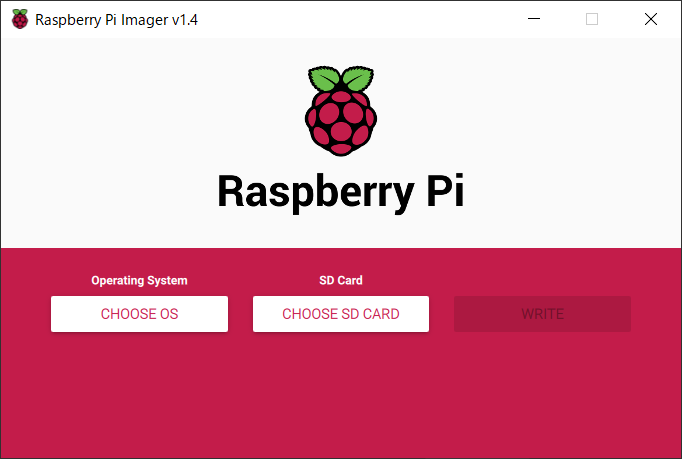
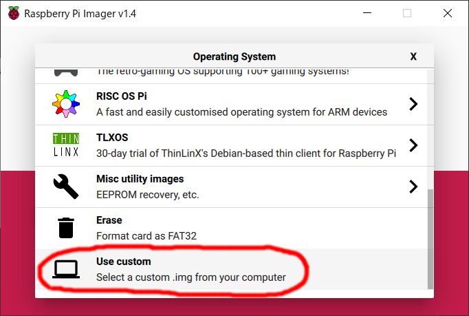
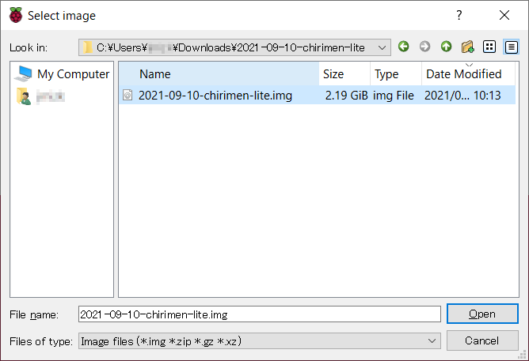

# CHIRIMEN for Raspberry Pi の SD カードを作成する (Raspberry Pi Imager編)

CHIRIMEN for Raspberry Pi (以下 CHIRIMEN Raspi) を利用するには Raspberry Pi 財団が配付する [Raspbian](https://www.raspberrypi.org/downloads/) をベースとして CHIRIMEN Raspi 用に必要なソフトウェアやサンプルコードなどを同梱・設定変更などを行った専用の環境をセットアップ済みの起動イメージを使用すると簡単です。

このページではご自身の microSD カードに CHIRIMEN Raspi 用のイメージを焼き込みセットアップする手順を説明します。

## 1. 作業環境の準備

SD カードに起動イメージを焼き込むには Windows, macOS または Linux の PC と SD カードリーダーが必要です。

また、SDイメージを作るPC用のツールとして、[Raspberry Pi Imager](https://www.raspberrypi.org/software/) をダウンロード・PCにインストールしてください (dd コマンドなどを使うことも出来ますが上級者向けのため割愛します)。

## 2. 起動イメージのダウンロード

SD カードの書き込みに使う PC で最新の起動イメージをダウンロードしてください。

- Raspberry Pi用：[CHIRIMEN for Raspberry Pi 最新リリース版](https://r.chirimen.org/sdimage)
- Raspberry Pi **Zero W**用：[CHIRIMEN Lite 最新リリース版](https://github.com/chirimen-oh/chirimen-lite/releases)

拡張子が `.zip` のファイルは zip 形式で圧縮されており、そのままでは焼き込みツールから利用できないため、ダウンロード後に展開してください。

## 3. SD カードにイメージを焼き込む

イメージファイルの準備が出来たら microSD カード (8GB 以上必須、Class 10 以上で高速なものを推奨) をカードリーダーに指し込み、[Raspberry Pi Imager](https://www.raspberrypi.org/software/) を起動してください。

`CHOOSE OS` ボタンを押すと出てくるダイアログで、`Use Custom`を選びます。そして先ほどダウンロード (と展開) したイメージファイルを選択します。

`CHOOSE STORAGE` で指し込んだ SD カードのドライブを選択 (間違ったドライブを選択するとそのデータが消えてしまうため要注意) し、`WRITE` ボタンを押してください。

## 4. 起動を確認する

焼き込み終わったら microSD カードを抜き、(HDMI ディスプレイや AD アダプターを繋いだ) Raspberry Pi に指し込んで電源を入れてみてください。

初回起動時には自動的にご利用の SD カードの容量に合わせたサイズにパーティーションが拡張されてから再起動します。暫く待って CHRIMEN のデスクトップが起動すれば無事焼き込み (と起動確認) 完了です。
