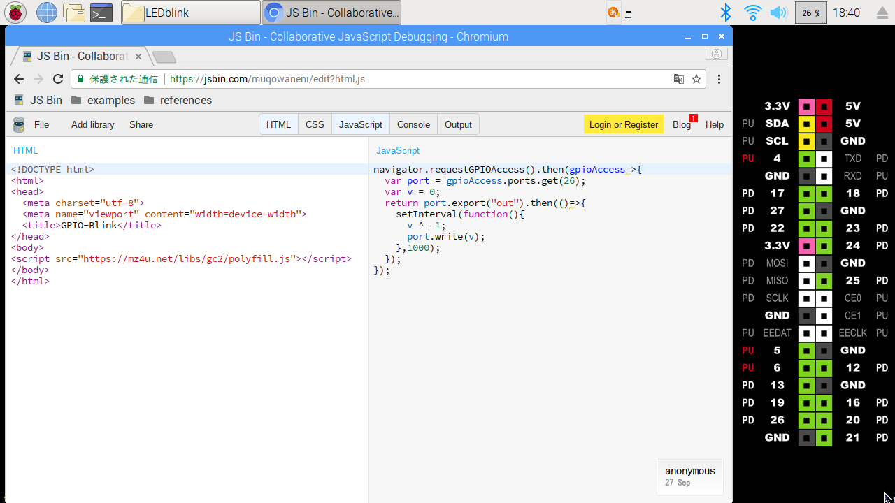
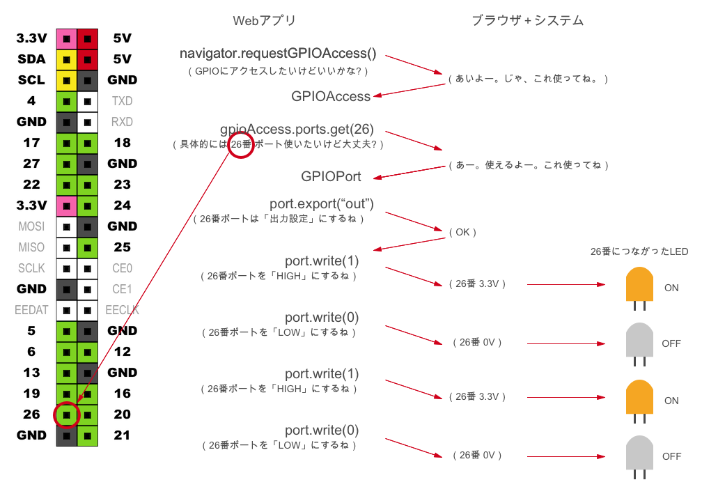

# Hello World

# 1. Today’s Objective
Get to know your CHIRIMEN for Raspberry Pi, and write your first program that turns on/off a LED bulb via a Web app.

1. Today’s Objective
2. Preparation
3. Booting the CHIRIMEN for Raspberry Pi
4. Trying the LED-Blink
5. Taking a look at the code

##CHIRIMEN for Raspberry Pi
"CHIRIMEN for Raspberry Pi” is an IoT programming environment built for Raspberry Pi（Raspi).

In combination with the [Web GPIO API (Draft)](http://browserobo.github.io/WebGPIO) or the [Web I2C API (Draft)](http://browserobo.github.io/WebI2C), you can write programs that controls electric parts connected to your Raspi via the Web.


# 2. Preparation（You can skip this section if you’re already set up）

## What you’ll need

###The basic hardware
Below is the list of items you will minimally need to boot CHIRIMEN for Raspberry Pi:


- 1 [Raspberry Pi 3 Model B](https://www.raspberrypi.org/products/raspberry-pi-3-model-b/) or [Raspberry Pi 3 Model B+](https://www.raspberrypi.org/products/raspberry-pi-3-model-b-plus/) or [Raspberry Pi 4 Model B](https://www.raspberrypi.org/products/raspberry-pi-4-model-b/)
- 1 AC adaptor + micro B USB power cable (this would work perfectly)
  - ex: [Switching Power Supply Set for Raspberry Pi (5V 3.0A)](https://www.physical-computing.jp/product/1171)
  - Caution: Smartphone chargers are usually 1.0〜2.0A. They officially recommend  3.0A, and therefore power supply from PCs might not be sufficient, leading to power outage. In addition, the microUSB aren't so durable, so connectors that have a built-in switch are recommended to reduce the number of times they are plugged in and out.
- 1 HDMI cable (this should connect to your display monitor)
- 1 A monitor with an HDMI input (should be able to display 720P)
- 1 USB mouse
- 1 USB keyboard
- 1 micro SD (Class 10 & up, 8GB or more storage)


### Parts you’ll need for the LED-Blink
In addition to the basic hardware, you will need the below parts to build your first program:


- 1 breadboard
- 1 LED bulb
- 1 resistor (150-470 ohms: depends on the LED bulb you use)
- 2 male-female jumper wires


## Writing the CHIRIMEN for Raspberry Pi environment to your SD card
Before you boot your system, you will have to write the CHIRIMEN for Raspberry Pi image file onto your SD card.

For instructions, visit [Setting up the CHIRIMEN for Raspberry Pi environment for your SD card](https://gist.github.com/tadfmac/527b31a463df0c9de8c30a598872344d)

# 3. Booting CHIRIMEN for Raspberry Pi
## Get wired up!
Once you have all the necessary supplies, you can connect them all together to boot the system.
Reference the below image to connect all of your components together. (connecting the power cable to the raspi should be your last step)


The [Raspberry Pi Hardware Guide](https://www.raspberrypi.org/learning/hardware-guide/) should come in handy if you’re having any trouble.

Your raspi should boot once you connect the power cable (if your power cable has a on/off switch, make sure you switch it on).

##Initial Startup
The below desktop should show once your raspi boots. If you see the same screen on your display, congratulations, you’re all set!


## I can’t get that screen!
If it displays a different screen than the one in the image above, chances are you have a different SD card from CHIRIMEN for Raspberry Pi inserted.
 Retry [burning the CHIRIMEN for Raspberry Pi environment onto your SD card ](https://gist.github.com/tadfmac/527b31a463df0c9de8c30a598872344d) again.

If nothing displays even though the power cable is connected and turned on, check to see if everything is connected to its correct position.
If the red LED on your raspi isn’t flashing even though everything is connected correctly, your AC cable may not be receiving any power.

## Configuring Wi-Fi settings
Once you have the desktop displayed, you are now ready to connect your device to the Internet.
Though you can CHIRIMEN for Raspberry Pi allows for you to program only with local files without any network connection, there are several online tools such as JS Bin or JSFiddle that will remarkably enhance your programing experience.
In addition, there will be lots more information about CHIRIMEN for Raspberry Pi to come that will be available online.

So let’s start by connecting your device to the Internet.

This can be done by clicking on the Wi-Fi icon on the top-right of your taskbar.


## 4. Onto theLED-Blink
With your device connected to the Internet, you’re finally ready to get coding.

## “LED-Blink”
LED-Blink refers to the act of turning an LED on and off. The LED-Blink program aims to make this phenomenon happen via code.

- FYI: [LED (Light Emitting Diode) ](https://en.wikipedia.org/wiki/Light-emitting_diode)

## Wiring up
To make your LED bulb flash, you must correctly connect it to your raspi.
Your LED bulb should have two leads coming out from it. The longer end is the anode (positive), the shorter the cathode (negative).

If you navigate to the below directory on your CHIRIMEN for Raspberry Pi, you can find the wiring diagram along with examples preinstalled.

```
/home/pi/Desktop/gc/gpio/LEDblink/schematic.png
```


First, double-click on the schematic.png file to open it.


Reference the diagram to connect your parts together.

Make sure to be aware of the anode (positive: longer end) and the cathode (negative: shorter end).

You should end up with something that looks more or less like this:


### References
- [Using a breadboard](https://www.sunhayato.co.jp/blog/2015/03/04/7)
- [Using an LED](https://www.marutsu.co.jp/pc/static/large_order/led)
- [Reading resistors](http://www.jarl.org/Japanese/7_Technical/lib1/teikou.htm)
- [Raspberry pi and GPIOs](https://tool-lab.com/make/raspberrypi-startup-22/)
- [Using a tester to read resistors](http://startelc.com/elcLink/tester/elc_nArtcTester2.html#chapter-2)

## Running the example program
Now you’re ready to make the bulb work.
In the same directory as the wire diagram, you can find the sample code for the LED-Blink:

```
/home/pi/Desktop/gc/gpio/LEDblink/index.html
```

Click on the index.html file. The browser will appear and your LED should start flashing.

## Browser screen


## What you should have


Its Flashing!!

## If it’s not working:
The issue is most likely a security error.

Take a look at [Solution to the security error issue for CIRIMEN for Raspberry Pi](https://qiita.com/tadfmac/items/2d7929fe3560c77fe867) to fix the issue.

> ToDo: add screenshot of https://localhost:33330 bookmark

#5. Looking at the code
You just made the LED-Blink work by running the example program on your desktop
However there’s actually a second way to run the sample program: the online version.

By using the online version, you can learn while editing the code as you go.

This time let’s make the LED flash with the online version of the program.

First things first: **before accessing the online example, make sure to close the browser window that’s running ```file:///home/pi/Desktop/gc/gpio/LEDblink/index.html``` .** If not the next sample will not work properly.

To be certain, you can close your browser and reboot it. (or you can just close the corresponding tab - either works)


##Open the JS Bin example
OK, so the online version.
You can keep everything connected as it is.

On the browser’s bookmarks bar, go to ```Examples > GPIO Examples > GPIO-Blink > JSBin```.



You should end up with a screen like this. (The screenshot actually has the titlebar hidden by clicking on the “output” tab once)



So let’s look at the code.

## HTML
```html
<!DOCTYPE html>
<html>
<head>
  <meta charset="utf-8">
  <meta name="viewport" content="width=device-width">
  <title>GPIO-Blink</title>
</head>
<body>
<script src="https://mz4u.net/libs/gc2/polyfill.js"></script>
</body>
</html>
```

You can see that this HTML is importing a JavaScript library called polyfill.js
polyfill.js is a Po [Polyfill (ブラウザ標準に未実装の機能などを利用可能にするためのライブラリ)](https://developer.mozilla.org/ja/docs/Glossary/Polyfill)lyfill for the two APIs [Web GPIO API](http://browserobo.github.io/WebGPIO) and [Web I2C API](http://browserobo.github.io/WebI2C)  which are both submitted to W3C as drafts.


## JavaScript
```javascript
mainFunction(); // run the below async function (entry point for this program)

async function mainFunction(){ //The main part of the program. wrap the entire program with an async function so it runs asyncronosly
var gpioAccess = await navigator.requestGPIOAccess(); // add await to call the function before the then
  var port = gpioAccess.ports.get(26);
  await port.export("out");
  while ( true ){ // infinite loop
    await sleep(1000); // wait 1000ms
    v ^= 1; // v = v ^ 1 (XOR operation: v turns to 0 when v=1, v turns 1 when v=0. 1 = LED turns on, 0 = off. Therefore, LED switches on/off every one second)
    port.write(v);
  }
}

function sleep(ms){
  return new Promise( function(resolve) {
    setTimeout(resolve, ms);
  });
}
```

### Caution!
CHIRIMEN for raspi creates systems using web browsers as the programming environment. Since Web browsers run in JavaScript, you will need some knowledge about the language. You can learn about JavaScript here: [JavaScript 1 Day lecture](https://r.chirimen.org/1dayjs).

## Asynchronous Processing

To use physical devices , you will have to run asynchronous processes. This tutorial  does this by using ```async wait``` .

If you are unfamiliar with asynchronous processes and/or ```async wait```  you can read about it [here](appendix0.md).

### Note:
This tutorial uses ```async wait``` since we think it is the easiest among asynchronous processing for beginners to understand. However, this function is rather within Javascript, and it may not work with some browsers. (It works on Chrome and Firefox) (You can see which browser supports the technology [here](https://caniuse.com/#feat=async-functions))

## Explanation

The first code in the JavaScript is ```navigator.requestGPIOAccess()```.
This is to use the [Web GPIO API](http://browserobo.github.io/WebGPIO) we mentioned above to get the interface needed to access the GPIO called gpioAccess.

Before we move on, let’s go on a tangent to talk about GPIOs.

## GPIO
[GPIO](https://en.wikipedia.org/wiki/GPIO) is an acronym for General-purpose input/output, and points to the general form of an input/output interface.

With raspi, you can use the 40 pin headers fro GPIO (not all 40 are used for GPIO, though).

The diagram below is a simplified diagram of the 40 pins on raspi. With CHIRIMEN for Raspberry Pi, the pins that correspond the green boxes are configured to be used as GPIO.

The GPIO pin on the RasPi can place either a 0V or 3.3V between the pin and the GND, or detect 0V/3.3V voltage that is put on between the pin.  Since the LED can light with only a couple of mA current, the LED turn on off when the voltage switches between 3.3V(on) and 0V(off) to get the blinking effect.

You can read more [here](https://tool-lab.com/make/raspberrypi-startup-22/)


## Configuring the GPIOPort
Back to the code.

```var port = gpioAccess.ports.get(26)```
The above code is used to get an **object to access GPIO port #26.**
Next, with ```port.export("out”)```, **port #26 is configured as an output port**. Now we can change the voltage that goes to the LED bulb.

Lastly, port.write(1) and port.write(0) are alternately called in 1000ms intervals to make the voltage for GPIO #26 change  3.3V→0V→3.3V→0V and so on.

LEDs emit light when the voltage reaches a certain threshold (aprox. 1.8V for red LEDs, 3.1V for blue LEDs), so the bulb turns on when its given 3.3V, and then turns off at 0V.

As a summary:



## Editing the example
If you find the JavaScript pane on the JS Bin site, you can edit the JS code from there.
Here are some challenges for you;

- Making the flash faster/slower
- Changing the GPIO port to a different port (you will need to do some rewiring of jumpers)
- make a button, switch, etc. on the index.html page and control the LED using that interface.


#Summary
In this tutorial, we tried the following tasks:
- Setting up and booting CHIRIMEN for Raspberry Pi
- Running the LED-Blink sample program
- Editing the LED-Blink code on JS Bin.

In the next tutorial[Tutorial 1. GPIO](https://tutorial.chirimen.org/raspi/en/section1), we will learn about GPIO inputs.
