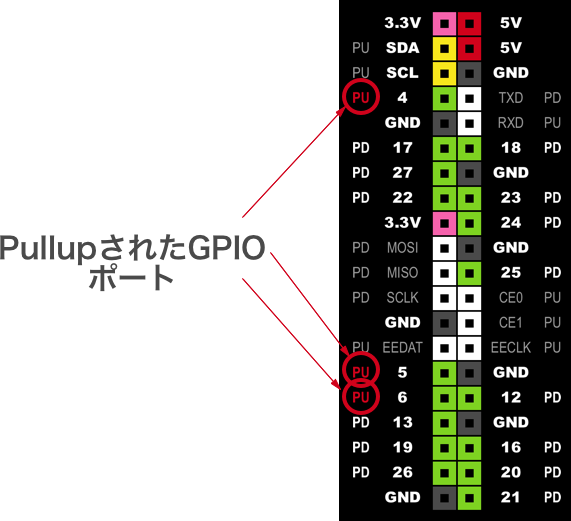
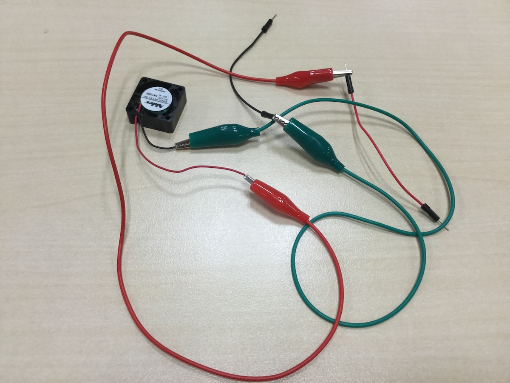
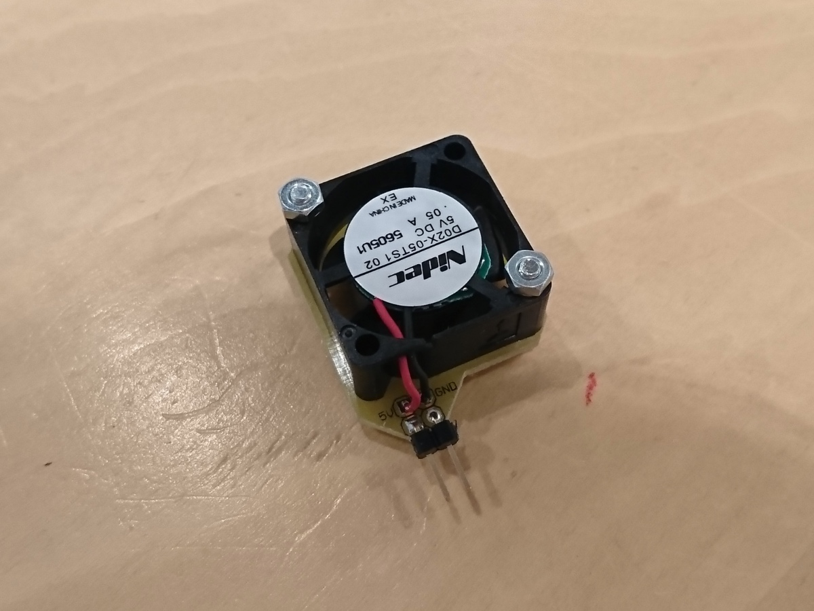
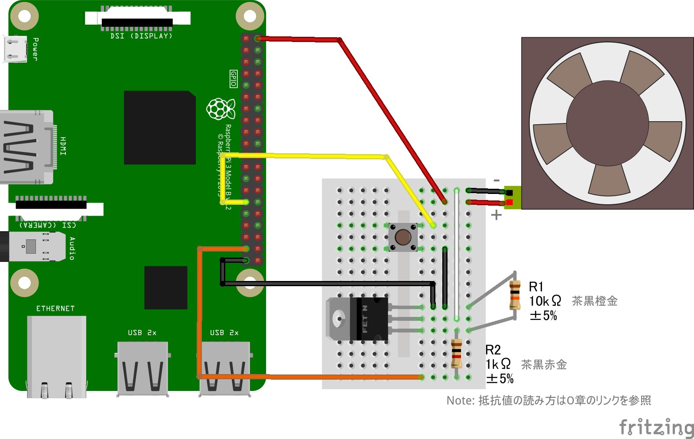

# 1. GPIO編

# 概要
CHIRIMEN for Raspberry Pi 3 (以下 CHIRIMEN Raspi3) を使ったプログラミングを通じて、Web GPIO APIの使い方を学びます。

CHIRIMEN Rapi3 を初めて使う方は本チュートリアルを進める前に「[CHIRIMEN for Raspberry Pi 3 Hello World](section0.md)」で基本的な操作方法を確認しておいてください。

## (※1) CHIRIMEN for Raspberry Pi 3とは
CHIRIMEN Raspi3 は Raspberry Pi 3（以下「Raspi」）上で動作する IoT プログラミング環境です。

[Web GPIO API](http://browserobo.github.io/WebGPIO/) や、[Web I2C API](http://browserobo.github.io/WebI2C/) といったAPIを活用したプログラミングにより、Web アプリから Raspi に接続した電子パーツを直接制御できます。 

CHIRIMEN Raspi3 の開発やこのチュートリアルの執筆・更新は [CHIRIMEN Open Hardware コミュニティ](https://chirimen.org/) によって行われています。

# 1. 準備
## 用意するもの
このチュートリアル全体で必要になるハードウエア・部品は下記の通りです。

* [Hello World 編](section0.md) に記載の「基本ハードウエア」と「Lチカに必要となるパーツ」
* タクトスイッチ (2pin, 4pin を使う場合は向きに注意) x 1
* ジャンパーワイヤー (オス-メス) x 5
* [Nch MOSFET (2SK4017)](http://akizukidenshi.com/catalog/g/gI-07597/)
* リード抵抗 (1KΩ) x 1
* リード抵抗 (10KΩ) x 1
* [DCファン](http://akizukidenshi.com/catalog/g/gP-02480/) x 1
  * ブレッドボードに接続できるようケーブルを加工したものを利用する

## CHIRIMEN for Raspberry Pi 3の起動とLチカの確認
* [Hello World 編](section0.md) の 「3. CHIRIMEN for Raspberry Pi 3 を起動してみよう」を参照して、CHIRIMEN for Raspberry Pi 3 を起動してください。
* ついでに [Hello World 編](section0.md) の 「4. Lチカをやってみよう」を実施して、Lチカが正しく行えることを確認しておいてください。

## Lチカでのおさらい
* CHIRIMEN Raspi3 では、各種 example の配線図とコードが ```~/Desktop/gc/``` 配下においてある
* CHIRIMEN Raspi3 で利用可能な GPIO Port 番号と位置は壁紙を見よう
* LED には方向がある。アノードが足が長い方でこちらをGPIOポートに繋ぐ。反対の足が短い方を GND 側に繋ぐ。抵抗はどちらかに繋ぐ
* CHIRIMEN Raspi3 では Web アプリからの GPIO の制御に [Web GPIO API](http://browserobo.github.io/WebGPIO/) を利用する

# 2. マウスクリックでLEDのON/OFFを制御してみる
それでは、実際にプログラミングしてみましょう。

[Hello World編](section0.md) では、[JS Bin](http://jsbin.com/) を使ってLチカの example コードを少し触ってみるだけでしたが、今度は最初から書いてみることにします。

サンプル同様に JS Bin で書いても良いですが、折角ですので、このチュートリアルでは他のオンラインエディタ [JSFiddle](https://jsfiddle.net/) を使ってみましょう。

> Web上のオンラインサービスは便利ですが、メンテナンスや障害、サービス停止などで利用できなくなることがあります。
> ローカルでの編集も含め、いくつかのサービスを使いこなせるようにしておくと安心です。
>
> 各サービスにはそれぞれ一長一短がありますので、利用シーンに応じて使い分けると良いかもしれません。

## a. 部品と配線について
このパートでは [Hello World編](section0.md) で実施したLチカの配線をそのまま利用します。必要な部品も同じです。


LED は、26番ポートに接続しておいてください。


## b. HTML/CSSを記載する
さて、今回はボタンと LED の状態インジケータを画面上に作ってみましょう。
HTMLに `<button>` と `<div>` 要素を1つづつ作ります。

[JSFiddle](https://jsfiddle.net/) にアクセスすると、初期状態でコード編集を始めることができます。
この画面のHTMLペインに下記コードを挿入します。

```html
<button id="onoff">LED ON/OFF</button>
<div id="ledView"></div>
```
※JSFiddle のHTMLペインにはHTMLタグの全てを書く必要はなく、`<body>` タグ内のみを書けばあとは補完してくれます。

`ledView` 要素には下記のようなスタイルを付けて黒い丸として表示させましょう。こちらは CSS ペインに記載します。

```css
#ledView {
  width: 60px;
  height: 60px;
  border-radius: 30px;
  background-color: black;
}
```

最後に、HTMLに戻って、[Web GPIO API](http://browserobo.github.io/WebGPIO/) を利用可能にする Polyfill を読み込ませましょう。
先ほど追加した `ledView` のすぐ下に下記 `<script>` タグを記載します。

```html
<script src="https://chirimen.org/chirimen-raspi3/gc/polyfill/polyfill.js"></script>
```

## c. ボタンに反応する画面を作る
GPIOを実際に使う前に、まずは「ボタンを押したら LED の ON/OFF 状態を表示する画面を切り替える」部分を作ってみます。

早速 JavaScript を書いていきましょう。

```javascript
window.onload = function mainFunction() {
  var onoff = document.getElementById("onoff");
  var ledView = document.getElementById("ledView");
  var v = 0;
  onoff.onclick = function controlLed() {
    v = v === 0 ? 1 : 0;
    ledView.style.backgroundColor = v === 1 ? "red" : "black";
  };
};
```

このコードでは `onoff` 要素と `ledView` 要素を取得し、`onoff` ボタンのクリックイベント発生時に `letview` の色を書き換えるイベントハンドラを登録しています。また、その処理は HTML 要素の読み込み後に実行するよう `window.onload` に設定する関数内に処理を書いています (HTML の読み込み前に処理すると `getElementById()` で要素が取得できません)。

実行タイミングを考えてコードを書くことは重要ですが、HTML の読み込み後に処理させたいことは多いので、実は JSFiddle では JavaScript は onload 後に実行する初期設定となっています。しかしこのままでは「読み込み完了時の処理を読み込み完了後に登録する」ことになってしまい、折角書いたコードが実行されません。

JSFiddle 利用時にはいずれかの対応をしてください (ローカルファイル編集時や JS Bin では不要):

* `JavaScript + No-Library (pure JS)` と書かれているところをクリックし `LOAD TYPE` の設定を `On Load` 以外 (`No wrap - bottom of <head>` など) に変更する (推奨)
* onload に関数を登録せず処理を直接 JavaScript ペインに書き込む (最初の `onload = function() {` と 最後の行の `}` を削除)

ここまでできたら JSFiddle の JavaScript の `▷ Run` をクリックして実行してみましょう。

これで、`LED ON/OFF` ボタンが表示されるはずですので、ボタンをクリックしてみてください。

赤→黒→赤→黒→赤→黒→ とクリックする都度切り替えできるようになったら成功です。


## d. ボタンにLEDを反応させる
画面ができましたので、いよいよ Web GPIO を使った LED 制御コードを入れていきます。

一度 Lチカの時に学んだことを思い出せばできるはずですが、まずは書き換えてみましょう。

```javascript
window.onload = async function mainFunction() {
  var onoff = document.getElementById("onoff");
  var ledView = document.getElementById("ledView");
  var v = 0;
  var gpioAccess = await navigator.requestGPIOAccess();
  var port = gpioAccess.ports.get(26);
  await port.export("out");
  onoff.onclick = function controlLed() {
    v = v === 0 ? 1 : 0;
    port.write(v);
    ledView.style.backgroundColor = v ? "red" : "black";
  };
};
```

これで、画面のボタンクリックに反応して LED の ON/OFF ができたら成功です。

JSFiddle 利用時には `LOAD TYPE` を変更するか、`mainFunction()` 呼び出しを onload で囲まず最上位で直接呼び出すことに注意してください。

[Hello World編](section0.md) のLチカのパートでも簡単に説明しましたが、ここでもういちど[GPIO編 (Web GPIO API)](section1.md) の流れをおさらいしておきましょう。

### await navigator.requestGPIOAccess()

Web GPIO を利用するための `GPIOAccess` インタフェースを取得するための最初の API 呼び出しです。
`requestGPIOAccess()` は非同期処理でインターフェイス初期化を行う非同期メソッドですので `await` で完了を待って次の処理を記述します。

async/await を使わずプロミスでコードを書きたい場合は返されるプロミスの `then` にコールバック関数を登録してください。初期化が完了したら `GPIOAccess` パラメータ付きでコールされます。

### gpioAccess.ports.get()

`GPIOAccess.ports` は利用可能なポートオブジェクトの一覧 ([Map](https://developer.mozilla.org/docs/Web/JavaScript/Reference/Global_Objects/Map)) です。

`gpioAccess.ports.get(26)` のようにすることで利用可能なポートオブジェクトの一覧から、 **GPIOポート番号 26** を指定して `port` オブジェクトを取得しています。

### await port.export()

`port.export("out")` により取得したGPIOポートを**「出力モード」**で初期化しています。この初期化処理も非同期処理となっているため、`await` を付けて処理完了を待ってから次の処理に進めます。

GPIO ポートにかける電圧を Web アプリで変化させたい時には「出力モード」を指定する必要があります。一方、GPIO ポートはもうひとつ「入力モード」があり、これは GPIO ポートの状態 (電圧の High/Low 状態) を読み取りたい時に利用します。入力モードについてはスイッチを使う例の中で説明します。

### port.write()

`port.write()` は、出力モードに指定した GPIO ポートの電圧を切り替える指定を行う API です。
`port.write(1)` で、指定したポートから HIGH (Raspi3 では 3.3V) の電圧がかかり、`port.write(0)` で LOW(0V) になります。


# 3. マウスクリックのかわりにタクトスイッチを使ってみる
それでは、さきほどまで書いたコードをベースに、マウスの替わりにスイッチを利用してみます。

今回は一般的に「タクトスイッチ」と呼ばれるものを利用します。

### タクトスイッチについて
「タクトスイッチ」は[アルプス電気の商標](http://www.alps.com/j/trademark/)のようです。

電子部品屋さん等では、アルプス電気製ではないスイッチも、同様の形状のものは「タクトスイッチ」として売られています。
* [秋月電気の「タクトスイッチ」一覧](http://akizukidenshi.com/catalog/c/ctactsw/)

今回の作例ではこのように「電気部品屋さん等でタクトスイッチとして売られてるスイッチ」を使います。

ようするに、下記のような仕様の「タクトスイッチっぽい」スイッチです。

* SPST (1回路1接点)
* プッシュボタン 1 つ
* プッシュボタンの押し込みでスイッチ ON、プッシュボタンを離すとスイッチ OFF (モーメンタリ動作)

Note: 1回路1接点なのに端子が4つあるスイッチが多いです。そのスイッチの構造は[こちらのページ](https://fabble.cc/takumanishikawa/chirimenpushbutton)が参考になりますが、どの端子間が常に接続されており、どの端子間がボタンによってオンオフされるかに注意が必要です。

## a. 準備：画面のボタンをモーメンタリ動作に変えておく
これまでに作成したプログラムは「ブラウザ画面のボタンをクリックしたら LED の HIGH/LOW を切り替える」というものでした。

クリック後は変更後の状態が維持されます。これは「オルタネート」のスイッチと同じ動きです。

一方で、今回用意したタクトスイッチは「モーメンタリ」のものです。

### スイッチの動作：オルタネートとモーメンタリ

* オルタネート : 状態をトグル (切り替え) します。一度ボタンを押すと ON になりボタンから手を離しても OFF に変わりません。次にボタンを押すと OFF になります。ボタンから手を離しても ON に変わることはありません。
* モーメンタリ : 押している間だけ ON になります。スイッチから手を離すと OFF に戻ります。

この2つの動作が混在すると画面とスイッチで状態が一致せず、面倒なことになるので、ブラウザ画面のボタンを「モーメンタリ」に合わせておきましょう。

下記のように、現在は `onclick` イベントで切り替えています。クリックイベントは、「マウスのボタンを押して離す」ことで発生します。

```javascript
  :
  onoff.onclick = function controlLed() {
    v = v === 0 ? 1 : 0;
    port.write(v);
    ledView.style.backgroundColor = v ? "red" : "black";
  };
  :
```

これを、マウスボタンを押した時と離した時にそれぞれオンオフさせるように変えましょう:

* マウスのボタンを押す → LEDをON
* マウスのボタンを離す → LEDをOFF

```javascript
  :
  onoff.onmousedown = function onLed() {
    port.write(1);
    ledView.style.backgroundColor = "red";
  };
  onoff.onmouseup = function offLed() {
    port.write(0);
    ledView.style.backgroundColor = "black";
  };
  :
```

これで、思った通りの動作になったはずです。

後でスイッチを追加したときに、同じ処理を呼ぶことになるので、LED の ON/OFF と `ledView` のスタイル切り替えをまとめて関数化しておきましょう。

下記のようになりました。

```javascript
var port;

function ledOnOff(v) {
  var ledView = document.getElementById("ledView");
  if (v === 0) {
    port.write(0);
    ledView.style.backgroundColor = "black";
  } else {
    port.write(1);
    ledView.style.backgroundColor = "red";
  }
}

window.onload = async function mainFunction() {
  var onoff = document.getElementById("onoff");
  var gpioAccess = await navigator.requestGPIOAccess();
  port = gpioAccess.ports.get(26);
  await port.export("out");
  onoff.onmousedown = function onLed() {
    ledOnOff(1);
  };
  onoff.onmouseup = function offLed() {
    ledOnOff(0);
  };
};
```

## b. 部品と配線について
今回追加するのは下記部品です。

* 前述のタクトスイッチ × 1
* ジャンパーワイヤー（オスーメス）× 2


下図のように、さきほどのLEDの配線にタクトスイッチを追加しましょう。


### 今回のスイッチは「プルアップ」回路で接続

上記回路ではスイッチが下記のように接続されています。

* Port 5 にスイッチを接続
* GND にスイッチの反対側を接続

これでどのようになるかというと、下記のようになります。

* スイッチを押す前は、Port 5 は HIGH (3.3V)
* スイッチを押している間、Port 5 は LOW (0V)

どうしてこうなるのでしょうか。

実は、Raspi3 の GPIO ポートのいくつかは、初期状態で「プルアップ」されています。

プルアップとは、回路を初期状態で「HIGHにしておく」ことですが、CHIRIMEN Raspi3 で利用可能な GPIO ポートのうち、下記ポート番号がプルアップ状態となっています。



今回の回路では、このうち、Port 5 を利用しています。
さきほどの動作となるメカニズムは下記の通りです。


この動作を頭に入れておきましょう。

## c. スイッチに反応するようにする (port.read()を使ってみる)
いよいよ、スイッチに対応させてみましょう。

まずは、単純に「GPIOポートの状態を読み込む」 `port.read()` を使ってみたいと思います。

`port.read()` で GPIO を読み込むコードは次のように書けます:

```javascript
  var gpioAccess = await navigator.requestGPIOAccess(); // writeと一緒。
  var port = gpioAccess.ports.get(5); // Port 5 を取得
  await port.export("in"); // Port 5 を「入力モード」に。
  var val = await port.read(); // Port 5の状態を読み込む
```

### await port.export()

`port.export("in")` により取得した GPIOポートを「入力モード」で初期化しています。非同期処理の待機が必要です。

GPIO ポートにかかる電圧を Web アプリ側から読み取りたい時に使います。

### await port.read()

`port.export("in")` で入力モードに設定した GPIO ポートのデータを任意のタイミングで読み取ります。読み取りは非同期処理になるので `await` で完了を待つようにしてください。

プロミスでコードを書きたい場合は `port.read().then((data)=>{ ... });` のように書きます。

上記コードで GPIO ポートの読み取りが１度だけ行えますが、今回は「スイッチが押され状態を監視する」必要がありますので、定期的に `port.read()` を行って GPIO ポートを監視する必要があります。

例えば単純に `setInterval()` でポーリング (定期問い合わせ) 処理するとこんなコードになります:

```javascript
  var gpioAccess = await navigator.requestGPIOAccess(); // writeと一緒。
  var port = gpioAccess.ports.get(5); // Port 5 を取得
  await port.export("in"); // Port 5 を「入力モード」に。
  setInterval(() => {
    var val = await port.read(); // Port 5の状態を読み込む
    //
    // ここにswitchの状態による処理を書き足す
    //
  }, 100); // 100ms 毎に実行
```

一応これでも動作しますが、この場合 `setInterval()` のポーリング間隔を極端に短くすると `port.read()` の読み取り結果が返って来る前に、次の Interval で読み取り要求してしまうようなケースも発生します。

場合によっては、こうした「順序の乱れ」が意図しない不具合を招くことも考えられます。

順序の乱れが生じないようにするには `setInterval()` で一定時間毎に実行するのではなく、繰り返し処理の最後に一定時間の待ち時間を入れます。そうすることで順序が維持されるポーリング処理となります:

```javascript
var gpioAccess = await navigator.requestGPIOAccess(); // writeと一緒。
var port = gpioAccess.ports.get(5); // Port 5 を取得
await port.export("in"); // Port 5 を「入力モード」に。
while(1) {
  var val = await port.read(); // Port 5の状態を読み込む  
  //
  // ここにswitchの状態による処理を書き足す
  //
  await sleep(100); // 100ms 秒待ってから繰り返す
}
```

LED の処理と組み合わせた全体のコードは下記のようになります:

```javascript
var ledPort;
var switchPort;

function ledOnOff(v) {
  var ledView = document.getElementById("ledView");
  if (v === 0) {
    ledPort.write(0);
    ledView.style.backgroundColor = "black";
  } else {
    ledPort.write(1);
    ledView.style.backgroundColor = "red";
  }
}

window.onload = async function mainFunction() {
  var onoff = document.getElementById("onoff");
  var gpioAccess = await navigator.requestGPIOAccess();
  var val;

  ledPort = gpioAccess.ports.get(26); // LED のポート番号
  await ledPort.export("out");

  switchPort = gpioAccess.ports.get(5); // タクトスイッチのポート番号
  await switchPort.export("in");

  onoff.onmousedown = function onLed() {
    ledOnOff(1);
  };
  onoff.onmouseup = function offLed() {
    ledOnOff(0);
  };

  for (;;) {
    val = await switchPort.read(); // Port 5の状態を読み込む
    val = val === 0 ? 1 : 0; // スイッチは Pull-up なので OFF で 1、LED は OFF で 0 なので反転させる
    ledOnOff(val);
    await sleep(100);
  }
};
```

さて、出来たらスイッチを押してみてください。
LED が押してる間だけ点灯したら成功です。

ただ、このコードではブラウザ画面上の「LED ON/OFF」ボタンを押すと正しく点灯しなくなってしまいました。

スイッチを読み込む処理がポーリング動作しているため、スイッチが押されていないとすぐ LED が消えてしまいます。

## d. スイッチに反応するようにする (port.onchange())

これまで一通り `port.read()` を使ったスイッチの制御方法を見てきましたが、実は Web GPIO API には「入力モード」の GPIO ポートの状態を取得する方法がもうひとつ用意されています。それが `port.onchange()` です。

`port.onchange()` の説明は後回しにして、さきほどのサンプルを `port.onchange()` を使ったコードに書き換えてみましょう。

```javascript
var ledPort;
var switchPort; // LED とスイッチの付いているポート

function ledOnOff(v) {
  var ledView = document.getElementById("ledView");
  if (v === 0) {
    ledPort.write(0);
    ledView.style.backgroundColor = "black";
  } else {
    ledPort.write(1);
    ledView.style.backgroundColor = "red";
  }
}

window.onload = async function initialize() {
  var onoff = document.getElementById("onoff");
  var gpioAccess = await navigator.requestGPIOAccess();
  ledPort = gpioAccess.ports.get(26); // LED のポート番号
  await ledPort.export("out");
  switchPort = gpioAccess.ports.get(5); // タクトスイッチのポート番号
  await switchPort.export("in");
  // Port 5 の状態が変わったタイミングで処理する
  switchPort.onchange = function toggleLed(val) {
    // スイッチは Pull-up なので OFF で 1、LED は OFF で 0 と反転させる
    ledOnOff(val === 0 ? 1 : 0);
  };

  onoff.onmousedown = function onLed() {
    ledOnOff(1);
  };
  onoff.onmouseup = function offLed() {
    ledOnOff(0);
  };
};
```

コードを見ていただけたらお気づきかもしれません。 `port.onchange()` は入力モードの GPIO ポートの「状態変化時に呼び出される関数を設定する」ための機能です。

`port.read()` を使ったコードと異なりポーリングする処理が不要になったので、今回のケースでは簡潔に書けるようになりましたね。

また、ポーリングによる LED 制御処理を行なっていないので、ブラウザ画面のボタンも正しく反応できるようになります。


# 4.LEDのかわりにCPUファンを回してみる
Web GPIO API の機能が一通り確認できましたので、本パートのしめくくりに違う部品も制御してみましょう。

ここでは、**MOSFET** を使って DC ファンの単純な ON/OFF を制御してみましょう。

## MOSFET とは

MOSFET は[電界効果トランジスタ (FET)](https://ja.wikipedia.org/wiki/%E9%9B%BB%E7%95%8C%E5%8A%B9%E6%9E%9C%E3%83%88%E3%83%A9%E3%83%B3%E3%82%B8%E3%82%B9%E3%82%BF) の一種で、主にスイッチング素子として利用される部品です。

[MOSFET(Wikipedia)](https://ja.wikipedia.org/wiki/MOSFET)

今回は、Nch MOSFET「[2SK4017](http://akizukidenshi.com/catalog/g/gI-07597/)」を利用します。


## DC ファンとは
DC ファンは、CPU の冷却等に利用される部品です。

小型のモーター、モータードライバ、そしてファンがセットになっており、通電するだけでファンを回して送風することができます。

今回は、[5V 50mAで回転させることができる小型のDCファン](http://akizukidenshi.com/catalog/g/gP-02480/) を利用します。


## DCファンには極性があるので注意してください!!
[上記の DC ファン](http://akizukidenshi.com/catalog/g/gP-02480/)には極性があります。通常販売している状態では赤黒のケーブルが付属しており、赤い方が 5V、黒い方が GND に接続する仕様です。**接続方法を誤ると (逆に接続すると) DC ファンが発熱し故障や事故 (火傷や火災) の原因になる可能性があります**。必ず極性を確認してから接続するようにしてください。

## DCファンをブレッドボードで利用するために

今回利用する DC ファンには細い電線が付属していますが、もともと基板へのハンダ付けを想定した電線であり、このままの状態ではブレッドボードで利用できません。

下記いずれかの方法でブレッドボードで利用できるようにしましょう。

### 1. ワニ口クリップでジャンパー線と繋ぐ (簡易)

この写真のように一応やれます。あまり綺麗ではないし、露出する接点が多いのでショートさせないよう注意が必要です。



### 2. ジャンパケーブルをハンダ付けする

オスピンのジャンパー線の反対側を切って DC ファンに直接ハンダづけすればブレッドボードで扱いやすい DC ファンが簡単に作成できます。

一般的にはこちらの方法をおススメめします。

ただし、元の線と同じく赤と黒にするなど、極性を間違いにくい配色にするよう注意してください。適当な色のジャンパー線を使うと極性を誤って事故を起こすため大変危険です。

### 3. ブレッドボード用に加工する

ブレッドボードに直接させるようにピンヘッダを半田付けすると同時に、極性を間違いにくいよう 5V と GND を明記した基板を取り付けるといった加工をすると、コンパクトかつ扱いやすいものになります。




## a. 部品と配線について
これまでに使った部品に下記を加えましょう。

DC ファンは前述の通りジャンパーケーブルをハンダ付けしたりブレッドボード用に加工したものをご用意ください。


次に、先ほどの「タクトスイッチを押したらLEDをつけたり消したり」する回路を下記のように変更します。

LEDとLED用の抵抗を一旦外して、MOSFET と抵抗、DCファンを配置します。

タクトスイッチの場所も多少調整していますが、Raspi3 側への接続ピン等は変えないでください。



さて、それでは遊んでみましょう。


## b. コードは... 書き換えなくて良い

実は、この回路は先ほどまでのコード**「d. スイッチに反応するようにする (port.onchange())」**と同じコードで動きます。
LED が点灯する替わりにファンが回るようになりました。


## c. しかし... (オチw)
スイッチを押してDCファンが回るだけなら、5V→タクトスイッチ→DCファン→GND と繋げば **プログラムを書かなくても出来る！！！！**

...... スイッチじゃないのでやりましょう。(次回に続く)


# まとめ

このチュートリアルでは、実際にコードを書きながら Web GPIO API の基本的な利用方法を学びました。

* Web GPIO APIを使ったGPIO出力ポートの設定と出力処理までの流れ  (`navigator.requestGPIOAccess()`〜`port.write()`）
* Web GPIO APIを使ったGPIO入力ポートの設定と読み出し処理の流れ  (`navigator.requestGPIOAccess()`〜`port.read()`）
* Web GPIO APIを使ったGPIO入力ポートの設定と変化検知受信の流れ  (`navigator.requestGPIOAccess()`〜`port.onchange()`)

このチュートリアルで書いたコードは以下のページで参照できます:

* [GitHub リポジトリで参照](https://github.com/chirimen-oh/tutorials/tree/master/raspi3/examples/section1)
* ブラウザで開くページ (各ステップ)
  * [画面のボタンで画面の要素の色を変える](https://tutorial.chirimen.org/raspi3/examples/section1/s1_1.html)
  * [他面のボタンで LED が光り画面の要素の色も変わる](https://tutorial.chirimen.org/raspi3/examples/section1/s1_2.html)
  * [マウスで画面のボタンを押している間だけ LED が光る](https://tutorial.chirimen.org/raspi3/examples/section1/s1_3.html)
  * [タクトスイッチを押している間だけ LED が光る](https://tutorial.chirimen.org/raspi3/examples/section1/s1_4.html)
  * [画面のボタンまたはタクトスイッチを押している間だけ LED が光る](https://tutorial.chirimen.org/raspi3/examples/section1/s1_5.html)

次の『[チュートリアル 2. I2C　基本編（ADT7410温度センサー）](section2.md)』では Web I2C API の学習をします。
