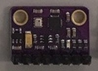

# CHIRIMEN for Raspberry Pi3 パーツリスト

## I2C センサー
|カテゴリ|部品型番|画像|
|-|-|-|
|ADC(アナログ電圧測定) 12bit精度|[ADS1015](https://chirimen.org/chirimen-raspi3/gc/top/examples/#I2C-ADS1015)||
|↑16bit精度|[ADS1115](https://chirimen.org/chirimen-raspi3/gc/top/examples/#I2C-ADS1115)||
|ADC, DAC(アナログ電圧出力) 複合|[PCF8591](https://chirimen.org/chirimen-raspi3/gc/top/examples/#I2C-PCF8591)||
|温度センサ|[ADT7410](https://chirimen.org/chirimen-raspi3/gc/top/examples/#I2C-ADT7410)||
|サーモグラフィ(8x8ピクセル)|[AMG8833](https://chirimen.org/chirimen-raspi3/gc/top/examples/#I2C-AMG8833)||
|温度, 圧力, 湿度 複合センサ|[BME280](https://chirimen.org/chirimen-raspi3/gc/top/examples/#I2C-BME280)||
|温度, 圧力 複合センサ|[BMP180](https://chirimen.org/chirimen-raspi3/gc/top/examples/#I2C-BMP180)||
|温度, 圧力 複合センサ|[BMP280](https://chirimen.org/chirimen-raspi3/gc/top/examples/#I2C-BMP280)||
|距離センサ(50cm程度まで)|[GP2Y0E03](https://chirimen.org/chirimen-raspi3/gc/top/examples/#I2C-GP2Y0E03)||
|距離センサ(2m弱まで)|[VL53L0X](https://chirimen.org/chirimen-raspi3/gc/top/examples/#I2C-VL53L0X)||
|ジェスチャーセンサ|[Grove-Gesture](https://chirimen.org/chirimen-raspi3/gc/top/examples/#I2C-Grove-Gesture) (PAJ7620U2)||
|光センサ|[Grove-Light](https://chirimen.org/chirimen-raspi3/gc/top/examples/#I2C-Grove-Light)||
|小型ディスプレイ|[Grove-OledDisplay](https://chirimen.org/chirimen-raspi3/gc/top/examples/#I2C-Grove-OledDisplay)||
|タッチセンサ|[Grove-Touch](https://chirimen.org/chirimen-raspi3/gc/top/examples/#I2C-Grove-Touch)||
|カラーセンサ|[S11059](https://chirimen.org/chirimen-raspi3/gc/top/examples/#I2C-S11059)||
|紫外線(UV)センサ|[VEML6070](https://chirimen.org/chirimen-raspi3/gc/top/examples/#I2C-VEML6070)||
|3軸加速度センサ|[Grove-Accelerometer](https://chirimen.org/chirimen-raspi3/gc/top/examples/#I2C-Grove-Accelerometer)||
|3軸加速度+ジャイロ 複合センサ|[MPU6050](https://chirimen.org/chirimen-raspi3/gc/top/examples/#I2C-MPU6050)||
|3軸加速度+ジャイロ+磁気 複合センサ|[MPU9250](https://chirimen.org/chirimen-raspi3/gc/top/examples/#I2C-MPU9250)||
|Neopixel LED 8x8|[NEOPIXEL](https://chirimen.org/chirimen-raspi3/gc/top/examples/#I2C-NEOPIXEL_I2C)||
|↑ 1x4|[NEOPIXEL](https://chirimen.org/chirimen-raspi3/gc/top/examples/#I2C-NEOPIXEL_I2C)||
|↑ 12|[NEOPIXEL](https://chirimen.org/chirimen-raspi3/gc/top/examples/#I2C-NEOPIXEL_I2C)||
|↑ 60|[NEOPIXEL](https://chirimen.org/chirimen-raspi3/gc/top/examples/#I2C-NEOPIXEL_I2C)||
|↑ Neopixelドライバ|NEOPIXEL_I2C||
|サーボモータ・DCモータ コントローラ|PCA9685||
|↑|[PCA9685 Servo](https://chirimen.org/chirimen-raspi3/gc/top/examples/#I2C-PCA9685)||
|↑|[PCA9685 PWM](https://chirimen.org/chirimen-raspi3/gc/top/examples/#GPIO-I2C-PWMHBridge-1)||

## GPIO センサ・アクチュエータ
|カテゴリー|型番|画像|
|-|-|-|
|[LED](https://chirimen.org/chirimen-raspi3/gc/top/examples/#GPIO-Blink)|LED||
|[タクトスイッチ](https://chirimen.org/chirimen-raspi3/gc/top/examples/#GPIO-Button)|Switch||
|[マイクロスイッチ](https://chirimen.org/chirimen-raspi3/gc/top/examples/#GPIO-Button)|Switch||
|[DCモーター](https://tutorial.chirimen.org/raspi3/section1#led--)|Geared Motor||
|[ちびギヤモーター](https://tutorial.chirimen.org/raspi3/section1#led--)|Geared Motor||
|[FET](https://tutorial.chirimen.org/raspi3/---)|2sK????||
|↑|2sK????||
|[DCモーター 正逆転コントローラ１](https://chirimen.org/chirimen-raspi3/gc/top/examples/#GPIO-HBridge)|L298N||
|↑２|L9110S||
|↑３|MX1508||
|↑４|TB6612FNG||
|[赤外線人感センサー](https://chirimen.org/chirimen-raspi3/gc/top/examples/#GPIO-pirSensor)|||
|↑|||
|雨センサ|-||
|水センサ|-||

## アナログセンサ(I2C ADCが必要)
|カテゴリー|型番|画像|
|-|-|-|
|圧力センサ|小||
|VR|-||

## アクチュエータ
|カテゴリー|型番|画像|
|-|-|-|
|サーボモータ|-|-|

## その他
|カテゴリー|型番|画像|
|-|-|-|
|ブレッドボード|小||
|ジャンパー線|オス-メス||
|カメラ|-||
|ファン|-||
|抵抗|-||

## ボードコンピュータ
|カテゴリー|型番|画像|
|-|-|-|
|マイクロビット|本体||
|↑|ブレークアウト||
