# CHIRIMEN for Raspberry Pi3 対応デバイス / パーツ リスト

## I2C センサー
|部品型番/カテゴリ|説明|画像|各種リンク|
|-|-|-|-|
|[ADS1015](https://www.switch-science.com/catalog/1136/) ADC(アナログ電圧測定)|アナログ電圧を 12bit 精度のデジタル信号に変換する部品で、アナログセンサ等を利用する際に必要です|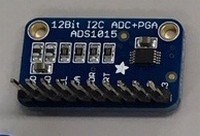|[Examples](https://chirimen.org/chirimen-raspi3/gc/top/examples/#I2C-ADS1015) [回路図](https://github.com/adafruit/ADS1X15-Breakout-Board-PCBs) [データシート](https://cdn-shop.adafruit.com/datasheets/ads1015.pdf)|
|[ADS1115](https://www.switch-science.com/catalog/1138/) ADC(アナログ電圧測定)|アナログ電圧を 16bit 精度のデジタル信号に変換する部品で、アナログセンサ等を利用する際に必要です||[Examples](https://chirimen.org/chirimen-raspi3/gc/top/examples/#I2C-ADS1115)|
|[PCF8591](http://www.aitendo.com/product/10938) ADC, DAC(アナログ電圧出力) 複合|ADC と DAC が一つになった部品です(デジタル側は 8bit)|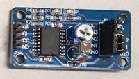|[Examples](https://chirimen.org/chirimen-raspi3/gc/top/examples/#I2C-PCF8591)|
|[ADT7410](http://akizukidenshi.com/catalog/g/gM-06675/) 温度センサ|-55℃ から +150℃ まで測定できる温度センサです||[Examples](https://chirimen.org/chirimen-raspi3/gc/top/examples/#I2C-ADT7410) [回路図](https://github.com/adafruit/ADS1X15-Breakout-Board-PCBs) [データシート](https://cdn-shop.adafruit.com/datasheets/ads1115.pdf)|
|[AMG8833](https://www.switch-science.com/catalog/3395/) サーモグラフィ|センサから見て上下左右のおよそ 60 度の範囲を 8x8 ピクセルに分割し、それぞれのエリアについて 0℃ ～ 80℃ の範囲で測定可能なサーモグラフィです|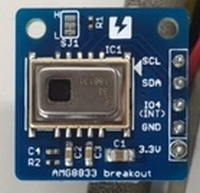|[Examples](https://chirimen.org/chirimen-raspi3/gc/top/examples/#I2C-AMG8833) [回路図](https://docid81hrs3j1.cloudfront.net/medialibrary/2017/11/AMG8833_breakout.pdf) [搭載チップの参考仕様書](https://docid81hrs3j1.cloudfront.net/medialibrary/2017/11/PANA-S-A0002141979-1.pdf)|
|[BME280](http://www.aitendo.com/product/15535) 温度, 圧力, 湿度 複合センサ|温度、湿度、気圧の測定ができる複合センサです||[Examples](https://chirimen.org/chirimen-raspi3/gc/top/examples/#I2C-BME280) [データシート](aitendo3.sakura.ne.jp/aitendo_data/product_img/sensor/BME280/BST-BME280_DS001-10.pdf)|
|[BMP180](http://www.aitendo.com/product/10760) 温度, 圧力 複合センサ|温度と気圧の測定ができる複合センサです|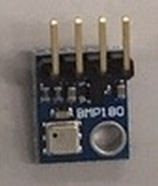|[Examples](https://chirimen.org/chirimen-raspi3/gc/top/examples/#I2C-BMP180) [データシート](http://aitendo3.sakura.ne.jp/aitendo_data/product_img/sensor/BMP180/BMP180.pdf)|
|[BMP280](http://www.aitendo.com/product/15806) 温度, 圧力 複合センサ|温度と気圧の測定ができる複合センサです([BMP180の後継品で精度が向上しています)](http://www.rvf-rc45.net/wordpress/?p=1823)||[Examples](https://chirimen.org/chirimen-raspi3/gc/top/examples/#I2C-BMP280) [データシート](aitendo3.sakura.ne.jp/aitendo_data/product_img/sensor/BMP280/BST-BMP280-DS001-11.pdf)|
|[GP2Y0E03](http://akizukidenshi.com/catalog/g/gI-07547/) 距離センサ|センサから対象物までの距離を測定できるセンサです( 50cm 程度まで)|-|[Examples](https://chirimen.org/chirimen-raspi3/gc/top/examples/#I2C-GP2Y0E03) [データシート](akizukidenshi.com/download/ds/sharp/gp2y0e03_e.pdf) [アプリケーションノート](akizukidenshi.com/download/ds/sharp/GP2Y0E02_an_20180829.pdf)|
|[VL53L0X](https://www.switch-science.com/catalog/2869/) 距離センサ|センサから対象物までの距離を測定できるセンサです( 2m 程度まで)|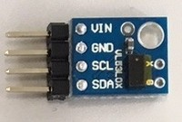|[Examples](https://chirimen.org/chirimen-raspi3/gc/top/examples/#I2C-VL53L0X) [回路図](https://www.pololu.com/file/0J1188/vl53l0x-time-of-flight-distance-sensor-carrier-schematic.pdf) [データシート](https://www.pololu.com/file/0J1187/VL53L0X.pdf)|
|[Grove-Gesture](https://www.switch-science.com/catalog/2645/) (PAJ7620U2) ジェスチャーセンサ|手を「上、下、左、右、遠ざかる、近づく、時計回り、反時計回り、手を振る」と動かしたときにそれらを検出するセンサです||[Examples](https://chirimen.org/chirimen-raspi3/gc/top/examples/#I2C-Grove-Gesture) [回路図](https://github.com/SeeedDocument/Grove_Gesture_V_1.0/raw/master/res/Grove_-_Gesture_v1.0_sch_pcb.zip) [データシート](https://github.com/SeeedDocument/Grove_Gesture_V_1.0/raw/master/res/PAJ7620U2_Datasheet_V0.8_20140611.pdf) [製造元資料(wiki)](http://wiki.seeedstudio.com/Grove-Gesture_v1.0/)|
|[Grove-Light](https://www.switch-science.com/catalog/1174/) 光センサ|0.1lx から 40000lx まで測定可能な照度センサです||[Examples](https://chirimen.org/chirimen-raspi3/gc/top/examples/#I2C-Grove-Light) [回路図](https://github.com/SeeedDocument/Grove-Digital_Light_Sensor/raw/master/res/Digital%20light%20sensor%20v1.0%20Sch.pdf) [データシート](https://raw.githubusercontent.com/SeeedDocument/Grove-Digital_Light_Sensor/master/res/TSL2561T.pdf) [製造元資料(wiki)](wiki.seeedstudio.com/Grove-Digital_Light_Sensor/)|
|[Grove-OledDisplay](https://www.switch-science.com/catalog/829/) 小型ディスプレイ|0.96inch、128x64dot の小型 OLED (有機 EL) ディスプレイです|-|[Examples](https://chirimen.org/chirimen-raspi3/gc/top/examples/#I2C-Grove-OledDisplay) [製造元資料(wiki)](http://wiki.seeedstudio.com/Grove-OLED_Display_0.96inch/)|
|[Grove-Touch](https://www.switch-science.com/catalog/825/) タッチセンサ|指などの接触を検出するセンサです|-|[Examples](https://chirimen.org/chirimen-raspi3/gc/top/examples/#I2C-Grove-Touch) [製造元資料(wiki)](http://wiki.seeedstudio.com/Grove-I2C_Touch_Sensor/) [データシート](https://www.sparkfun.com/datasheets/Components/MPR121.pdf)|
|[S11059](http://akizukidenshi.com/catalog/g/gK-08316/) カラーセンサ|RGB 各色と赤外線の強度を測定するセンサです||[Examples](https://chirimen.org/chirimen-raspi3/gc/top/examples/#I2C-S11059) [データシート](http://akizukidenshi.com/download/ds/hamamatsu/s11059-02dt.pdf) [説明書](http://akizukidenshi.com/download/ds/akizuki/S11059_module_manual.pdf)|
|[VEML6070](https://www.switch-science.com/catalog/2748/) 紫外線(UV)センサ|紫外線の強度を測定できるセンサです|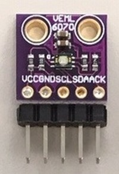|[Examples](https://chirimen.org/chirimen-raspi3/gc/top/examples/#I2C-VEML6070) [データシート](https://cdn-shop.adafruit.com/product-files/2899/C4170_veml6070.pdf)|
|[Grove-Accelerometer](https://www.switch-science.com/catalog/972/) 3軸加速度センサ|3軸の加速度を検出できるセンサです|-|[Examples](https://chirimen.org/chirimen-raspi3/gc/top/examples/#I2C-Grove-Accelerometer) [製造元資料(wiki)](http://wiki.seeedstudio.com/Grove-3-Axis_Digital_Accelerometer-16g/)|
|[MPU6050](http://www.aitendo.com/product/9549) 3軸加速度+ジャイロ 複合センサ|3軸の加速度に加え、ジャイロの測定も可能な複合センサです|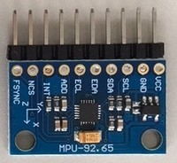|[Examples](https://chirimen.org/chirimen-raspi3/gc/top/examples/#I2C-MPU6050) [回路図](http://aitendo3.sakura.ne.jp/aitendo_data/product_img/sensor/accelerometer/MPU6050/MPU6050-sch.jpg) [データシート](http://aitendo3.sakura.ne.jp/aitendo_data/product_img/sensor/accelerometer/MPU6050/PS-MPU-6000A-00_v1.0.pdf)|
|[MPU9250](https://www.amazon.co.jp/HiLetgo®-MPU9250-9自由度1-ジャイロスコープ-磁気センサ/dp/B0154PM102/) 3軸加速度+ジャイロ+磁気 複合センサ|3軸の加速度、ジャイロのほか、磁気も測定可能な複合センサです|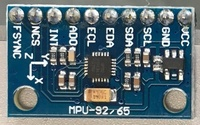|[Examples](https://chirimen.org/chirimen-raspi3/gc/top/examples/#I2C-MPU9250) [仕様書](https://strawberry-linux.com/pub/PS-MPU-9250A-01.pdf) [説明書](https://strawberry-linux.com/pub/RM-MPU-9250A-00.pdf)|
|Neopixel LEDコントローラ|多数のフルカラー LED を個々に制御可能なコントローラです(詳細は[Examples](https://chirimen.org/chirimen-raspi3/gc/top/examples/#I2C-NEOPIXEL_I2C)をご覧ください)||[Examples](https://chirimen.org/chirimen-raspi3/gc/top/examples/#I2C-NEOPIXEL_I2C) [チュートリアル](https://learn.adafruit.com/adafruit-neopixel-uberguide/the-magic-of-neopixels) [Arduinoでの製作例](https://qiita.com/tatmos/items/3d6a51d8098f4d3d75d3)|
|[64 LED マトリックス](https://www.amazon.co.jp/dp/B07KG3Y2BG/) Neopixel LED 8x8|NEOPIXEL対応の 8x8 LED パネルです||-|
|↑ 1x4|1x4のパネルです||-|
|↑ 12|円形のパネルです|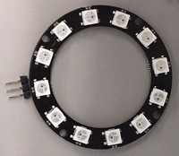|-|
|↑ 60|20個のパネルを3つ組み合わせることで60個のパネルとなります||-|
|[PCA9685](https://www.switch-science.com/catalog/961/) サーボモータ・DCモータ コントローラ|サーボモータを PWM 制御できる部品で、サーボモータを利用する際に必要です|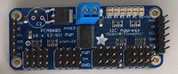|[データシート](https://cdn-shop.adafruit.com/datasheets/PCA9685.pdf) [チュートリアル](https://learn.adafruit.com/16-channel-pwm-servo-driver/downloads)|
|[SG90 Servo](http://akizukidenshi.com/catalog/g/gM-08761/) サーボモータ|アームを指定した角度をに動かすことのできる部品です||[Examples](https://chirimen.org/chirimen-raspi3/gc/top/examples/#I2C-PCA9685) [データシート](akizukidenshi.com/download/ds/towerpro/SG90_a.pdf)|
|PCA9685 PWM ↑|詳細は[Examples](https://chirimen.org/chirimen-raspi3/gc/top/examples/#GPIO-I2C-PWMHBridge-1)をご覧ください||[Examples](https://chirimen.org/chirimen-raspi3/gc/top/examples/#GPIO-I2C-PWMHBridge-1)|

## GPIO センサ・アクチュエータコントローラ
|部品型番/カテゴリー|説明|画像|各種リンク|
|-|-|-|-|
|- LED||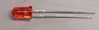|[Examples](https://chirimen.org/chirimen-raspi3/gc/top/examples/#GPIO-Blink)|
|[150Ω](http://akizukidenshi.com/catalog/g/gR-07969/) [10kΩ](http://akizukidenshi.com/catalog/g/gR-07990/) [1kΩ](http://akizukidenshi.com/catalog/g/gR-07980/) カーボン抵抗|必要な場所に電気抵抗を入れる部品です(ここでは通常のものよりサイズが大きく、抵抗値が読みやすい商品を紹介しています)||[Examples](https://chirimen.org/chirimen-raspi3/gc/top/examples/#GPIO-Blink)|
|- タクトスイッチ|||[Examples](https://chirimen.org/chirimen-raspi3/gc/top/examples/#GPIO-Button)|
|- マイクロスイッチ|||[Examples](https://chirimen.org/chirimen-raspi3/gc/top/examples/#GPIO-Button)|
|2sK4017 FET (DC電力 On/Off制御)|||[CHIRIMEN チュートリアル](https://tutorial.chirimen.org/raspi3/section1#led--)|
|IRF520 ↑||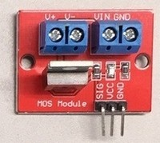|-|
| DCモーター 正逆転コントローラ１|L298N||[Examples](https://chirimen.org/chirimen-raspi3/gc/top/examples/#GPIO-HBridge)|
|L9110S ↑２|||
|MX1508 ↑３|||
|TB6612FNG ↑４|||
|赤外線人感センサー|||[Examples](https://chirimen.org/chirimen-raspi3/gc/top/examples/#GPIO-pirSensor)|
|↑|||

## アナログセンサ(I2C ADCが必要)
|カテゴリー|型番|画像|
|-|-|-|
|雨センサ|-|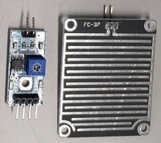|
|水センサ|-|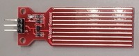|
|圧力センサ|小|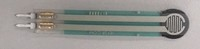|
|VR|-|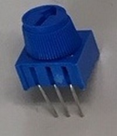|

## アクチュエータ
|カテゴリー|型番|画像|
|-|-|-|
|サーボモータ|[PCA9685 Servo](https://chirimen.org/chirimen-raspi3/gc/top/examples/#I2C-PCA9685)|-|
|↑|SG90||
|DCモータ|[On/Off](https://tutorial.chirimen.org/raspi3/section1#led--), [正逆転](https://chirimen.org/chirimen-raspi3/gc/top/examples/#GPIO-HBridge), [可変速正逆転](https://chirimen.org/chirimen-raspi3/gc/top/examples/#GPIO-I2C-PWMHBridge-1) |-|
|↑|ちびギヤモーター||
|↑|小型ギヤードモータ||

## その他
|カテゴリー|型番|画像|
|-|-|-|
|ブレッドボード|小||
|ジャンパー線|オス-メス|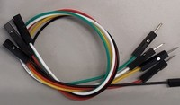|
|カメラ|-||
|ファン|-|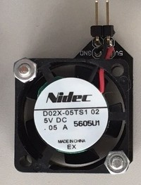|
|抵抗|-||

## ボードコンピュータ
|カテゴリー|型番|画像|
|-|-|-|
|マイクロビット|本体||
|↑|ブレークアウト||
