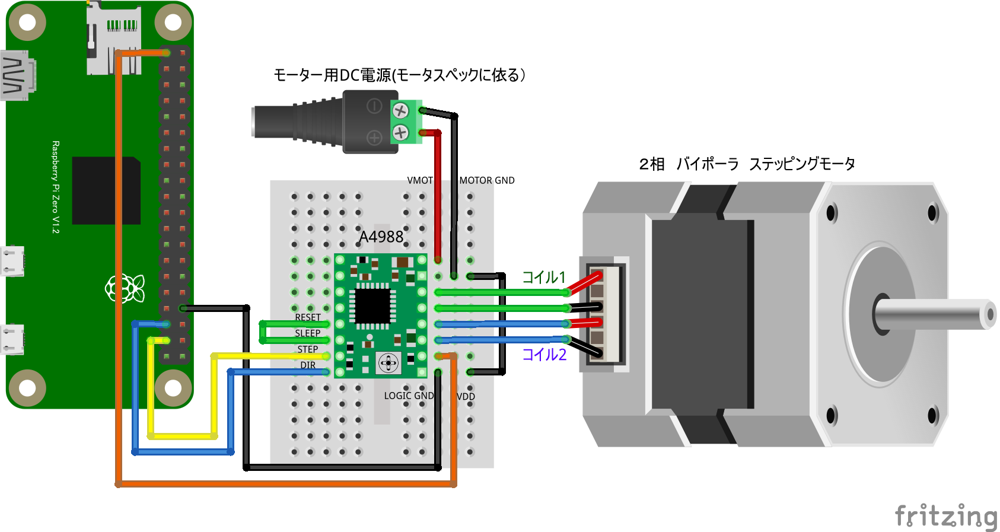

# モーター制御

## ステッピングモータードライバー

### A4988ドライバによるステッピングモータ制御

#### 概要

* I²C 接続モータードライバ
* 電圧設定と回転方向を指定するだけでモーターを簡単に制御可能

#### 配線図

{width=363px height=193px}

#### CHIRIMEN 用ドライバのインストール

- 不要

#### サンプルコード (main.js)

```javascript
import { requestGPIOAccess } from "./node_modules/node-web-gpio/dist/index.js";
const sleep = msec => new Promise(resolve => setTimeout(resolve, msec));

let portA, portB;

async function init() {
    const gpioAccess = await requestGPIOAccess();
    portA = gpioAccess.ports.get(26);
    await portA.export("out");
    await portA.write(0);
    portB = gpioAccess.ports.get(19);
    await portB.export("out");
    await portB.write(0);
}

async function main() {
    await init();
    let direction = 1;
    for (; ;) {
        console.log("Move:", direction);
        await stepMove(100, direction);
        await sleep(500);
        direction = direction == 1 ? 0 : 1;
    }
}

async function stepMove(steps, direction) {
    await portB.write(direction);
    for (let i = 0; i < steps; i++) {
        await portA.write(1);
        await sleep(1);
        await portA.write(0);
        await sleep(20);
    }
}

main();
```
