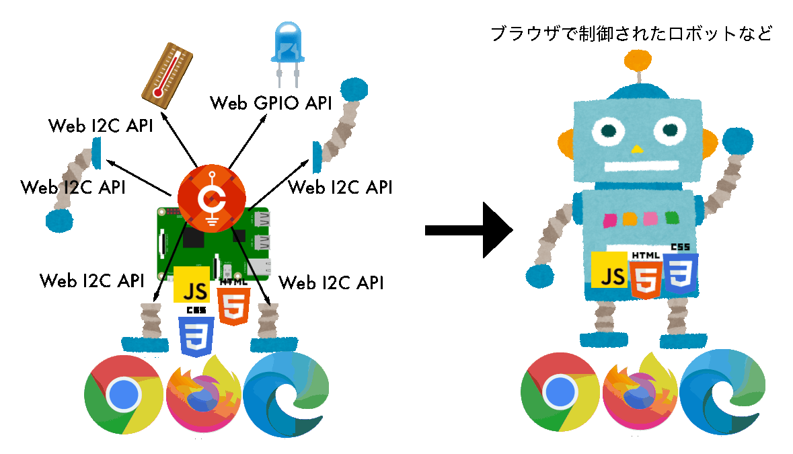

# CHIRIMEN とは

{width=310px height=160px}

CHIRIMEN は、JavaScript や HTML といった Web 技術を用いて、センサーやモーターなどの電子部品を簡単に制御できるプロトタイピング環境です。

Raspberry Pi に [WebGPIO API](http://browserobo.github.io/WebGPIO) や [WebI2C API](http://browserobo.github.io/WebI2C) を組み合わせることで、ブラウザ上からハードウェアを直接制御できます。

教育や試作開発を目的とし、誰でも手軽に扱えるように設計された、オープンで自由な環境です。

## CHIRIMEN のメリット

- 標準技術ベース：学習のハードルが低く、スキルの汎用性が高い
- Web 技術との親和性：UIやサービス連携が容易
- 開発しやすさ：ブラウザ上で実行・開発可能
- 情報の検索性：ネット上の情報が豊富で調べやすい

## コミュニティについて

不明点や質問がある場合は、CHIRIMENコミュニティまでお気軽にご相談ください

- [Slack](http://chirimen-oh.slack.com/) 
- [Github](https://github.com/chirimen-oh/)
- [X](https://x.com/chirimen_oh)
- [Facebook](https://www.facebook.com/groups/chirimen/)
