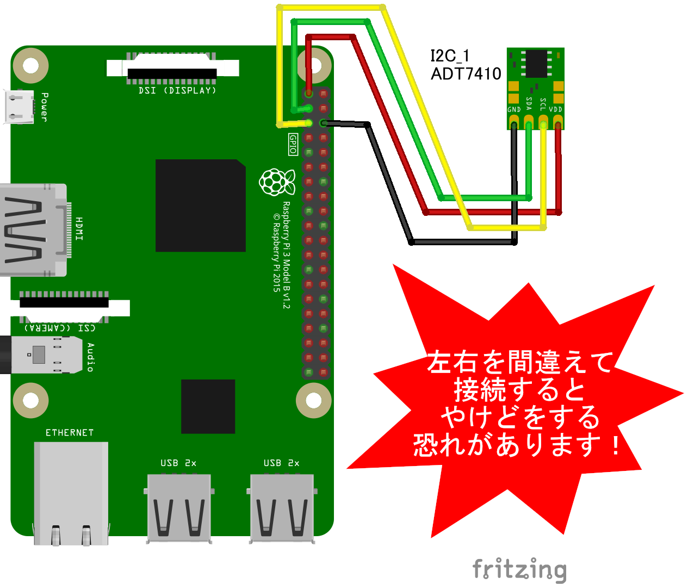

# ADT7410 温度センサー

## 配線図




## サンプルコード (main.js)

```javascript
import {requestI2CAccess} from "./node_modules/node-web-i2c/index.js";
import ADT7410 from "@chirimen/adt7410";
const sleep = msec => new Promise(resolve => setTimeout(resolve, msec));

main();

async function main() {
  const i2cAccess = await requestI2CAccess(); // i2cAccessを非同期で取得
  const port = i2cAccess.ports.get(1); // I2C I/Fの1番ポートを取得
  const adt7410 = new ADT7410(port, 0x48); // 取得したポートの0x48アドレスをADT7410ドライバで受信する
  await adt7410.init();
  for (;;) {
    // 無限ループ
    const value = await adt7410.read();
    console.log(`${value} degree`);
    await sleep(1000);
  }
}
```


---
[← 目次に戻る](../index.md)
