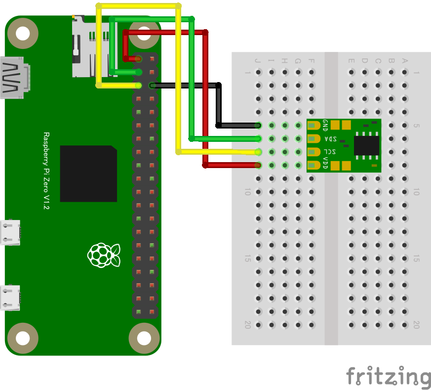

# 環境センサー

## 温度・湿度センサー

##### ADT7410 温度センサー

#### 概要

* I²C 接続の温度センサーで、±0.5°C の高精度（0°C〜+70°C の範囲）測定可能

#### 配線図

{width=175px height=175px}

{width=175px height=175px}

#### CHIRIMEN 用ドライバのインストール

```shell
npm i @chirimen/adt7410
```

#### サンプルコード (main.js)

```javascript
import {requestI2CAccess} from "./node_modules/node-web-i2c/index.js";
import ADT7410 from "@chirimen/adt7410";
const sleep = msec => new Promise(resolve => setTimeout(resolve, msec));

main();

async function main() {
  const i2cAccess = await requestI2CAccess(); // i2cAccessを非同期で取得
  const port = i2cAccess.ports.get(1); // I2C I/Fの1番ポートを取得
  const adt7410 = new ADT7410(port, 0x48); // 取得したポートの0x48アドレスをADT7410ドライバで受信する
  await adt7410.init();
  for (;;) {
    // 無限ループ
    const value = await adt7410.read();
    console.log(`${value} degree`);
    await sleep(1000);
  }
}
```
