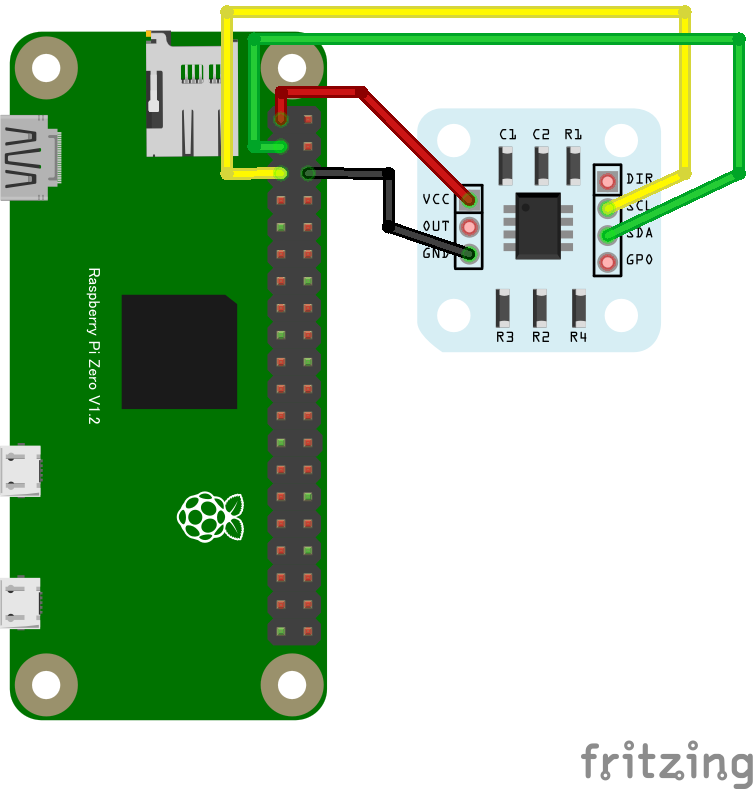

## 角度センサー

### AS5600 磁気式角度センサー

#### 概要

* ブレークアウトボードを購入すると付属している円盤状の磁石をチップに近接配置。
* この磁石の回転角を非接触で検出できるセンサー

#### 配線図

{width=250px height=250px}

#### CHIRIMEN 用ドライバのインストール

- 不要

#### サンプルコード (main.js)

```javascript
// AS5600(磁気式角度センサ)を使う
import { requestI2CAccess } from "./node_modules/node-web-i2c/index.js";
import AS5600 from "./as5600.js";
const sleep = msec => new Promise(resolve => setTimeout(resolve, msec));

main();

var as5600;

async function main() {
    const i2cAccess = await requestI2CAccess();
    const port = i2cAccess.ports.get(1);
    as5600 = new AS5600(port);
    await as5600.init();
    var stat = await as5600.getStatus();
    console.log("stat:" , stat);
    startMeasurement();
}

async function startMeasurement() {
    for (; ;) {
        var rawAngle = await as5600.getAngle();
        console.log("rawA:",rawAngle);
        await sleep(1000);
    }
}
```

#### 特記事項

* 円盤状磁石の中心を回転軸とし、この角度を検出して、チップの中心と円盤状磁石の中心を一致させる
* チップ表面と磁石の距離は 0.5～3mm 程度にする ([参照情報(データシート 33 ページ)](https://ams.com/documents/20143/36005/AS5600_DS000365_5-00.pdf#page=34))
* DIR ピンを VCC に接続すると角度の方向が逆向きになる
* ブレークアウトボード：[※1](https://electronicwork.shop/items/64205dc6cd92fe0096fb7d5c), [※2](https://www.switch-science.com/products/3493)
* ソフトウェア
  * [`as5600.js`](https://raw.githubusercontent.com/chirimen-oh/chirimen-drivers/master/packages/as5600/as5600.js), main.js 両方とも myApp ディレクトリ直下に置く
* [AS5600 データシート](https://ams.com/documents/20143/36005/AS5600_DS000365_5-00.pdf)
